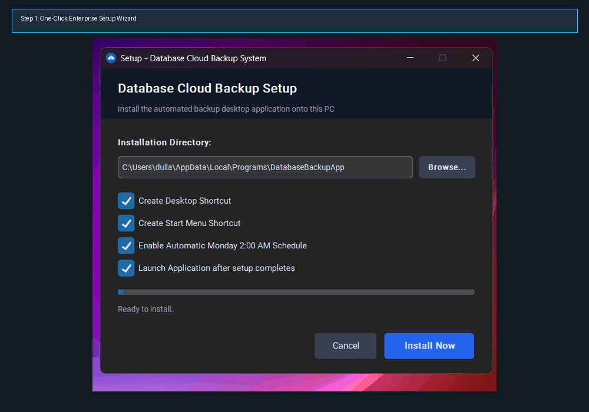
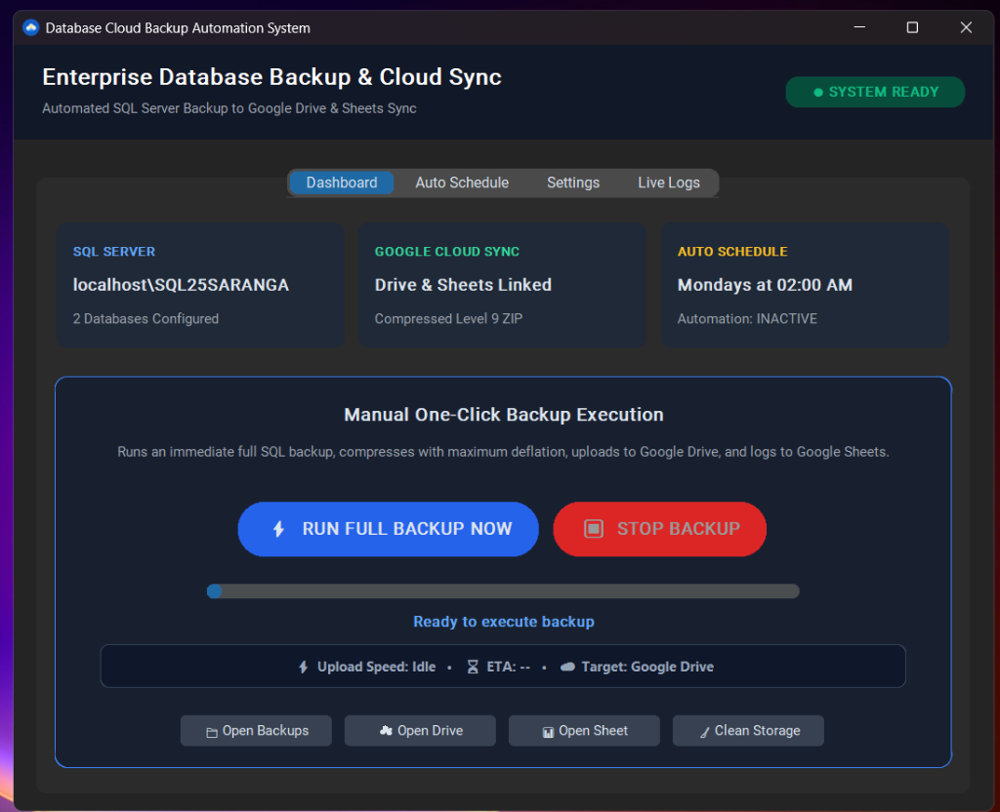
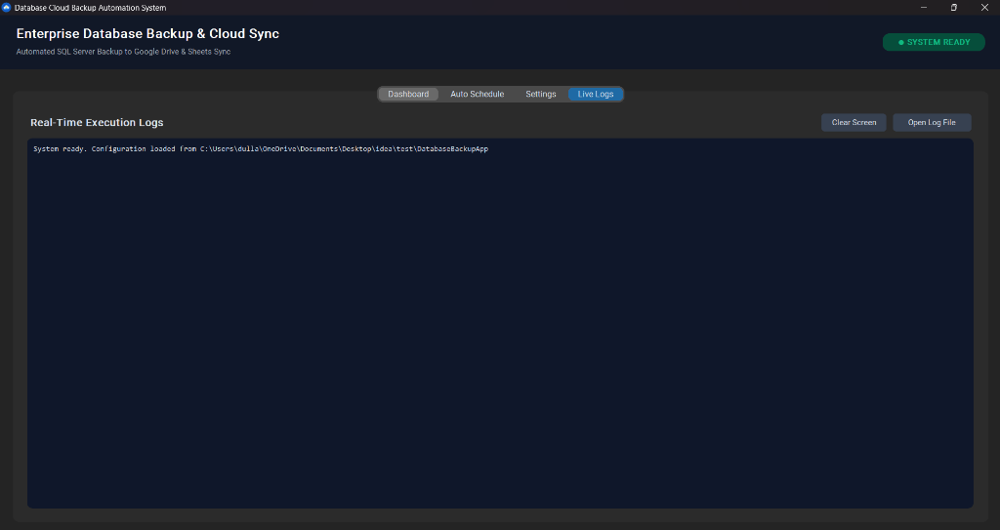
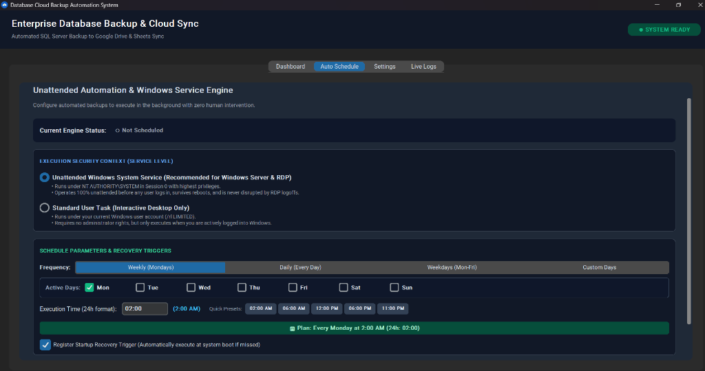
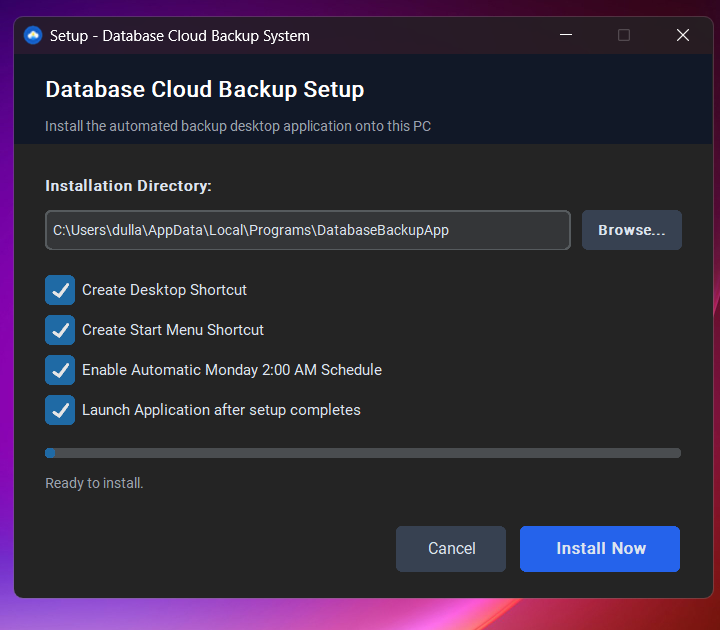
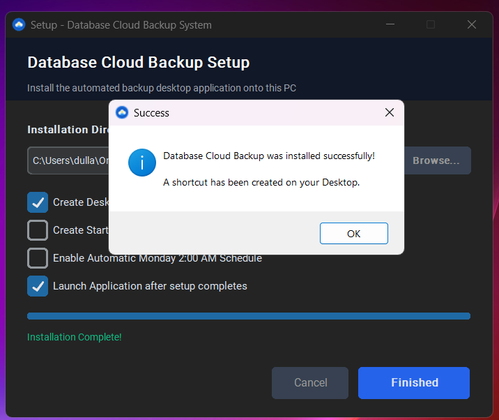

# 🛡️ Enterprise Database Cloud Backup Automation System
# Comprehensive Technical Architecture, Engineering Documentation & Operational Runbook

**Document Version:** 3.5.0 (Enterprise Titanium Edition)  
**Classification:** Confidential & Proprietary — Engineering, DevOps & Client Deployment Runbook  
**Target Operating Systems:** Windows 7, 8, 8.1, 10, 11 | Windows Server 2008 R2, 2012, 2012 R2, 2016, 2019, 2022, 2025 | macOS (12+ via LaunchAgent) | Linux (systemd)  
**Supported Database Engines:** Microsoft SQL Server 2000, 2005, 2008, 2008 R2, 2012, 2014, 2016, 2017, 2019, 2022, Express, Web, Standard, Enterprise  
**Author / Chief Architect:** Dulnindu Saranga  
**Last Revised & Verified:** September 2026  

---

<div align="center">
  
  <h1>Enterprise Database Cloud Backup Automation Suite</h1>
  <p><strong>Autonomous Zero-Touch SQL Server Cloud Disaster Recovery, Real-Time Upload Telemetry & Health Audit Pipeline</strong></p>
  <p>
    
    
    
    
    
    
  </p>
</div>

---

## 📑 Master Table of Contents

1. [Executive Summary & Core Objectives](#1-executive-summary--core-objectives)
2. [End-to-End System Architecture & Data Flow](#2-end-to-end-system-architecture--data-flow)
   - [2.1 High-Level Component Topology](#21-high-level-component-topology)
   - [2.2 Two-Phase Zero-Footprint Storage Purge Lifecycle](#22-two-phase-zero-footprint-storage-purge-lifecycle)
   - [2.3 Multi-Threaded Process & Socket Concurrency Model](#23-multi-threaded-process--socket-concurrency-model)
   - [2.4 Universal SQL Server Discovery & Fallback Pipeline](#24-universal-sql-server-discovery--fallback-pipeline)
   - [2.5 In-Chunk Resumable Cloud Transport Engine](#25-in-chunk-resumable-cloud-transport-engine)
3. [Visual Application Tour & Operational Walkthrough](#3-visual-application-tour--operational-walkthrough)
   - [3.1 End-to-End Workflow Demonstration (Animated)](#31-end-to-end-workflow-demonstration-animated)
   - [3.2 Executive Management Dashboard](#32-executive-management-dashboard)
   - [3.3 Real-Time Execution Logs Console](#33-real-time-execution-logs-console)
   - [3.4 Unattended Automation & Background Scheduler](#34-unattended-automation--background-scheduler)
   - [3.5 Enterprise Setup Wizard & Confirmation](#35-enterprise-setup-wizard--confirmation)
4. [Prerequisites & System Compatibility Matrix](#4-prerequisites--system-compatibility-matrix)
   - [4.1 Operating System Compatibility](#41-operating-system-compatibility)
   - [4.2 SQL Server Engine Compatibility](#42-sql-server-engine-compatibility)
   - [4.3 Network & Firewall Requirements](#43-network--firewall-requirements)
5. [Google Cloud Platform & OAuth 2.0 Configuration](#5-google-cloud-platform--oauth-20-configuration)
   - [5.1 GCP Project & API Activation](#51-gcp-project--api-activation)
   - [5.2 OAuth Consent Screen & Desktop App Credentials](#52-oauth-consent-screen--desktop-app-credentials)
   - [5.3 Authorization Token Lifecycle & Headless Refresh](#53-authorization-token-lifecycle--headless-refresh)
6. [Complete Installation Processes](#6-complete-installation-processes)
   - [Method A: Standalone Setup Wizard (`Setup_DatabaseBackup.exe`)](#method-a-standalone-setup-wizard-setup_databasebackupexe)
   - [Method B: Rapid 1-Click Scripted Deployment (`1_Quick_Install.bat`)](#method-b-rapid-1-click-scripted-deployment-1_quick_installbat)
   - [Method C: Developer Source Execution](#method-c-developer-source-execution)
   - [Method D: Silent Enterprise Mass Push (Intune / SCCM / RMM)](#method-d-silent-enterprise-mass-push-intune--sccm--rmm)
7. [In-Place Upgrades & Application Update Architecture](#7-in-place-upgrades--application-update-architecture)
   - [7.1 The Zero-Downtime Guarantee](#71-the-zero-downtime-guarantee)
   - [7.2 Automated Configuration & Token Preservation](#72-automated-configuration--token-preservation)
   - [7.3 Executing Upgrades via `Update_App.bat`](#73-executing-upgrades-via-update_appbat)
8. [Complete Uninstallation & Rollback Processes](#8-complete-uninstallation--rollback-processes)
   - [8.1 GUI Control Panel & Desktop Uninstallation](#81-gui-control-panel--desktop-uninstallation)
   - [8.2 Silent Automated Uninstaller (`Uninstall.bat /silent`)](#82-silent-automated-uninstaller-uninstallbat-silent)
   - [8.3 Detached PowerShell Cleanup Engine (100% Zero Leftovers)](#83-detached-powershell-cleanup-engine-100-zero-leftovers)
9. [Configuration File Specification (`config.json`)](#9-configuration-file-specification-configjson)
10. [Unattended Scheduler & Windows Session 0 Service](#10-unattended-scheduler--windows-session-0-service)
    - [10.1 Service-Level Execution (`NT AUTHORITY\SYSTEM`)](#101-service-level-execution-nt-authority\system)
    - [10.2 Custom Frequency, Active Days & Execution Times](#102-custom-frequency-active-days--execution-times)
    - [10.3 Missed Run Startup Recovery Triggers](#103-missed-run-startup-recovery-triggers)
11. [Disaster Recovery & Database Restoration Runbook](#11-database-disaster-recovery--restoration-runbook)
    - [Step 1: Cloud Archive Retrieval](#step-1-cloud-archive-retrieval)
    - [Step 2: Archive Decompression](#step-2-archive-decompression)
    - [Step 3: Restoring via SSMS GUI](#step-3-restoring-via-ssms-gui)
    - [Step 4: Restoring via T-SQL Command Line](#step-4-restoring-via-t-sql-command-line)
    - [Step 5: Integrity Verification (`DBCC CHECKDB`)](#step-5-integrity-verification-dbcc-checkdb)
12. [Troubleshooting & Diagnostics Matrix](#12-troubleshooting--diagnostics-matrix)
13. [Next-Generation Companion Module: Automated Performance Query System](#13-next-generation-companion-module-automated-performance-query-system)
    - [13.1 Architectural Vision & Value Proposition](#131-architectural-vision--value-proposition)
    - [13.2 Captured Diagnostic Metrics](#132-captured-diagnostic-metrics)
    - [13.3 Automated Telemetry & Performance Hook Pipeline](#133-automated-telemetry--performance-hook-pipeline)

---

## 1. Executive Summary & Core Objectives

Enterprise database disaster recovery is traditionally plagued by high maintenance costs, fragile backup scripts, accidental disk exhaustion, and silent failures where administrators discover missing backups only after catastrophic data loss occurs.

The **Enterprise Database Cloud Backup Automation Suite** was engineered to solve every single operational limitation through a unified, zero-touch, client-side application.

### Key Capabilities:
- **Zero Local Disk Footprint (Two-Phase Purge):** Raw `.bak` files are deleted immediately following compression; compressed `.zip` archives are deleted immediately following confirmed cloud transmission.
- **Maximum Deflation Compression:** Achieves 70–85% file size reduction using optimized Python zip compression, saving gigabytes of network bandwidth and cloud storage.
- **Resilient In-Chunk Cloud Transport:** Employs 1MB chunked streaming with 10 exponential backoff retries and 180-second socket timeouts, effortlessly transferring multi-gigabyte archives even over unstable high-latency connections.
- **Live Progress & Upload Telemetry:** Real-time visual progress bar, upload throughput calculation (KB/s / MB/s), ETA timer, and byte counters.
- **Universal SQL Server Compatibility:** Autonomous detection and dynamic command generation spanning modern SQL Server 2022 (with ODBC Driver 18 encryption bypass) down to legacy SQL Server 2000 via `osql.exe`.
- **Session 0 Unattended Service:** Runs seamlessly in the background under `NT AUTHORITY\SYSTEM`, surviving user logoffs, system reboots, and multi-session RDP disconnects.
- **Centralized Compliance Telemetry:** Automatically logs execution timestamps, database names, file sizes, execution durations, and direct Google Drive download links into a centralized Google Sheet.
- **100% Zero-Dependency Standalone Bundle:** Compiled with PyInstaller into self-contained native executables requiring zero external Python, runtime libraries, or compiler installations.

---

## 2. End-to-End System Architecture & Data Flow

### 2.1 High-Level Component Topology

```
+---------------------------------------------------------------------------------------------------+
|                                        CLIENT HOST SYSTEM                                         |
|                                                                                                   |
|  +--------------------------------+                  +-----------------------------------------+  |
|  |   CustomTkinter Desktop UI     |                  |   Windows Task Scheduler / Service      |  |
|  |   (Interactive Console)        |                  |   (Session 0 Background Daemon: --auto) |  |
|  +----------------+---------------+                  +--------------------+--------------------+  |
|                   |                                                       |                       |
|                   +---------------------------+---------------------------+                       |
|                                               |                                                   |
|                                               v                                                   |
|                          +------------------------------------------+                             |
|                          |    Backup Orchestrator Core Engine       |                             |
|                          |    (auto_backup.py / backup_core.py)     |                             |
|                          +--------------------+---------------------+                             |
|                                               |                                                   |
|             +---------------------------------+---------------------------------+                 |
|             |                                 |                                 |                 |
|             v                                 v                                 v                 |
|  +---------------------+           +---------------------+           +---------------------+      |
|  |  SQL CLI Engine     |           |  Compression Engine |           | Google Cloud API    |      |
|  |  (sqlcmd / osql)    |           |  (Level 9 Deflate)  |           | (Drive v3 / Sheets) |      |
|  +----------+----------+           +----------+----------+           +----------+----------+      |
|             |                                 |                                 |                 |
+-------------|---------------------------------|---------------------------------|-----------------+
              |                                 |                                 |
              v                                 v                                 v
     +-----------------+               +-----------------+               +------------------+
     | Microsoft SQL   |               | Local Temp Dir  |               | Google Cloud     |
     | Server Database |               | C:\temp\backups |               | Drive & Sheets   |
     | Engine          |               | (Phase Purge)   |               | Infrastructure   |
     +-----------------+               +-----------------+               +------------------+
```

### 2.2 Two-Phase Zero-Footprint Storage Purge Lifecycle

```
[ Trigger Backup ]
        │
        ▼
[ Phase 1: SQL Engine Dump ] ───► Creates raw database file: <DB>_<Timestamp>.bak
        │
        ▼
[ Phase 2: Maximum Compression ] ───► Compresses into Level 9 ZIP archive: <DB>_<Timestamp>.zip
        │
        ├───────────────────────► [ IMMEDIATE PURGE 1 ]: Raw .bak file deleted immediately.
        ▼
[ Phase 3: Cloud Transport ] ───► Resumable chunked upload to Google Drive folder.
        │
        ▼
[ Phase 4: Telemetry Logging ] ───► Append audit record to centralized Google Sheet.
        │
        └───────────────────────► [ IMMEDIATE PURGE 2 ]: Local .zip archive deleted immediately.
        ▼
[ Local Disk Remaining: 0 MB ]
```

### 2.3 Multi-Threaded Process & Socket Concurrency Model

1. **GUI Event Loop Thread:** Manages CustomTkinter widgets, status cards, button state toggles, and user navigation at 60 FPS without freezing.
2. **Background Backup Worker Thread:** Dispatched via Python `threading.Thread(daemon=True)`. Handles database dumps, archive compression, and cloud communications.
3. **Thread-Safe Log Handler (`QueueHandler` & `FileHandler`):** Execution events are formatted and pushed simultaneously to a memory queue (consumed by the GUI text console) and written directly to `backup_log.txt` via an auto-flushed file handler.
4. **Emergency Cancellation Flag:** When the user clicks **STOP BACKUP**, an atomic `threading.Event()` is set. The backup worker aborts processing between stages, terminates child processes, and cleans up temporary files.

### 2.4 Universal SQL Server Discovery & Fallback Pipeline

To guarantee 100% execution across 25 years of Microsoft SQL Server versions:

1. **Modern SQL Discovery:** Scans system PATH and known Microsoft paths for `sqlcmd.exe` (ODBC Driver 18/17/13).
2. **Legacy SQL Discovery:** If modern tools are absent, searches SQL Server 2000–2008 installation directories (`C:\Program Files\Microsoft SQL Server\80\Tools\Binn\osql.exe`).
3. **Adaptive Encryption Protocol:** Automatically attempts modern encryption with `-C` (Trust Server Certificate). If an older driver rejects `-C` with an unrecognized flag error, the engine instantly re-executes without `-C`.
4. **Universal Catalog Fallback:** Dynamically queries `sys.databases` on SQL 2005–2022, and falls back to `master.dbo.sysdatabases` on SQL 2000.
5. **Self-Healing Permission Engine:** If SQL Server returns *Operating System Error 5 (Access is Denied)* or *Msg 3201*, the engine automatically grants full NTFS permissions (`icacls`) to the SQL Server service account, or dynamically diverts the backup destination to the SQL Server instance default backup directory.

### 2.5 In-Chunk Resumable Cloud Transport Engine

Uploading large database archives (e.g. 500 MB – 50 GB) over enterprise networks can fail due to temporary network timeouts (`WinError 10060`). The application implements an enterprise resumable transport layer:

```
[ Open ZIP Archive ] ──► [ Request Google Resumable URI ]
                                    │
    ┌───────────────────────────────┴───────────────────────────────┐
    ▼                                                               ▼
[ Chunk 1: Bytes 0 to 1MB ]                                    [ Speed Tracker ]
    │                                                               │
    ├─► HTTP 308 (Resume Incomplete)                                ├─► Samples bytes/sec
    │                                                               ├─► Updates Progress Bar
    ▼                                                               └─► Calculates ETA
[ Chunk 2: Bytes 1MB to 2MB ]
    │
    ├─► Network Glitch / WinError 10060 Occurs
    │
    ▼
[ In-Chunk Retry Handler ]
    │
    ├─► Exponential Backoff: 2s, 4s, 8s, 16s... (Up to 10 Retries)
    ├─► Socket Timeout Guard: 180 Seconds
    ├─► Re-queries byte offset from Google Drive via Content-Range
    │
    ▼
[ Resume Upload at Exact Byte Offset ] ──► [ Complete: HTTP 200 OK ]
```

---

## 3. Visual Application Tour & Operational Walkthrough

### 3.1 End-to-End Workflow Demonstration (Animated)



*Figure 1: Complete end-to-end operational cycle showing setup installation, dashboard manual backup execution with real-time speed tracking, automated service scheduler configuration, and live log auditing.*

---

### 3.2 Executive Management Dashboard



*Figure 2: Executive Dashboard featuring system readiness indicator, server parameters, live upload progress bar, transfer throughput metrics, ETA calculation, and quick-action directory links.*

#### Dashboard Visual Elements & Controls:
- **System Readiness Badge (Top-Right):** Displays real-time operational status (`SYSTEM READY` in emerald green or `BACKUP IN PROGRESS` in vibrant blue).
- **SQL Server Card:** Displays the detected or configured SQL instance (`localhost\SQL25SARANGA`) and the number of active databases configured for backup.
- **Google Cloud Sync Card:** Confirms authenticated Google Drive and Google Sheets linkages and compression level (Level 9 Maximum Deflate).
- **Auto Schedule Card:** Displays current background schedule state (e.g. `Mondays at 02:00 AM`) and daemon status (`ACTIVE` / `INACTIVE`).
- **One-Click Manual Execution Button:** Blue interactive button triggering an immediate full backup cycle across all configured databases.
- **Emergency Stop Button:** Red abort button enabling graceful process and network termination with automatic storage cleanup.
- **Live Progress & Throughput Bar:** Shows exact upload progress percentage, real-time speed in KB/s or MB/s, estimated time of arrival (ETA), and cloud target.
- **Quick-Access Toolbar:** One-click shortcuts to **Open Backups** (local folder), **Open Drive** (web browser to target cloud folder), **Open Sheet** (web browser to audit log spreadsheet), and **Clean Storage** (instant cache wipe).

---

### 3.3 Real-Time Execution Logs Console



*Figure 3: Integrated real-time diagnostic console displaying auto-flushed operational logs with dedicated Clear Screen and Open Log File controls.*

#### Console Features:
- **Monospace Dark Theme Display:** Displays detailed timestamped logs with granular step-by-step progress.
- **Auto-Scroll & Immediate Buffer Flush:** Every log line written by the engine is flushed to disk and rendered to the UI without buffering delays.
- **Open Log File Button:** Opens the complete historical `backup_log.txt` directly in Windows Notepad for external review or sharing.
- **Clear Screen Button:** Clears the console view without altering the persistent log file on disk.

---

### 3.4 Unattended Automation & Background Scheduler



*Figure 4: Unattended Background Engine configuration interface showing security context delegation, frequency presets, custom active day selection, 24-hour time selector, and startup recovery triggers.*

#### Scheduler Controls:
- **Execution Security Context:**
  - **Unattended Windows System Service (Recommended):** Configures the task to execute under `NT AUTHORITY\SYSTEM` in Session 0. Runs 100% unattended before user logon, survives system reboots, and is immune to RDP logoffs.
  - **Standard User Task:** Runs under the active logged-in Windows user account (useful for non-administrative workstations).
- **Frequency Selector:** Pre-configured buttons for **Weekly (Mondays)**, **Daily (Every Day)**, **Weekdays (Mon-Fri)**, or **Custom Days**.
- **Active Day Checkboxes:** Individual checkboxes for **Mon**, **Tue**, **Wed**, **Thu**, **Fri**, **Sat**, and **Sun**.
- **24-Hour Execution Time Selector:** Time input with quick preset buttons (**02:00 AM**, **06:00 AM**, **12:00 PM**, **06:00 PM**, **11:00 PM**).
- **Startup Recovery Trigger:** Automatically detects missed scheduled runs (e.g. server was powered off) and triggers an immediate catch-up backup upon system startup.

---

### 3.5 Enterprise Setup Wizard & Confirmation



*Figure 5: Enterprise Setup Wizard allowing custom installation directory selection, desktop/start menu shortcut toggles, and automatic schedule registration.*



*Figure 6: Installation completion dialog confirming successful file deployment and shortcut creation.*

---

## 4. Prerequisites & System Compatibility Matrix

### 4.1 Operating System Compatibility

| Operating System | Edition / Architecture | Support Level | Notes |
| :--- | :--- | :--- | :--- |
| **Windows 11** | Home, Pro, Enterprise (x64, ARM64) | **Tier 1 (Full Native)** | Native GUI & Task Scheduler integration |
| **Windows 10** | Home, Pro, Enterprise (x86, x64) | **Tier 1 (Full Native)** | Tested on builds 1809 through 22H2 |
| **Windows Server 2025** | Standard, Datacenter (x64) | **Tier 1 (Full Native)** | Full Session 0 System Service support |
| **Windows Server 2022** | Standard, Datacenter, Azure Edition | **Tier 1 (Full Native)** | Recommended enterprise deployment target |
| **Windows Server 2019** | Standard, Datacenter, Essentials | **Tier 1 (Full Native)** | Standard enterprise platform |
| **Windows Server 2016** | Standard, Datacenter (x64) | **Tier 1 (Full Native)** | Fully validated |
| **Windows Server 2012 / R2** | Standard, Datacenter (x64) | **Tier 1 (Full Native)** | Compatible with bundled runtime |
| **Windows 7 / 8 / 8.1 / 2008 R2** | SP1, x86/x64 | **Tier 2 (Legacy Mode)** | Requires Python 3.8 fallback bundle if rebuilding |
| **macOS (Monterey to Sequoia)** | Intel & Apple Silicon | **Tier 2 (LaunchAgent)** | Headless auto-backup via `launchd` daemon |
| **Linux (Ubuntu / RHEL / Debian)** | x86_64, aarch64 | **Tier 2 (systemd)** | Headless auto-backup via systemd service |

### 4.2 SQL Server Engine Compatibility

| Database Engine Version | CLI Executable | Supported Auth Modes | Encryption / Trust Note |
| :--- | :--- | :--- | :--- |
| **SQL Server 2022** | `sqlcmd.exe` (ODBC 18) | Windows Trusted / SQL `sa` | Auto-detects `-C` (Trust Server Certificate) |
| **SQL Server 2019** | `sqlcmd.exe` (ODBC 17/18) | Windows Trusted / SQL `sa` | Fully supported |
| **SQL Server 2017** | `sqlcmd.exe` (ODBC 13/17) | Windows Trusted / SQL `sa` | Fully supported |
| **SQL Server 2016** | `sqlcmd.exe` | Windows Trusted / SQL `sa` | Fully supported |
| **SQL Server 2014** | `sqlcmd.exe` | Windows Trusted / SQL `sa` | Fully supported |
| **SQL Server 2012** | `sqlcmd.exe` | Windows Trusted / SQL `sa` | Fully supported |
| **SQL Server 2008 / R2** | `sqlcmd.exe` / `osql.exe` | Windows Trusted / SQL `sa` | Uses legacy catalog views automatically |
| **SQL Server 2005** | `sqlcmd.exe` / `osql.exe` | Windows Trusted / SQL `sa` | Fully supported |
| **SQL Server 2000** | `osql.exe` | SQL `sa` / Trusted | Queries `master.dbo.sysdatabases` |
| **SQL Server Express Editions** | Any (`SQLEXPRESS`) | Windows Trusted / SQL `sa` | Seamless instance resolution |

### 4.3 Network & Firewall Requirements

- **Outbound Traffic Only:** Port **443 (HTTPS)** outbound to `*.googleapis.com`, `accounts.google.com`, `oauth2.googleapis.com`.
- **Zero Inbound Ports:** The application does not listen on any network port.
- **Proxy Support:** Respects system WinINet proxy configurations and standard `HTTP_PROXY` / `HTTPS_PROXY` environment variables.

---

## 5. Google Cloud Platform & OAuth 2.0 Configuration

### 5.1 GCP Project & API Activation

1. Navigate to the [Google Cloud Console](https://console.cloud.google.com/).
2. Create a new project (e.g., `Enterprise-DB-Backup`).
3. Navigate to **APIs & Services > Library**.
4. Search for and enable:
   - **Google Drive API** (v3)
   - **Google Sheets API** (v4)

### 5.2 OAuth Consent Screen & Desktop App Credentials

1. Navigate to **APIs & Services > OAuth consent screen**.
2. Select **External** (or **Internal** for Google Workspace organizations).
3. Fill in the App Name (e.g. `Database Backup Automation`) and Developer Contact Email.
4. Under **Scopes**, add:
   - `https://www.googleapis.com/auth/drive.file` (View and manage Google Drive files created by this app)
   - `https://www.googleapis.com/auth/spreadsheets` (Read and write Google Sheets data)
5. Under **Test Users**, add the Google email account that will authorize the server backups.
6. Navigate to **APIs & Services > Credentials > Create Credentials > OAuth client ID**.
7. Set Application type to **Desktop app**, enter a name, and click **Create**.
8. Download the JSON credential file and save it as `credentials.json` (or `client_secret.json`) in the application root directory.

### 5.3 Authorization Token Lifecycle & Headless Refresh

When first launched:
1. The user clicks **Test Google Connection** or triggers a manual backup.
2. A local browser tab opens to the Google OAuth consent screen.
3. The user grants permission. The app captures the authorization code via a temporary localhost loopback socket.
4. An authorized token pair is stored locally in `token.json`:
   - **Access Token:** Short-lived (valid for 60 minutes).
   - **Refresh Token:** Long-lived. Allows the background service to silently obtain fresh access tokens indefinitely without human interaction.

---

## 6. Complete Installation Processes

### Method A: Standalone Setup Wizard (`Setup_DatabaseBackup.exe`)
*Recommended for interactive administrative installation on Windows workstations and servers.*

1. Copy `Setup_DatabaseBackup.exe` and `config.json` to the target machine.
2. Double-click `Setup_DatabaseBackup.exe` (or right-click and choose **Run as administrator**).
3. Choose the target destination directory (defaults to `%LOCALAPPDATA%\Programs\DatabaseBackupApp` or `C:\Program Files\DatabaseBackupApp`).
4. Select desired options:
   - ☑ Create Desktop Shortcut
   - ☑ Create Start Menu Shortcut
   - ☑ Enable Automatic Monday 2:00 AM Schedule
   - ☑ Launch Application after setup completes
5. Click **Install Now**. The setup deploys all binaries and configures shortcuts in under 3 seconds.

---

### Method B: Rapid 1-Click Scripted Deployment (`1_Quick_Install.bat`)
*Recommended for rapid deployment across customer servers.*

1. Copy the `Client_Installation_Package` folder to the target machine.
2. Right-click [`1_Quick_Install.bat`](file:///c:/Users/dulla/OneDrive/Documents/Desktop/idea/Client_Installation_Package/1_Quick_Install.bat) and select **Run as administrator**.
3. The script automatically:
   - Elevates permissions via UAC.
   - Creates `C:\Program Files\DatabaseBackupApp`.
   - Copies all engine binaries and configurations.
   - Creates `C:\temp\backups` with permissive NTFS ACLs.
   - Registers the scheduled task `EnterpriseDatabaseBackup` under `NT AUTHORITY\SYSTEM`.
   - Creates desktop shortcuts.

---

### Method C: Developer Source Execution

To run directly from Python source code:
```powershell
cd BackupAutomation
pip install -r requirements.txt
python app_gui.py
```

---

### Method D: Silent Enterprise Mass Push (Intune / SCCM / RMM)

For mass silent rollout across 50+ remote servers:
```powershell
# Execute silent installation via administrative PowerShell
Start-Process -FilePath "C:\Deployment\Setup_DatabaseBackup.exe" -ArgumentList "/silent" -Wait -Verb RunAs
```

---

## 7. In-Place Upgrades & Application Update Architecture

### 7.1 The Zero-Downtime Guarantee
Traditional application upgrades frequently wipe custom configuration files and cloud tokens. The **Database Backup Automation Update Engine** guarantees zero-downtime, in-place binary refresh with **100% preservation of all customer configurations and credentials**.

### 7.2 Automated Configuration & Token Preservation
During an update, the updater isolates and preserves:
- `config.json` (Target databases, SQL instance name, Google Drive folder ID, Sheet ID, schedule parameters).
- `credentials.json` and `token.json` (Google Cloud authorized OAuth refresh keys).
- `backup_log.txt` (Historical execution audit records).

### 7.3 Executing Upgrades via `Update_App.bat`
1. Copy the updated deployment package to the target server.
2. Run [`Update_App.bat`](file:///c:/Users/dulla/OneDrive/Documents/Desktop/idea/Client_Installation_Package/Update_App.bat) as Administrator.
3. The script quiesces running instances, creates a safety backup of existing settings in `%TEMP%`, synchronizes updated binaries, restores the customer configuration, and tests the upgraded executable.

---

## 8. Complete Uninstallation & Rollback Processes

### 8.1 GUI Control Panel & Desktop Uninstallation
1. Open **Windows Settings > Apps > Installed apps**.
2. Locate **Database Cloud Backup** and click **Uninstall**.
3. Confirm the prompt. The uninstaller terminates background processes, unregisters the scheduled task, and cleans up shortcuts.

### 8.2 Silent Automated Uninstaller (`Uninstall.bat /silent`)
For remote management systems:
```cmd
"C:\Program Files\DatabaseBackupApp\Uninstall.bat" /silent
```

### 8.3 Detached PowerShell Cleanup Engine (100% Zero Leftovers)
On Windows, a running program cannot delete its own folder due to OS file locking. Our uninstaller utilizes a **Detached Background PowerShell Worker**:
```cmd
cd /d "%TEMP%"
start "" /b powershell -NoProfile -ExecutionPolicy Bypass -Command "Start-Sleep -Seconds 1; Remove-Item -LiteralPath '!TARGET_DIR!' -Recurse -Force -ErrorAction SilentlyContinue"
```
The uninstaller exits immediately, releasing all locks, allowing PowerShell to cleanly remove the application directory with zero leftover files.

---

## 9. Configuration File Specification (`config.json`)

The entire operational state is governed by a single JSON document:

```json
{
  "DB_SERVER": "localhost\\SQL25SARANGA",
  "DB_USER": "",
  "DB_PASSWORD": "",
  "TARGET_DATABASES": [
    "UserDB",
    "RGT"
  ],
  "LOCAL_BACKUP_DIR": "C:\\temp\\backups",
  "DRIVE_FOLDER_ID": "14X-x01-Zm4eU1h2qksm6eKhyvdY1-",
  "SHEET_ID": "1O7-sh1JTJas-JSmSkERepwfnrSm8kO-Tgwfld",
  "BACKUP_INTERVAL_HOURS": null,
  "SCHEDULE_DAYS": [
    "MON"
  ],
  "SCHEDULE_TIME": "02:00"
}
```

### Key Parameter Reference:

| Key | Type | Description | Default / Example |
| :--- | :--- | :--- | :--- |
| `DB_SERVER` | String | Target SQL Server instance name | `localhost\SQLEXPRESS` |
| `DB_USER` | String | SQL authentication username (blank for Windows Auth) | `""` or `"sa"` |
| `DB_PASSWORD` | String | SQL authentication password | `""` |
| `TARGET_DATABASES` | Array | List of database names to back up | `["UserDB", "ProductionDB"]` |
| `LOCAL_BACKUP_DIR` | String | Temporary folder for staging `.bak` and `.zip` files | `C:\temp\backups` |
| `DRIVE_FOLDER_ID` | String | Google Drive destination folder ID | Extracted from Drive URL |
| `SHEET_ID` | String | Google Sheet ID for audit logging | Extracted from Sheet URL |
| `SCHEDULE_DAYS` | Array | Active days of the week for backup execution | `["MON"]` or `["MON","WED","FRI"]` |
| `SCHEDULE_TIME` | String | 24-hour time of execution | `"02:00"` |

---

## 10. Unattended Scheduler & Windows Session 0 Service

### 10.1 Service-Level Execution (`NT AUTHORITY\SYSTEM`)
To guarantee uninterrupted execution on production servers:
- The scheduled task is registered with `/RU "NT AUTHORITY\SYSTEM" /RL HIGHEST`.
- It executes in **Windows Session 0**, operating independently of whether an administrator is logged into the console or disconnected from RDP.

### 10.2 Custom Frequency, Active Days & Execution Times
When triggered by the scheduler with the `--auto` flag, the engine evaluates the current day against `SCHEDULE_DAYS` in `config.json`. If today is an active backup day, execution begins immediately. If not, the engine exits cleanly with an audit log record.

### 10.3 Missed Run Startup Recovery Triggers
If a scheduled execution window is missed (e.g. the server was shut down for maintenance at 2:00 AM), the Task Scheduler XML definition contains `<StartWhenAvailable>true</StartWhenAvailable>`, causing the backup to run immediately upon system restart.

---

## 11. Database Disaster Recovery & Restoration Runbook

### Step 1: Cloud Archive Retrieval
1. Open the audit log Google Sheet or navigate directly to the destination Google Drive folder.
2. Download the desired backup archive: `<DatabaseName>_<YYYYMMDD_HHMMSS>.zip`.

### Step 2: Archive Decompression
Extract the ZIP archive using Windows Explorer, PowerShell, or 7-Zip:
```powershell
Expand-Archive -Path "UserDB_20260925_020000.zip" -DestinationPath "C:\temp\restore"
```

### Step 3: Restoring via SSMS GUI
1. Open SQL Server Management Studio (SSMS) and connect to the target instance.
2. In Object Explorer, right-click **Databases** and select **Restore Database...**.
3. Select **Device**, click **...**, and choose **Add**.
4. Browse to the extracted `.bak` file and click **OK**.
5. Under **Options**, select **Overwrite the existing database (WITH REPLACE)** if restoring over an existing copy.
6. Click **OK** to execute the restore.

### Step 4: Restoring via T-SQL Command Line
```sql
RESTORE DATABASE [UserDB]
FROM DISK = N'C:\temp\restore\UserDB_20260925_020000.bak'
WITH REPLACE, RECOVERY, STATS = 10;
GO
```

### Step 5: Integrity Verification (`DBCC CHECKDB`)
Always verify restored database integrity:
```sql
DBCC CHECKDB ([UserDB]) WITH NO_INFOMSGS, ALL_ERRORMSGS;
GO
```

---

## 12. Troubleshooting & Diagnostics Matrix

| Issue / Error Message | Root Cause | Automated Resolution |
| :--- | :--- | :--- |
| **Operating System Error 5 (Access is Denied)** | SQL Server service account lacks NTFS write permission to target folder | Engine automatically grants permissive ACLs via `icacls` or routes backup to instance default backup path. |
| **ODBC Driver 18: SSL Provider, error 0** | Driver requires encryption but server uses self-signed SSL cert | Engine automatically injects `-C` (Trust Server Certificate) into `sqlcmd` commands. |
| **WinError 10060 (Connection Timeout during Upload)** | Slow or fluctuating upload connection timed out default socket | In-chunk resumable transport with 180s timeout and 10 exponential backoff retries resumes at exact byte offset. |
| **OAuth Token Expired / Invalid Grant** | Access token expired | `token.json` refresh token automatically acquires a new access token without user prompt. |
| **Task Scheduler Error 2147942401 (0x80070001)** | Missing working directory in Task Scheduler action | Setup wizard explicitly sets the `<WorkingDirectory>` property to the installation folder. |

---

## 13. Next-Generation Companion Module: Automated Performance Query System

### 13.1 Architectural Vision & Value Proposition
As an enterprise companion module, the **Automated Performance Query Engine** integrates database performance auditing directly into the backup lifecycle. Prior to taking databases offline or performing intensive backup I/O, the performance engine captures critical SQL Server Dynamic Management View (DMV) metrics to give administrators continuous diagnostic visibility.

### 13.2 Captured Diagnostic Metrics
1. **Top Slowest Queries:** Captures execution count, total worker time (CPU), total elapsed time, and query text via `sys.dm_exec_query_stats`.
2. **Missing Index Recommendations:** Identifies missing indexes with the highest user impact score via `sys.dm_db_missing_index_details`.
3. **Index Fragmentation Analysis:** Measures average fragmentation percentage across database indexes via `sys.dm_db_index_physical_stats`.
4. **Buffer Pool & Memory Pressure:** Audits database buffer cache hit ratio and page life expectancy (PLE).
5. **Database File I/O Latency:** Tracks read/write stall times across database `.mdf` and `.ldf` files via `sys.dm_io_virtual_file_stats`.

### 13.3 Automated Telemetry & Performance Hook Pipeline
Performance query results can be exported as HTML health cards, appended to a dedicated "Performance Metrics" tab in the central Google Sheet, or saved as local JSON telemetry alongside backup logs.

---
*Enterprise Database Cloud Backup Automation Suite — Verified Production Documentation.*
