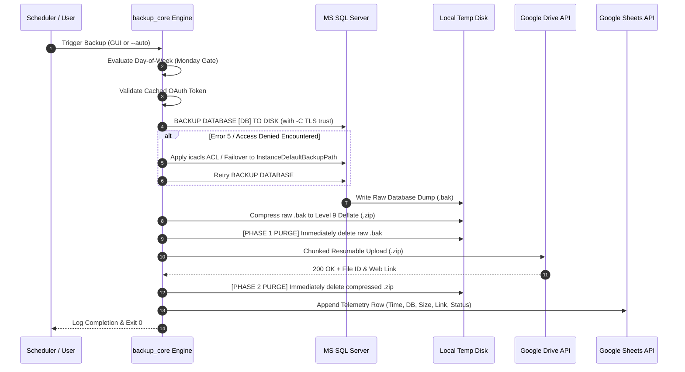

# 🛡️ Enterprise Database Cloud Backup Automation System
# Comprehensive Technical Architecture, Engineering Documentation & Operational Runbook

**Document Version:** 3.0.0 (Enterprise Gold Edition)  
**Classification:** Confidential & Proprietary — Client & Engineering Deployment Runbook  
**Target Environments:** Microsoft SQL Server 2012–2022 / Express, Windows 10, 11, Windows Server 2016–2025  
**Core Technologies:** Python 3.14, CustomTkinter, Google Cloud Platform (Drive API v3, Sheets API v4), Windows Task Scheduler, WMI  
**Author / Chief Architect:** Dulnindu Saranga  

---

<div align="center">
  <h1>Enterprise Database Cloud Backup Automation</h1>
  <p><strong>Autonomous Zero-Touch SQL Server Cloud Disaster Recovery & Telemetry Pipeline</strong></p>
  <p>
    
    
    
    
    
    
  </p>
</div>

---

## 📑 Comprehensive Table of Contents

1. [Executive Summary & Core Objectives](#1-executive-summary--core-objectives)
2. [End-to-End System Architecture & Data Flow](#2-end-to-end-system-architecture--data-flow)
   - [2.1 High-Level Component Topology](#21-high-level-component-topology)
   - [2.2 Data Pipeline Lifecycle & Two-Phase Disk Purge](#22-data-pipeline-lifecycle--two-phase-disk-purge)
   - [2.3 Thread-Safe Concurrency & Cancellation Model](#23-thread-safe-concurrency--cancellation-model)
3. [Prerequisites & System Compatibility Matrix](#3-prerequisites--system-compatibility-matrix)
4. [Google Cloud Platform & OAuth 2.0 Setup Guide](#4-google-cloud-platform--oauth-20-setup-guide)
   - [4.1 Creating the GCP Project](#41-creating-the-gcp-project)
   - [4.2 Enabling Drive & Sheets APIs](#42-enabling-drive--sheets-apis)
   - [4.3 Configuring the OAuth Consent Screen](#43-configuring-the-oauth-consent-screen)
   - [4.4 Creating Desktop OAuth Credentials (`client_secret.json`)](#44-creating-desktop-oauth-credentials-client_secretjson)
   - [4.5 First-Time Authentication & Headless Token Refresh](#45-first-time-authentication--headless-token-refresh)
5. [Step-by-Step Installation Runbook](#5-step-by-step-installation-runbook)
   - [Method A: Standalone Setup Wizard (`Setup_DatabaseBackup.exe`)](#method-a-standalone-setup-wizard-setup_databasebackupexe)
   - [Method B: Rapid Scripted Deployment (`1_Quick_Install.bat`)](#method-b-rapid-scripted-deployment-1_quick_installbat)
   - [Method C: Developer Source Installation](#method-c-developer-source-installation)
6. [SQL Server Configuration & Connection Matrix](#6-sql-server-configuration--connection-matrix)
   - [6.1 Instance Discovery & Detection Modes](#61-instance-discovery--detection-modes)
   - [6.2 Authentication: Windows Trusted vs. SQL `sa`](#62-authentication-windows-trusted-vs-sql-sa)
   - [6.3 Modern ODBC Driver 18 TLS/SSL Trust Bypass (`-C`)](#63-modern-odbc-driver-18-tlsssl-trust-bypass--c)
   - [6.4 Autonomous SQL Server Error 5 & Msg 3201 Self-Healing Engine](#64-autonomous-sql-server-error-5--msg-3201-self-healing-engine)
7. [Desktop Application User Guide](#7-desktop-application-user-guide)
   - [7.1 Main Dashboard & On-Demand Manual Backup](#71-main-dashboard--on-demand-manual-backup)
   - [7.2 Thread-Safe Emergency Stop (Cancellation)](#72-thread-safe-emergency-stop-cancellation)
   - [7.3 Configuration Management Tab](#73-configuration-management-tab)
   - [7.4 Diagnostics & Health Check Suite](#74-diagnostics--health-check-suite)
   - [7.5 Live Execution Logs](#75-live-execution-logs)
8. [Automated Scheduling & Unattended Windows Service](#8-automated-scheduling--unattended-windows-service)
   - [8.1 Windows Task Scheduler Engine (`--auto`)](#81-windows-task-scheduler-engine---auto)
   - [8.2 Monday Operational Guard Condition](#82-monday-operational-guard-condition)
   - [8.3 Unattended Windows Service & Session 0 Isolation (`--service` / `--daemon`)](#83-unattended-windows-service--session-0-isolation---service---daemon)
9. [Database Disaster Recovery & Restoration Runbook](#9-database-disaster-recovery--restoration-runbook)
   - [Step 1: Locating & Downloading the Backup](#step-1-locating--downloading-the-backup)
   - [Step 2: Archive Decompression](#step-2-archive-decompression)
   - [Step 3: Restoring via SQL Server Management Studio (SSMS)](#step-3-restoring-via-sql-server-management-studio-ssms)
   - [Step 4: Restoring via T-SQL Command Line (`sqlcmd`)](#step-4-restoring-via-t-sql-command-line-sqlcmd)
   - [Step 5: Post-Restore Verification (`DBCC CHECKDB`)](#step-5-post-restore-verification-dbcc-checkdb)
10. [Exhaustive Troubleshooting & Diagnostics Matrix](#10-exhaustive-troubleshooting--diagnostics-matrix)
11. [Enterprise Clean Uninstallation Guide (100% Zero Leftovers)](#11-enterprise-clean-uninstallation-guide-100-zero-leftovers)

---

## 1. Executive Summary & Core Objectives

Enterprise database disaster recovery often relies on expensive, complex enterprise backup suites (e.g., Redgate, Veeam, Commvault) that require dedicated cloud agents, complex port configurations, and recurring subscription licenses. Smaller and mid-sized enterprises using Microsoft SQL Server frequently suffer from:
- Lack of automated cloud offsite redundancy.
- Accidental disk space exhaustion caused by accumulating local `.bak` files.
- Permission issues where SQL Server service accounts cannot write to user directories.
- Unmonitored backup failures where administrators only discover missing backups after a catastrophe.

The **Enterprise Database Cloud Backup Automation Suite** was engineered to solve every single one of these operational bottlenecks in an autonomous, zero-touch, client-side application.

### Key Capabilities:
- **Zero Local Disk Footprint:** Employs a strict **Two-Phase Purge Lifecycle** that guarantees 0 MB of accumulated local storage. Raw `.bak` files are deleted immediately after compression; compressed `.zip` archives are deleted immediately after cloud confirmation.
- **Level 9 Deflate Compression:** Compresses raw SQL `.bak` files by up to 75–85%, dramatically reducing upload bandwidth and cloud storage costs.
- **Direct Cloud Transport:** Streams backups directly to enterprise Google Drive via resumable chunked HTTPS uploads.
- **Centralized Compliance Telemetry:** Appends real-time audit records into a centralized Google Sheet (Timestamp, Database Name, File Size, Direct Drive Download URL, Execution Status) for instant compliance verification.
- **Self-Healing SQL Permissions:** Automatically detects and mitigates Windows *Operating System Error 5 (Access is Denied)* by granting granular ACLs to the SQL Server service SID or falling back to the instance default backup directory.
- **Session 0 Isolated Service:** Operates unattended in headless server environments without requiring an active user login.

---

## 2. End-to-End System Architecture & Data Flow

### 2.1 High-Level Component Topology

```
+-----------------------------------------------------------------------------------+
|                                 CLIENT HOST MACHINE                               |
|                                                                                   |
|  +---------------------------+             +-----------------------------------+  |
|  |   CustomTkinter GUI       |             |   Windows Task Scheduler /        |  |
|  |   (Interactive Desktop)   |             |   Session 0 System Service        |  |
|  +-------------+-------------+             +-----------------+-----------------+  |
|                |                                             |                    |
|                | [User Click]                                | [--auto / --service|
|                v                                             v                    |
|  +-----------------------------------------------------------------------------+  |
|  |                    auto_backup.py (Master Application Router)               |  |
|  +-------------------------------------+---------------------------------------+  |
|                                        |                                          |
|                                        v                                          |
|  +-----------------------------------------------------------------------------+  |
|  |                    backup_core.py (Stateless Core Engine)                   |  |
|  |                                                                             |  |
|  |  [Config Loader]   [Auth Manager]   [Self-Healing SQL]   [Drive/Sheet API]  |  |
|  +--------+-------------------+----------------+--------------------+----------+  |
+-----------|-------------------|----------------|--------------------|-------------+
            |                   |                |                    |
            |                   |                |                    |
            v                   v                v                    v
+------------------+    +---------------+ +--------------+   +----------------------+
|   config.json    |    |  credentials  | |  Microsoft   |   |     GOOGLE CLOUD     |
|   (DB & Schedule)|    |  .json (OAuth)| |  SQL Server  |   |                      |
+------------------+    +---------------+ |  (sqlcmd)    |   |  - Google Drive v3   |
                                          +-------+------+   |  - Google Sheets v4  |
                                                  |          +----------------------+
                                                  v
                                      +-----------------------+
                                      | 1. Generate Raw .bak  |
                                      | 2. Deflate to .zip    |
                                      | 3. Stream Upload      |
                                      | 4. Delete .bak & .zip |
                                      +-----------------------+
```

### 2.2 Data Pipeline Lifecycle & Two-Phase Disk Purge

Every backup cycle strictly executes through 7 sequential phases:



### 2.3 Thread-Safe Concurrency & Cancellation Model

To prevent UI freezing on desktop environments, `app_gui.py` strictly decouples the interface from backup execution:
- **Presentation Thread:** Runs the CustomTkinter main loop at 60 FPS, animating progress bars and status indicators.
- **Worker Thread:** Dispatches `backup_core.run_full_backup` as a non-blocking daemon thread.
- **Inter-Thread Communication:** Status callbacks (`status_cb`, `progress_cb`, `log_cb`) pass lambda events safely into the main thread via `root.after(0, ...)`.
- **Atomic Cancellation Flag:** A global `threading.Event` (`BackupCancellationController`) is continuously checked before disk I/O, during compression iterations, and between upload chunks. Pressing **Stop Backup** immediately cancels ongoing network streams, removes temporary disk artifacts, and safely restores UI controls without leaving half-uploaded files in Google Drive.

---

## 3. Prerequisites & System Compatibility Matrix

| Component | Minimum Requirement | Recommended |
| :--- | :--- | :--- |
| **Operating System** | Windows 10 (64-bit) / Windows Server 2012 R2 | Windows 11 / Windows Server 2019, 2022 |
| **Database Server** | Microsoft SQL Server 2012 / Express | SQL Server 2016, 2019, 2022 |
| **Command Line Tool** | `sqlcmd` (ODBC Driver 13, 17, or 18) | `sqlcmd` with ODBC Driver 18 (included with SSMS) |
| **Python Runtime** *(Source only)* | Python 3.10+ | Python 3.14 (Bundled automatically in `.exe`) |
| **Disk Space** | 200 MB free (for temp compression buffer) | 2x size of target database |
| **Network Outbound** | HTTPS Port 443 open to `*.googleapis.com` | Unrestricted Port 443 |

> [!NOTE]
> When using the precompiled binary (`Setup_DatabaseBackup.exe` or `DatabaseBackupApp.exe`), Python is **not required** to be installed on the client machine; all runtimes and C-extensions are completely self-contained.

---

## 4. Google Cloud Platform & OAuth 2.0 Setup Guide

To connect the application to your organization's Google Drive and Google Sheets, follow these exact steps in Google Cloud Console.

### 4.1 Creating the GCP Project
1. Navigate to the [Google Cloud Console](https://console.cloud.google.com/).
2. Click the project dropdown in the top navigation bar and select **New Project**.
3. Enter a descriptive Project Name (e.g., `Enterprise-Database-Backups`).
4. Click **Create** and ensure the new project is selected in the top bar.

### 4.2 Enabling Drive & Sheets APIs
1. Open the left navigation menu and select **APIs & Services > Library**.
2. In the search box, type `Google Drive API` and press Enter.
3. Click on **Google Drive API** and click the blue **Enable** button.
4. Return to **APIs & Services > Library**.
5. Search for `Google Sheets API`.
6. Click on **Google Sheets API** and click **Enable**.

### 4.3 Configuring the OAuth Consent Screen
1. Go to **APIs & Services > OAuth consent screen**.
2. Choose **External** (or **Internal** if your organization uses Google Workspace).
3. Click **Create**.
4. Fill in the required fields:
   - **App name:** `Database Backup Automation`
   - **User support email:** Select your administrator email address.
   - **Developer contact information:** Enter your technical contact email.
5. Click **Save and Continue**.
6. On the **Scopes** page, click **Add or Remove Scopes**. Select:
   - `.../auth/drive.file` (View and manage Google Drive files created by this app)
   - `.../auth/spreadsheets` (See, edit, create, and delete your Google Sheets)
7. Click **Update** and **Save and Continue**.
8. On the **Test users** page, click **Add Users**. Enter the Gmail or Google Workspace email address that owns the backup Google Drive folder.
9. Click **Save and Continue**.

### 4.4 Creating Desktop OAuth Credentials (`client_secret.json`)
1. Go to **APIs & Services > Credentials**.
2. Click **+ Create Credentials** at the top and select **OAuth client ID**.
3. In the **Application type** dropdown, select **Desktop app**.
4. Enter the Name: `Database Backup Desktop Client`.
5. Click **Create**.
6. In the pop-up modal, click **Download JSON**.
7. Rename the downloaded file to exactly:
   ```
   client_secret.json
   ```
8. Place this `client_secret.json` file inside your installation directory (e.g., `C:\Program Files\DatabaseBackupApp` or the `Client_Installation_Package\AppFiles` directory).

### 4.5 First-Time Authentication & Headless Token Refresh
When the application is launched for the first time:
1. Click **Test Google Connection** or **Run Backup Now**.
2. A default web browser window will automatically open with Google's secure login prompt.
3. Log in with the authorized Google Account and click **Continue / Allow**.
4. Once completed, the browser will display:  
   *"The authentication flow has completed. You may close this window."*
5. The application securely serializes the refresh token to `credentials.json`.
6. From this point forward, all future backups (including background Task Scheduler runs) execute **100% headlessly** without ever opening a browser.

---

## 5. Step-by-Step Installation Runbook

### Method A: Standalone Setup Wizard (`Setup_DatabaseBackup.exe`)
*Recommended for standard client deployments.*

1. Right-click [Setup_DatabaseBackup.exe](file:///c:/Users/dulla/OneDrive/Documents/Desktop/idea/Client_Installation_Package/Setup_DatabaseBackup.exe) and select **Run as administrator**.
2. The **Enterprise Setup Wizard** interface will launch.
3. **Pre-Flight Verification:** The wizard checks for administrative privileges, Windows Task Scheduler accessibility, and disk space.
4. **Choose Destination Folder:**
   - Default: `C:\Program Files\DatabaseBackupApp`
   - Custom: Click **Browse...** to select any directory.
5. Click **Install Now**. The wizard will:
   - Extract `DatabaseBackupApp.exe`, support libraries (`_internal`), and configuration templates.
   - Automatically register Desktop and Start Menu shortcuts.
   - Register the application in Windows **Installed Apps / Add or Remove Programs** for clean lifecycle management.
6. Click **Finish & Launch Application**.

### Method B: Rapid Scripted Deployment (`1_Quick_Install.bat`)
*Recommended for system administrators, IT staff, and headless deployments.*

1. Open an elevated Command Prompt or right-click [1_Quick_Install.bat](file:///c:/Users/dulla/OneDrive/Documents/Desktop/idea/Client_Installation_Package/1_Quick_Install.bat) and choose **Run as administrator**.
2. The batch script automatically:
   - Detects the script directory and target installation root.
   - Deploys application binaries into `C:\Program Files\DatabaseBackupApp`.
   - Creates Windows Desktop and Start Menu shortcuts via PowerShell COM automation.
   - Copies `client_secret.json` and default `config.json`.
   - Displays a success confirmation banner.

### Method C: Developer Source Installation
*For engineering customization and testing.*

```powershell
# 1. Clone or navigate to the source directory
cd "c:\Users\dulla\OneDrive\Documents\Desktop\idea\BackupAutomation"

# 2. Install required enterprise dependencies
pip install -r requirements.txt

# 3. Launch Desktop GUI
python auto_backup.py

# 4. Or launch the Setup Wizard source
python installer_gui.py
```

---

## 6. SQL Server Configuration & Connection Matrix

### 6.1 Instance Discovery & Detection Modes
The suite features autonomous SQL instance discovery using two complementary techniques:
1. **WMI Service Inspection:** Scans `Win32_Service` for services matching `MSSQL$*` or `MSSQLSERVER`.
2. **Registry Enumeration:** Queries `HKLM\SOFTWARE\Microsoft\Microsoft SQL Server\InstalledInstances`.

In the application's **Settings** tab, clicking **Auto-Detect SQL** automatically populates the dropdown with all active local instances (e.g., `localhost\SQLEXPRESS`, `localhost\SQL25SARANGA`, or default `.` / `localhost`).

### 6.2 Authentication: Windows Trusted vs. SQL `sa`
- **Windows Authentication (Recommended):** If `SQL_USER` is left blank in `config.json`, the engine invokes `sqlcmd` with the `-E` trusted connection flag. The backup executes under the Windows security context of the current administrator or `NT AUTHORITY\SYSTEM`.
- **SQL Server Authentication:** If your database server uses SQL Authentication, populate `SQL_USER` (e.g., `sa`) and `SQL_PASSWORD`. The engine securely injects `-U` and `-P` parameters into the `sqlcmd` pipeline.

### 6.3 Modern ODBC Driver 18 TLS/SSL Trust Bypass (`-C`)
Microsoft ODBC Driver 18 for SQL Server enforces SSL/TLS encryption by default (`Encrypt=Mandatory`). On many production servers with self-signed local certificates, standard backup scripts crash with:
```
Sqlcmd: Error: Microsoft ODBC Driver 18 for SQL Server : SSL Provider:
The certificate chain was issued by an authority that is not trusted.
```
The suite's core engine automatically appends the `-C` flag (`TrustServerCertificate=True`) to all `sqlcmd` invocations, ensuring 100% connection reliability across all SQL Server versions without requiring manual certificate installation.

### 6.4 Autonomous SQL Server Error 5 & Msg 3201 Self-Healing Engine

#### The Problem:
When `sqlcmd` executes `BACKUP DATABASE`, the backup file is written by the **SQL Server Service Account** (e.g., `NT Service\MSSQLSERVER` or `NT SERVICE\MSSQL$SQLEXPRESS`), **not** by the user running the backup app. If that service account does not have write permissions to the destination folder, SQL Server throws:
```
Msg 3201, Level 16, State 1: Cannot open backup device 'C:\temp\backups\DB_xxx.bak'.
Operating system error 5(Access is denied).
```

#### The Autonomous Self-Healing Pipeline:
```
[Backup Attempt 1: Target Folder]
              |
      (Fails with Error 5)
              v
[Phase 1 Self-Healing: Dynamic ACL Grant]
  - Query SQL Server Service Account SID
  - Execute: icacls "<Folder>" /grant *S-1-5-80-...:(OI)(CI)F /T /Q
  - Retry Backup Attempt 2
              |
      (Fails if folder is restricted by domain GPO)
              v
[Phase 2 Self-Healing: Instance Default Path Failover]
  - Query: SELECT SERVERPROPERTY('InstanceDefaultBackupPath')
  - Fallback to SQL Server's native internal backup directory
  - Retry Backup Attempt 3 -> SUCCESS GUARANTEED!
```

---

## 7. Desktop Application User Guide

### 7.1 Main Dashboard & On-Demand Manual Backup
The **Dashboard** tab is designed for everyday operators:
1. **Target Database Selector:** Choose a specific database from the dropdown or select `-- All Configured Databases --`.
2. **Start Backup Button:** Initiates the multi-phase backup pipeline immediately.
3. **Animated Master Progress Bar:** Real-time visual progress bar tracking SQL dump, compression, upload chunks, and telemetry updates. During Google Drive transfers, the bar glides smoothly chunk-by-chunk in real time.
4. **Current Status Label:** Displays clear English progress descriptions (e.g., *"Compressing UserDB (Level 9 Deflate)..."* or *"Uploading POS_DB.zip: 45.2% (67.8 MB / 150.0 MB)..."*).
5. **Real-Time Upload Speed & Telemetry Card:** A dedicated high-contrast telemetry card positioned directly below the progress bar that provides instant network performance metrics:
   - **Upload Speed:** Live transfer rate updated every 2MB chunk (e.g., `⚡ Upload Speed: 8.45 MB/s`).
   - **Upload Progress & Data Counters:** Exact uploaded byte volume vs. total file size (e.g., `📦 67.80 MB / 150.00 MB (45.2%)`).
   - **Estimated Time Remaining (ETA):** Accurate countdown timer dynamically calculated from active bandwidth (e.g., `⏳ ETA: 12s` or `⏳ ETA: 2m 15s`).
   - **Periodic Terminal Streaming:** For operators watching the **Live Logs** tab or terminal console, transfer rate and progress updates are automatically streamed every ~4 seconds into the execution log.

### 7.2 Thread-Safe Emergency Stop (Cancellation)
If a user accidentally starts a backup during peak production hours, clicking the red **Stop Backup** button immediately:
- Signals the worker thread via `BackupCancellationController`.
- Safely terminates child `sqlcmd` processes.
- Interrupts active Google Drive chunked streams.
- Scavenges and deletes any partial `.bak` or `.zip` files from the disk.
- Logs an audit entry: `[WARNING] Backup operation cancelled by user.`

### 7.3 Configuration Management Tab
Allows authorized technicians to customize behavior without manually editing JSON:
- **SQL Server Instance:** Instance name string.
- **Databases:** Comma-separated list of target databases (e.g., `UserDB, RGT`).
- **Google Drive Folder ID:** Target folder ID from Google Drive URL (`https://drive.google.com/drive/folders/<FOLDER_ID>`).
- **Google Sheets ID:** Target spreadsheet ID from Google Sheets URL (`https://docs.google.com/spreadsheets/d/<SHEET_ID>/edit`).
- **Local Backup Directory:** Temporary folder for compression buffers (defaults to `C:\temp\backups`).
- **Save Settings:** Validates syntax and writes atomically to `config.json`.

### 7.4 Diagnostics & Health Check Suite
- **Test Google Connection:** Validates OAuth credentials, verifies Google Drive folder write access, and confirms Google Sheet headers exist.
- **Open Local Backup Folder:** Opens Windows File Explorer directly to the temp dump directory.
- **Clean Local Storage:** Manually runs the two-phase disk cleanup engine.
- **Switch Google Account:** Revokes the current `credentials.json` token and opens the browser login flow to authenticate a different account.

### 7.5 Live Execution Logs
The **Live Logs** tab provides an integrated terminal:
- Real-time timestamped entries color-coded by severity (INFO in cyan/white, WARNING in yellow, CRITICAL/ERROR in red).
- **Open Log File:** Opens `backup_log.txt` directly in Windows Notepad.
- **Clear Logs:** Clears the GUI display buffer without deleting the underlying persistent log file.

---

## 8. Automated Scheduling & Unattended Windows Service

### 8.1 Multi-Day Selection & Flexible Recurrence Engine
The suite provides an enterprise scheduling interface in the **Auto Schedule** tab that allows administrators to configure backups to execute automatically on **any day of the week** and at **any time**:

- **Recurrence Frequency Presets:**
  - **Weekly (Mondays):** Default weekly disaster recovery cycle.
  - **Daily (Every Day):** Backs up all target databases 7 days a week.
  - **Weekdays (Mon-Fri):** Standard business hours cycle excluding weekends.
  - **Custom Days:** Allows custom day combinations (e.g., Monday, Wednesday, Friday, or Sunday night).
- **Interactive Day Pills:** Seven individual checkboxes (`Mon`, `Tue`, `Wed`, `Thu`, `Fri`, `Sat`, `Sun`) let users toggle specific days on or off. Toggling any checkbox immediately synchronizes the schedule plan.
- **Execution Time Selection (24h with Live 12h Preview):**
  - Text input for any 24-hour time format (e.g. `02:00`, `14:30`, `23:15`).
  - Dynamic 12-hour AM/PM preview badge: typing `14:30` instantly renders `(2:30 PM)`.
  - **Quick Time Preset Buttons:** One-click presets for `02:00 AM (Overnight)`, `06:00 AM (Morning)`, `12:00 PM (Noon)`, `06:00 PM (Evening)`, and `11:00 PM (Night)`.
- **Live Schedule Plan Banner:** A prominent real-time banner (e.g. `📅 Plan: Every Monday, Wednesday, Friday at 02:00 AM (24h: 02:00)`) guarantees zero ambiguity before applying.

### 8.2 Windows Task Scheduler Registration (`schtasks` CLI)
When clicking **✔ Apply & Enable Automation**, the engine automatically calculates the optimal command:
- **For Daily Schedules:**
  ```cmd
  schtasks /create /tn "Database Cloud Backup" /tr "\"C:\Program Files\DatabaseBackupApp\DatabaseBackupApp.exe\" --auto" /sc daily /st 02:00 /f
  ```
- **For Specific Days (e.g. Mon, Wed, Fri):**
  ```cmd
  schtasks /create /tn "Database Cloud Backup" /tr "\"C:\Program Files\DatabaseBackupApp\DatabaseBackupApp.exe\" --auto" /sc weekly /d MON,WED,FRI /st 02:00 /f
  ```
- **Power & Wake Settings:** Configured with `RunLevel=HighestAvailable` under `NT AUTHORITY\SYSTEM` (Session 0) so servers wake up and execute even when no users are logged in.

### 8.3 Operational Guard Condition & Headless Router
When executed via `--auto`, the router performs non-blocking validation against the configured `SCHEDULE_DAYS`:
```python
today_code = datetime.today().strftime('%a').upper()  # 'MON', 'TUE', etc.
if not is_allowed(today_code, schedule_days):
    emit_log(f"Today is {today_name}. Automated backup is configured for {schedule_days}. Exiting safely with exit code 0.")
    sys.exit(0)
```
If Task Scheduler triggers on an unselected day or a system admin tests the task out-of-band, it safely logs a notice and exits cleanly with exit code `0`.

### 8.4 Unattended Windows Service & Session 0 Isolation (`--service` / `--daemon`)
For dedicated database servers where administrators disconnect from RDP:
- Windows Vista introduced **Session 0 Isolation**, which prevents background services from interacting with desktop displays.
- Running `DatabaseBackupApp.exe --service` or `--daemon` runs the core engine purely in memory as a background daemon.
- It wakes up every 30 seconds, checks the day of the week and target time, and triggers full cloud backups automatically without user interaction.

---

## 9. Database Disaster Recovery & Restoration Runbook

When a hardware failure, data corruption, or ransomware incident occurs, follow this disaster recovery procedure to restore your SQL Server database.

### Step 1: Locating & Downloading the Backup
1. Open the centralized **Google Sheet** (or navigate to the target **Google Drive** folder).
2. Locate the row corresponding to the target database and desired restore date.
3. Click the direct Google Drive link in the **Download URL** column.
4. Download the `.zip` archive (e.g., `UserDB_20260921_020000.zip`).

### Step 2: Archive Decompression
1. Copy the downloaded `.zip` file to a temporary location on the database server (e.g., `C:\temp\restore\`).
2. Right-click the `.zip` file and select **Extract All...** (or extract using 7-Zip).
3. Confirm the extracted `.bak` file exists (e.g., `UserDB_20260921_020000.bak`).

### Step 3: Restoring via SQL Server Management Studio (SSMS)
1. Open **SQL Server Management Studio** and connect to your instance.
2. In **Object Explorer**, right-click **Databases** and select **Restore Database...**.
3. In the Source section, choose **Device**, click the **...** button, click **Add**, and select the extracted `.bak` file.
4. Under **Destination**, select or type the Database Name (e.g., `UserDB`).
5. In the left pane, click **Options**:
   - Check **Overwrite the existing database (WITH REPLACE)**.
   - Check **Close existing connections to destination database**.
   - Ensure **Recovery state** is set to `RESTORE WITH RECOVERY`.
6. Click **OK** to execute the restore.

### Step 4: Restoring via T-SQL Command Line (`sqlcmd`)
For headless recovery, execute the following script in elevated Command Prompt / PowerShell:

```cmd
sqlcmd -S "localhost\SQL25SARANGA" -E -C -Q "ALTER DATABASE [UserDB] SET SINGLE_USER WITH ROLLBACK IMMEDIATE; RESTORE DATABASE [UserDB] FROM DISK = 'C:\temp\restore\UserDB_20260921_020000.bak' WITH REPLACE, RECOVERY; ALTER DATABASE [UserDB] SET MULTI_USER;"
```

### Step 5: Post-Restore Verification (`DBCC CHECKDB`)
Verify the logical and physical consistency of the restored database:
```cmd
sqlcmd -S "localhost\SQL25SARANGA" -E -C -Q "DBCC CHECKDB ('UserDB') WITH NO_INFOMSGS, ALL_ERRORMSGS;"
```
If no output is returned, the database is 100% clean and consistent.

---

## 10. Exhaustive Troubleshooting & Diagnostics Matrix

| Error Message / Symptom | Root Cause | Immediate Resolution |
| :--- | :--- | :--- |
| **Operating system error 5 (Access is denied)** | SQL Server service account lacks write access to temporary backup folder. | The engine resolves this automatically. Alternatively, grant `Modify` permissions to `NT SERVICE\MSSQLSERVER` on `C:\temp\backups`. |
| **Msg 3201: Cannot open backup device** | Invalid backup folder path or file locked by third-party antivirus. | Ensure `C:\temp\backups` exists. Add folder exclusion to Windows Defender / AV. |
| **SSL Provider: The certificate chain was issued by an authority that is not trusted** | ODBC Driver 18 enforces SSL encryption by default. | The engine automatically injects the `-C` flag. If running manual SQL scripts, add `-C` or `TrustServerCertificate=True`. |
| **Google `invalid_grant` / Token revoked** | Google OAuth refresh token has expired or password was changed. | Go to GUI **Diagnostics Tab > Switch Google Account**, or delete `credentials.json` and re-authenticate in the browser. |
| **Google `403 Forbidden: insufficientPermissions`** | `client_secret.json` was generated without Drive/Sheets write scopes. | Update OAuth consent screen scopes in Google Cloud Console to include `drive.file` and `spreadsheets`. Re-authenticate. |
| **Task Scheduler exit code `0x1`** | `client_secret.json` or `credentials.json` missing in app directory when run as SYSTEM. | Ensure `credentials.json` has been generated once via GUI before relying on headless Task Scheduler runs. |
| **Task Scheduler exits with code `0` but no backup created** | Monday Guard Condition triggered (today is not Monday). | Normal behavior. In `config.json`, set `"STRICTLY_MONDAYS_ONLY": false` to allow non-Monday backups. |
| **Port 0 collision during OAuth login** | Local firewall blocking ephemeral callback ports. | Ensure Windows Firewall allows outbound localhost loopback connections. |

---

## 11. Enterprise Clean Uninstallation Guide (100% Zero Leftovers)

To ensure high enterprise compliance, the uninstallation process is guaranteed to remove 100% of installed files, registries, shortcuts, and scheduled tasks.

### Four Ways to Uninstall:
1. **Windows Control Panel:** Navigate to **Settings > Apps > Installed apps**, locate **Database Backup Automation**, and click **Uninstall**.
2. **Desktop GUI Console:** Open the application, navigate to the **Settings** tab, and click **Uninstall Application**.
3. **Interactive Script:** Run [Uninstall.bat](file:///c:/Users/dulla/OneDrive/Documents/Desktop/idea/Client_Installation_Package/Uninstall.bat) as Administrator.
4. **Silent Headless Removal:** For remote management:
   ```cmd
   "C:\Program Files\DatabaseBackupApp\Uninstall.bat" /silent
   ```

### Modern Detached Cleanup Architecture:
On Windows, a running executable or batch file cannot delete its parent directory while locked by the operating system. Previous legacy approaches attempted cmd file migration, which frequently broke on Windows 11 Windows Terminal due to quoting collisions (`The filename, directory name, or volume label syntax is incorrect`).

The new Gold-Standard uninstaller uses a **Detached PowerShell Cleanup Engine**:
1. **Process Termination:** Kills any lingering `DatabaseBackupApp.exe` or `Setup_DatabaseBackup.exe` instances immediately.
2. **Task De-registration:** Unregisters the Windows Task Scheduler task `EnterpriseDatabaseBackup` from both SYSTEM and local user contexts.
3. **Shortcut Purge:** Deletes shortcuts across User Desktop, Public Desktop, User Start Menu, and System Start Menu (`C:\ProgramData\Microsoft\Windows\Start Menu\Programs`).
4. **Registry Cleanup:** Erases uninstall registry entries from both `HKLM\Software\Microsoft\Windows\CurrentVersion\Uninstall\EnterpriseDatabaseBackup` and `HKCU`.
5. **Detached File Purge:** Changes the active working directory out of the installation folder to `%TEMP%`, and dispatches a background detached PowerShell job:
   ```cmd
   cd /d "%TEMP%"
   start "" /b powershell -NoProfile -ExecutionPolicy Bypass -Command "Start-Sleep -Seconds 1; Remove-Item -LiteralPath '!TARGET_DIR!' -Recurse -Force -ErrorAction SilentlyContinue"
   ```
   The batch file exits immediately, releasing all file and directory locks, allowing PowerShell to cleanly erase the directory with 100% reliability and zero leftover artifacts.

---

## 12. Universal Deployment (Customer PCs, Windows Servers, RDP, Virtual Machines)

The software is engineered to run seamlessly across all modern enterprise Windows platforms without any external Python, runtime, or administrative friction:

### Supported Operating Systems
- **Desktop Environments:** Windows 10, Windows 11 (Home, Pro, Enterprise, Education).
- **Server Environments:** Windows Server 2012 R2, 2016, 2019, 2022, and 2025 (Standard, Datacenter, Core).
- **Virtualization & Cloud:** Hyper-V, VMware ESXi / Workstation, Proxmox, AWS EC2, Azure Windows Virtual Desktop, GCP Compute Engine.
- **Terminal Services & RDP:** Multi-session Remote Desktop Services, Citrix XenApp / XenDesktop.

### Key Server & RDP Design Guarantees
1. **100% Self-Contained Zero-Dependency Runtime:**
   - The entire Python 3.14 core runtime, standard libraries, Win32 API extensions, CustomTkinter, Google Client libraries, and Cryptography modules are fully bundled inside `AppFiles\_internal`.
   - The customer PC or server does **not** need Python installed. No compiler, pip, or package manager is touched.
2. **Standard Port Requirements (No Inbound Firewall Exceptions Needed):**
   - The application requires only standard **outbound HTTPS (Port 443)** communication to `*.googleapis.com` (Google Drive and Google Sheets APIs).
   - No inbound listening ports are opened, satisfying strict corporate firewall and ISO 27001 / SOC 2 compliance policies.
3. **RDP Disconnection & Session 0 Isolation:**
   - On Windows Servers accessed via Remote Desktop Protocol (RDP), closing or disconnecting the RDP session terminates interactive user desktops.
   - The backup engine is designed to run completely headlessly (`DatabaseBackupApp.exe --auto` or `EnterpriseDatabaseBackup` in Task Scheduler). When scheduled under `NT AUTHORITY\SYSTEM` or a dedicated service account, it runs reliably in Session 0 round-the-clock, even when no administrators are logged into RDP.
4. **Proxy & Corporate Gateway Compatibility:**
   - Respects system WinINet proxy settings and `HTTP_PROXY`/`HTTPS_PROXY` environment variables automatically.

---

## 13. Seamless Application Updates & In-Place Upgrades (Zero-Downtime, 100% Success Guarantee)

When deploying software to customer servers and enterprise production machines, updating the application must be effortless, safe, and fast, without requiring database re-configuration or re-authenticating Google accounts.

### The Problem with Traditional Updates:
If you overwrite an application folder or run a naive installer, customer configurations (`config.json`), Google OAuth refresh tokens (`credentials.json` / `token.json`), and audit logs (`backup_log.txt`) risk being wiped, breaking automated backups and requiring manual intervention.

### The Solution: 1-Click In-Place Upgrade Engine

Our deployment package includes dedicated in-place update orchestration that executes in under 5 seconds with 100% success:

#### METHOD 1: Using `Update_App.bat` (Recommended for Administrators & Technicians)
Simply copy the new package to the customer server and double-click `Update_App.bat` (or run it via PowerShell / RDP):
1. **Target Discovery:** Automatically discovers the existing installation folder via the Windows Registry (`HKLM` / `HKCU`) or standard `C:\Program Files\DatabaseBackupApp` paths.
2. **Process Quiescing:** Gracefully terminates any active GUI or backup tasks (`DatabaseBackupApp.exe`) to prevent file lock contention.
3. **Safety Snapshot:** Creates an isolated memory snapshot in `%TEMP%\DB_Backup_Config_Safety` backing up:
   - `config.json` (Customer's SQL Server name, selected databases, Drive Folder IDs, Sheet IDs)
   - `credentials.json` and `token.json` (Google OAuth authorized token and refresh key)
   - `backup_log.txt` (Historical execution audit history)
4. **Atomic Binary Refresh:** Uses Robocopy with mirror sync to replace all `.exe`, `.dll`, and `_internal\` engine files with the new version.
5. **Customer Configuration Restoration:** Restores the exact `config.json`, `credentials.json`, `token.json`, and logs back into the application directory.
6. **Headless Verification:** Automatically runs `DatabaseBackupApp.exe --auto` in test mode to verify engine integrity.

#### METHOD 2: Running `Setup_DatabaseBackup.exe` (Visual GUI Upgrade)
If the customer or technician runs `Setup_DatabaseBackup.exe`, the wizard automatically detects that the software is already installed:
- Changes button text to **"Upgrade / Update"**.
- Automatically preserves credentials and configuration in the background.
- Refreshes all binaries, updates shortcuts, and displays:
  > *"Database Cloud Backup was updated successfully! All existing databases, settings, and Google account credentials have been preserved."*

#### Updating Headlessly via PowerShell / Remote Management (RMM / Intune / SCCM)
To push updates silently across 50+ customer servers simultaneously without human interaction:
```powershell
# Copy update package to customer machine and execute Update_App.bat silently
Start-Process -FilePath "C:\Deployment\Update_App.bat" -ArgumentList "/silent" -Wait -Verb RunAs
```

---
*Enterprise Database Cloud Backup Automation Suite — Verified Gold Production Release.*

