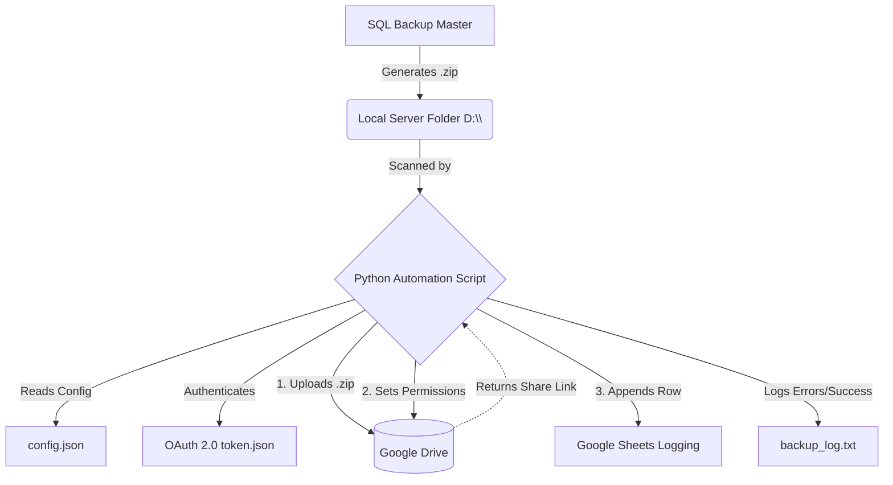
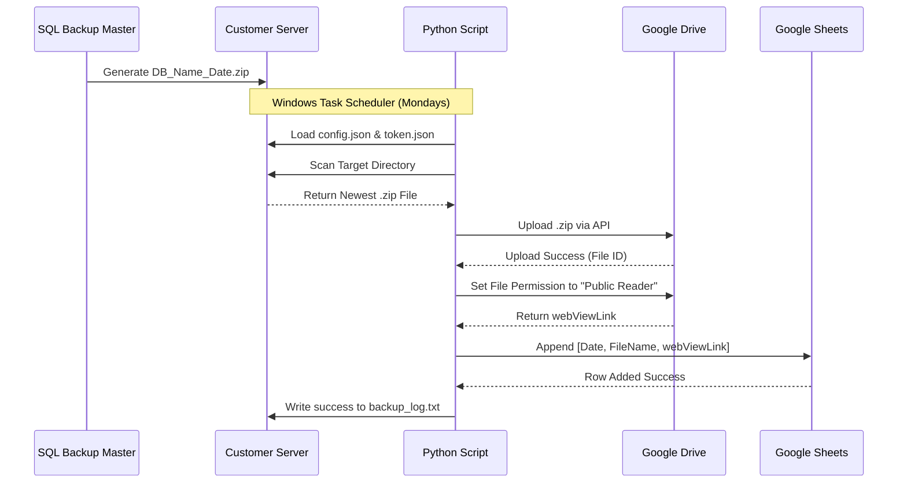

# Database Backup Automation System
**Technical Documentation & Deployment Guide**

---

## 1. Executive Summary
The Database Backup Automation System is a robust, Python-based utility designed to bridge the gap between local database backups and cloud storage. By leveraging Google's OAuth 2.0 API, the system automatically detects, securely uploads, and logs daily database backups to Google Drive and Google Sheets. It is built with a focus on bulletproof error handling, configuration-driven deployments, and zero-touch operation on customer servers.

## 2. System Architecture

The architecture consists of three core layers:
1. **Generation Layer:** Local SQL database backups.
2. **Automation Layer:** Python environment executing the `auto_backup.py` script.
3. **Cloud Layer:** Google APIs handling storage and database logging.

### 2.1 Component Diagram



### 2.2 Sequence Diagram



---

## 3. Technology Stack
- **Language:** Python 3.x
- **Core Libraries:** 
  - `google-api-python-client` (Drive API)
  - `google-auth-oauthlib` (OAuth 2.0 User Flow)
  - `gspread` (Google Sheets REST API)
- **Authentication:** OAuth 2.0 Client ID (Desktop Application)
- **Deployment Platform:** Windows Server (Task Scheduler)

---

## 4. Configuration Management

The system is entirely configuration-driven. No source code modifications are required for deployment. All settings are managed in `config.json`.

### `config.json` Specification
| Key | Type | Description |
|---|---|---|
| `BACKUP_FOLDER` | String | Absolute path to the local backup directory. |
| `BACKUP_EXTENSION` | String | The file extension to search for (e.g., `.zip`). |
| `TARGET_DATABASES` | Array[String] | List of database prefixes to back up. |
| `GOOGLE_DRIVE_FOLDER_ID` | String | The unique ID of the target Google Drive folder. |
| `GOOGLE_SHEET_ID` | String | The unique ID of the Google Sheet for logging. |
| `STRICTLY_MONDAYS_ONLY` | Boolean | Safety toggle to prevent script execution on non-Mondays. |

---

## 5. Deployment & Setup Guide

Deploying this solution to a new customer server requires a one-time authentication step locally, followed by a simple file transfer to the customer server.

### Phase 1: Local Preparation (Authentication)
Because the script utilizes Google's OAuth 2.0 flow (to securely access your 15GB Drive quota), it requires a web browser to grant permissions during the first run.
1. Place `client_secret.json` in the `BackupAutomation` folder on your local PC.
2. Open Command Prompt and run: `python auto_backup.py`
3. A web browser will open. Log into the Master Google Account.
4. Click **Advanced -> Go to App (unsafe)** and grant all permissions.
5. The script will generate a `token.json` file. **This file represents the permanent authorization.**

### Phase 2: Server Deployment
1. Copy the entire `BackupAutomation` folder (which now includes `auto_backup.py`, `config.json`, `client_secret.json`, and `token.json`) to the customer's server.
2. Ensure Python is installed on the customer's server.
3. Open Command Prompt on the server and install the required dependencies:
   ```cmd
   pip install google-api-python-client google-auth-oauthlib gspread
   ```
4. Open `config.json` on the server and modify the `BACKUP_FOLDER` to match the customer's local drive path. Add any specific `TARGET_DATABASES` required for that customer.

### Phase 3: Task Scheduler Setup
1. Open **Windows Task Scheduler** on the customer server.
2. Click **Create Basic Task**. Name it "Database Cloud Backup".
3. Trigger: Set to **Weekly**, select **Monday**, and choose an appropriate time (e.g., 2:00 AM, ensuring it runs *after* SQL Backup Master has finished).
4. Action: **Start a Program**.
   - **Program/script:** `python`
   - **Add arguments:** `auto_backup.py`
   - **Start in:** `C:\Path\To\BackupAutomation\` (The folder containing the script).
5. Save the task.

---

## 6. Error Handling & Diagnostics

The script is built with resilient error handling designed for unattended server environments:
- **Missing Directories:** Validates `BACKUP_FOLDER` existence before executing.
- **File Locks:** Detects if the backup file is currently locked by another process (e.g., actively being written to) and aborts to prevent corrupt uploads.
- **Storage Full (Quota Limits):** Explicitly catches Google API Quota errors (`403 storageQuotaExceeded`). If the customer's Google Drive is completely full, it immediately aborts the upload and logs a critical alert to prevent endless, wasteful retries.
- **API Retries:** Google Drive uploads implement a 3-attempt retry loop with exponential backoff to handle transient network drops.
- **Logging:** All events, including successful uploads, skipped databases, and API errors, are appended to `backup_log.txt` with UTC timestamps for easy auditing.
