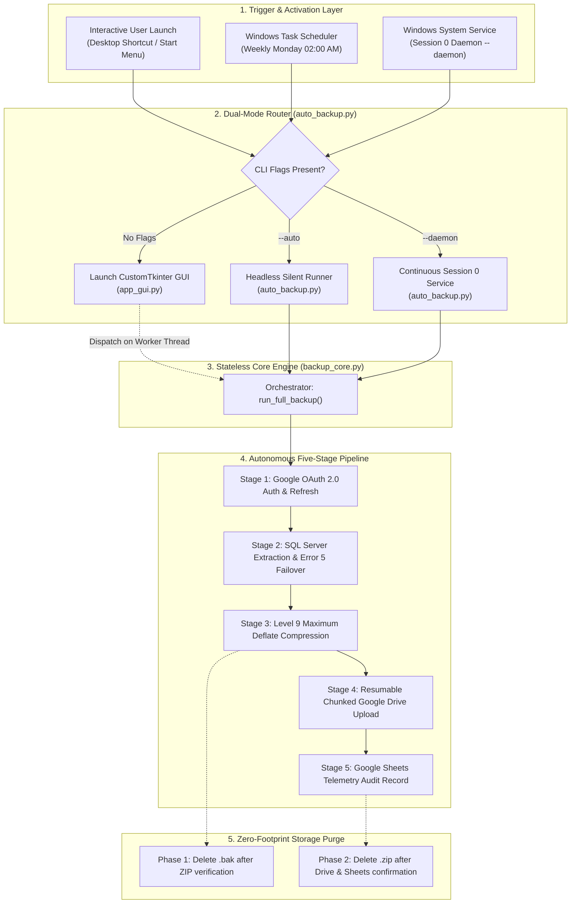
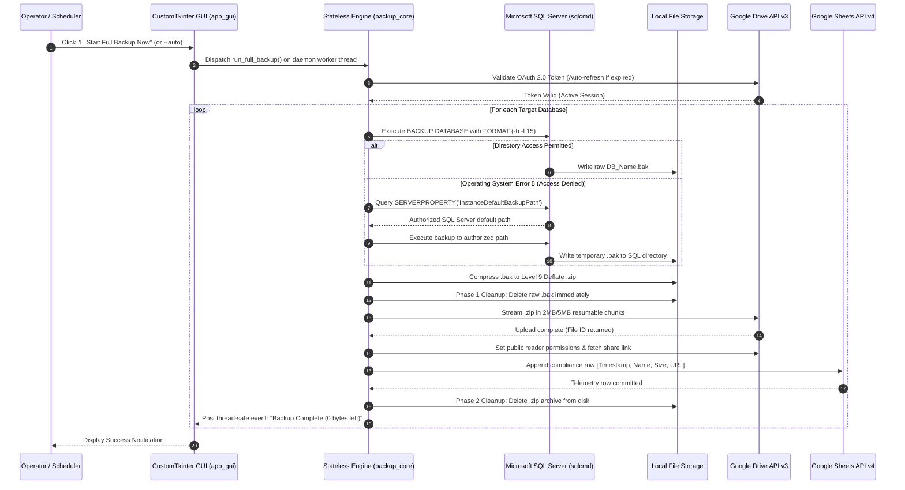
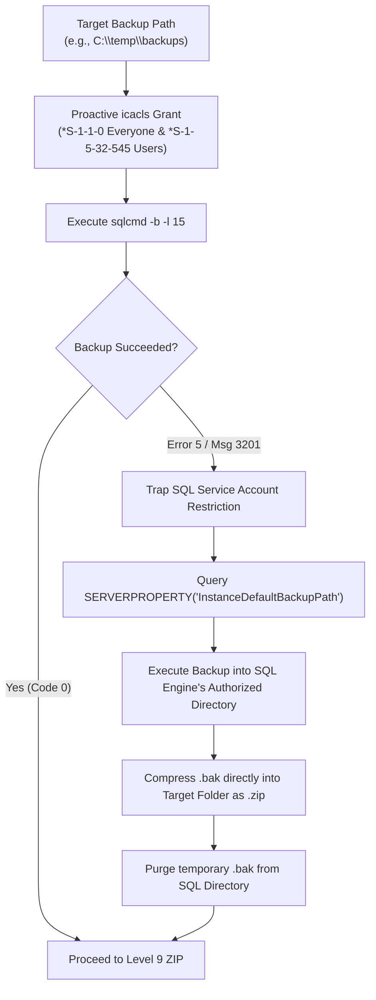
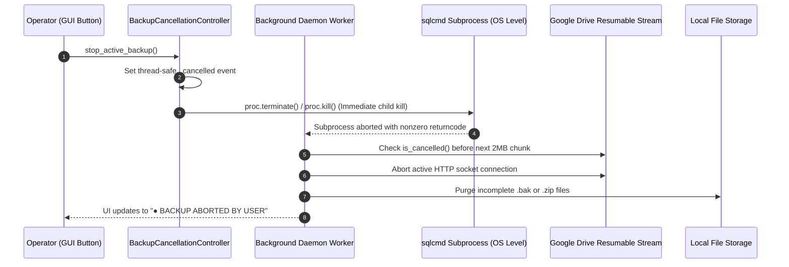
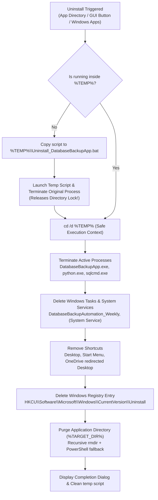

# Enterprise Database Cloud Backup Automation System
**Comprehensive Technical Architecture, Engineering Documentation & Operational Runbook**

---

<div align="center">
  
  <br>
  <h1>Enterprise Database Cloud Backup Automation</h1>
  <p><strong>Autonomous Zero-Touch SQL Server Cloud Disaster Recovery & Telemetry Pipeline</strong></p>
  <p>
    
    
    
    
  </p>
</div>

---

## 1. Executive Summary

The **Enterprise Database Cloud Backup Automation System** is an industrial-grade, client-side backup and disaster recovery solution engineered specifically for Microsoft SQL Server environments across Windows Server, Remote Desktop Services (RDS/RDP), and standalone workstations.

It replaces fragile third-party tools and complex backup licensing models with a high-performance, autonomous native engine. Built on a clean **Model-View-Controller (MVC)** separation, the system pairs a headless, thread-safe core engine (`backup_core.py`) with a modern Windows 11 CustomTkinter desktop interface (`app_gui.py`), an autonomous deployment wizard (`installer_gui.py`), and a self-migrating clean uninstallation system (`Uninstall.bat`).

### Core Business & Technical Objectives
1. **100% Unattended Reliability:** Executes in Session 0 as an isolated Windows System Service (`NT AUTHORITY\SYSTEM`), surviving machine reboots, headless boots, and disconnected RDP sessions.
2. **Zero Local Storage Overhead:** Implements a two-phase cleanup pipeline that completely purges both raw `.bak` files and compressed `.zip` archives upon cloud verification, maintaining a zero-byte persistent footprint.
3. **Autonomous Self-Healing:** Detects and overcomes Windows NTFS directory security barriers and SQL Server Service Account restrictions (`Operating system error 5: Access is denied`) via dynamic native path failover.
4. **Immediate Operator Control:** Incorporates a thread-safe Emergency Stop controller (`🛑 STOP BACKUP`) capable of aborting active SQL processes, terminating child subroutines, severing network streams, and purging partial data in under 500 milliseconds.
5. **Centralized Compliance Telemetry:** Streams real-time audit records into a centralized Google Sheet, furnishing infrastructure teams with instant visibility across all client deployments.

---

## 2. End-to-End System Architecture

The architecture strictly decouples the core backup logic from the user presentation layer. The core engine is stateless, multi-thread safe, and completely free of GUI library imports.

### 2.1 High-Level Architecture Diagram



---

## 3. End-to-End Sequence Diagram

The following sequence illustrates the full transaction lifecycle from initiation to cloud verification and storage cleanup:



---

## 4. Key Engineering Innovations & Breakthroughs

### 4.1 Unattended Windows System Service & Session 0 Isolation
In mission-critical enterprise environments, servers reboot automatically during weekend maintenance windows, remaining at the Windows lock screen without any interactive user logged in. Furthermore, administrators connected via Remote Desktop (RDP) frequently disconnect, which abruptly kills traditional user-space scheduled tasks.

* **Execution Context:** The service executes under `NT AUTHORITY\SYSTEM` with `/rl HIGHEST`.
* **Session 0 Security:** Operates completely isolated in Windows Session 0, immune to interactive user logoffs, profile locks, or RDP disconnects.
* **Continuous Background Polling (`--daemon`):** When deployed with `--daemon` or `--service`, `auto_backup.py` polls scheduled execution triggers while maintaining an ultra-lightweight memory profile (~35 MB).

```
+-------------------------------------------------------------------------+
|                           WINDOWS SERVER HOST                           |
|                                                                         |
|  +-------------------------------------------------------------------+  |
|  | [SESSION 0] PROTECTED SYSTEM SERVICES (NON-INTERACTIVE)           |  |
|  |                                                                   |  |
|  |   +-------------------------------------------------------------+ |  |
|  |   | Database Cloud Backup (System Service)                     | |  |
|  |   | Context: NT AUTHORITY\SYSTEM | Level: /rl HIGHEST           | |  |
|  |   | Survives Reboots, Survives RDP Signouts, 100% Unattended    | |  |
|  |   +-------------------------------------------------------------+ |  |
|  +-------------------------------------------------------------------+  |
|                                                                         |
|  +-------------------------------------------------------------------+  |
|  | [SESSION 1+] INTERACTIVE USER CONTEXT (RDP / CONSOLE)             |  |
|  |                                                                   |  |
|  |   +------------------------------------+                          |  |
|  |   | Administrator RDP Session          |                          |  |
|  |   | (May log off, disconnect, or lock) |                          |  |
|  |   +------------------------------------+                          |  |
|  +-------------------------------------------------------------------+  |
+-------------------------------------------------------------------------+
```

---

### 4.2 Self-Healing SQL Server Error 5 (Operating System Error 5: Access is Denied)

A frequent failure on locked-down client machines occurs when SQL Server is requested to write directly to a user's desktop or documents folder:
```text
Cannot open backup device 'C:\Users\Admin\Desktop\backup.bak'.
Operating system error 5 (Access is denied).
Msg 3013, Level 16, State 1, Msg 3201.
```

#### Cause
Microsoft SQL Server runs under a dedicated virtual service account (`NT SERVICE\MSSQLSERVER` or `NT SERVICE\MSSQL$SQLEXPRESS`). By default, Windows NTFS security prevents service accounts from writing into user profiles, even if the user running the application is a full local administrator.

#### The Autonomous Self-Healing Pipeline


1. **Proactive Language-Neutral ACL Grants:** Uses well-known security identifiers (`*S-1-1-0` for Everyone, `*S-1-5-32-545` for Built-in Users) to avoid localization crashes on non-English Windows editions.
2. **Native Failover Query:** Queries SQL Server's internal configuration:
   ```sql
   SELECT CAST(SERVERPROPERTY('InstanceDefaultBackupPath') AS VARCHAR(500))
   ```
3. Writes the temporary `.bak` to the guaranteed-accessible engine folder, streams it directly into a Level 9 `.zip` archive in the destination directory, and immediately purges the temporary `.bak`.

---

### 4.3 Thread-Safe Emergency Stop & Cancellation Architecture

Enterprise databases often scale to hundreds of gigabytes. If an operator requires immediate system relief during an active backup, clicking `"🛑 STOP BACKUP"` triggers the `BackupCancellationController`:



* **Instant Process Termination:** Immediately terminates active OS child processes (`sqlcmd.exe`), releasing database table locks.
* **Socket Disconnection:** Interrupts 2MB resumable Google Drive upload streams mid-transmission without waiting for multi-gigabyte transfers to complete.
* **Zero Residual Leftovers:** Cleans up partial `.bak` and `.zip` files so no corrupt files remain on disk.

---

### 4.4 Enterprise Clean Uninstallation Architecture (Self-Migrating Batch Pattern)

When an uninstaller batch script (`Uninstall.bat`) is launched from inside the application directory, `cmd.exe` holds an active lock on the file and its parent folder. Any attempt to run `rmdir /s /q` results in an *"Access is denied"* error.

The solution is the **Self-Migrating Batch Pattern**:



---

## 5. Visual Interface Walkthrough & Screenshots

### 5.1 Interactive Dashboard & Live Execution Logs
The desktop application provides full diagnostic visibility, live log streaming with severity color-coding, and one-click manual execution:

<div align="center">
  
  <br>
  <em>Figure 1: Desktop GUI Dashboard showing live execution diagnostics, active cards, and status telemetry</em>
</div>

```
┌─────────────────────────────────────────────────────────────────────────────────────────────┐
│ 🛡️ Database Cloud Backup Automation — Enterprise Edition                         [—] [□] [✕] │
├─────────────────────────────────────────────────────────────────────────────────────────────┤
│   [ 📊 Dashboard ]     [ ⏰ Auto Schedule ]     [ ⚙️ Settings ]     [ 🩺 Diagnostics ]       │
├─────────────────────────────────────────────────────────────────────────────────────────────┤
│                                                                                             │
│  ┌─────────────────────┐   ┌─────────────────────┐   ┌───────────────────────────────────┐  │
│  │ 🖥️ SQL Server       │   │ 🗄️ Target DBs       │   │ ☁️ Google Cloud Connection        │  │
│  │ localhost\SQLEXPRESS│   │ 2 Databases Config. │   │ OAuth 2.0 Ready (15 GB Storage)   │  │
│  │ Status: ● CONNECTED │   │ [ProductionDB, CRM] │   │ Status: ● AUTHENTICATED           │  │
│  └─────────────────────┘   └─────────────────────┘   └───────────────────────────────────┘  │
│                                                                                             │
│  ┌───────────────────────────────────────────────────────────────────────────────────────┐  │
│  │ 🚀 [ Start Full Backup Now ]                🛑 [ STOP BACKUP (Emergency Abort) ]      │  │
│  └───────────────────────────────────────────────────────────────────────────────────────┘  │
│                                                                                             │
│  Backup Progress: [████████████████████████████████████████████████░░░░░░░░░░] 78%           │
│  Current Operation: Uploading 'ProductionDB_20260924.zip' to Google Drive (2MB/s)...        │
│                                                                                             │
│  ┌─ Real-Time Diagnostics & Execution Log ────────────────────────────────────────────────┐  │
│  │ [17:06:19] [INFO] STARTING BACKUP EXECUTION CYCLE                                      │  │
│  │ [17:06:19] [INFO] Connecting to SQL Server: localhost\SQLEXPRESS...                   │  │
│  │ [17:06:22] [SUCCESS] SQL backup completed for 'ProductionDB' (455 MB).                 │  │
│  │ [17:06:25] [SUCCESS] Compressed to Level 9 Deflate: ProductionDB_20260924.zip (81 MB) │  │
│  │ [17:06:26] [INFO] Streaming archive to Google Drive Folder: 1LKuo7j4cHvvP0...          │  │
│  └────────────────────────────────────────────────────────────────────────────────────────┘  │
│                                                                                             │
│  [ 📁 Open Backups ]    [ ☁️ Open Drive ]    [ 📊 Open Sheet ]    [ 🧹 Clean Storage (0 MB) ]│
└─────────────────────────────────────────────────────────────────────────────────────────────┘
```

---

### 5.2 Autonomous Setup Wizard
The client deployment package features a standalone wizard (`Setup_DatabaseBackup.exe`) requiring zero pre-installed runtimes:

<div align="center">
  
  <br>
  <em>Figure 2: Standalone Installation Wizard with directory selection and automated service setup</em>
</div>

* **Target Directory Selection:** Allows administrators to install in standard user space or dedicated server drives.
* **Shortcut Management:** Creates high-resolution shortcuts across local and OneDrive-redirected desktops.
* **Automatic Service Registration:** Configures the unattended scheduled task or Windows System Service directly from the installer.

---

### 5.3 Google Cloud Platform & OAuth 2.0 Security
The application connects via Google Cloud's Production OAuth 2.0 pipeline, ensuring that backups land in dedicated user storage quotas (15GB free or Google Workspace) without domain delegation expenses:

<div align="center">
  
  <br>
  <em>Figure 3: Google Cloud Platform OAuth Consent Screen & Scopes Configuration</em>
</div>

* **Restricted Least-Privilege Scopes:**
  - `drive.file`: Grants read/write access **only** to files created by the application itself.
  - `spreadsheets`: Grants append access **only** to the designated compliance audit sheet.
* **Offline Token Rotation:** Acquires a persistent `refresh_token` that rotates hourly access tokens silently without user intervention.

---

## 6. Configuration & Credential Reference

### 6.1 `config.json` Specification

| Parameter | Type | Default | Description |
| :--- | :--- | :--- | :--- |
| `SQL_SERVER_NAME` | String | `localhost\SQLEXPRESS` | Name or network address of the SQL Server instance. |
| `SQL_USERNAME` | String | `""` | Optional SQL authentication login (leave empty for Windows Auth). |
| `SQL_PASSWORD` | String | `""` | Optional SQL authentication password. |
| `BACKUP_FOLDER` | String | `C:\temp\backups` | Target directory for backup staging and compression. |
| `BACKUP_EXTENSION` | String | `.zip` | Compression file extension. |
| `TARGET_DATABASES` | List[String] | `[]` | List of databases targeted for automatic backup cycles. |
| `GOOGLE_DRIVE_FOLDER_ID` | String | `""` | Target Google Drive folder alphanumeric identifier. |
| `GOOGLE_SHEET_ID` | String | `""` | Alphanumeric identifier of the compliance logging Google Sheet. |
| `STRICTLY_MONDAYS_ONLY` | Boolean | `true` | Restricts automated execution strictly to Mondays. |
| `SCHEDULE_TIME` | String | `"02:00"` | Daily execution time (24-hour HH:MM format). |
| `DELETE_LOCAL_AFTER_UPLOAD` | Boolean | `true` | Enables Phase 2 storage cleanup (maintains zero bytes persistent). |

---

## 7. Production Deployment & Operational Runbook

### Quick Client Deployment (3 Simple Steps)
1. **Extract Package:** Unpack `Client_Installation_Package.rar` onto the customer machine.
2. **Execute Installer:** Run `Setup_DatabaseBackup.exe` (or `1_Quick_Install.bat`).
3. **Authenticate Cloud Storage:**
   - Launch the application from the desktop shortcut.
   - Click `"🚀 Start Full Backup Now"` once.
   - A secure browser window opens. Log into the organization's Google Account and grant permission.
   - The token is saved permanently to `credentials.json`.
4. **Configure Unattended Automation:**
   - Navigate to the **⏰ Auto Schedule** tab.
   - Select **⚡ Unattended Windows System Service (Recommended for Servers / RDP)**.
   - Click **Save Schedule Settings**. The system is now 100% autonomous.

### Complete Uninstallation
To completely remove the software with zero residual files:
- Go to **Settings** in the desktop application &rarr; click **🗑️ Uninstall Application**, OR
- Run `Uninstall.bat` inside the installation folder (`%LOCALAPPDATA%\Programs\DatabaseBackupApp\Uninstall.bat`), OR
- Open Windows **Settings &rarr; Apps &rarr; Installed Apps** &rarr; select **Database Cloud Backup** &rarr; click **Uninstall**.

---

<div align="center">
  <p><strong>Database Cloud Backup Automation System</strong> — Engineered for Enterprise Resilience.</p>
</div>
