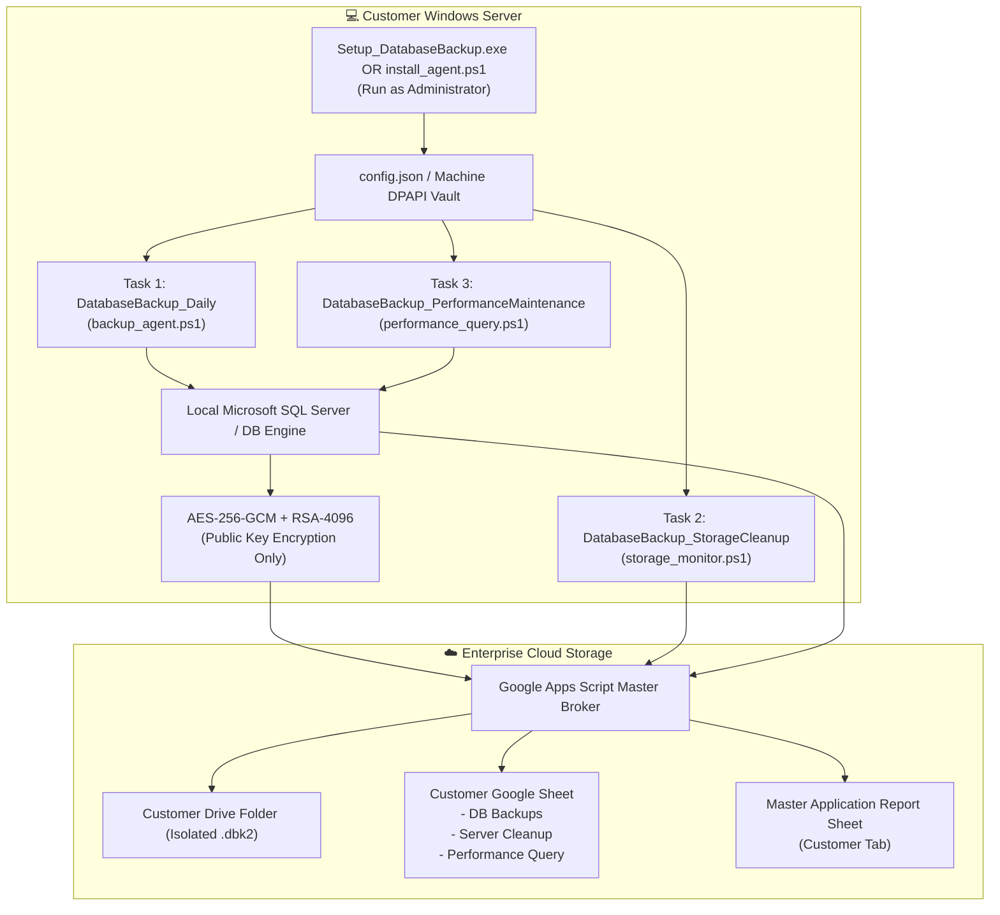

# 📦 Client / Customer Installation & Operations Guide
### Enterprise Database Cloud Backup & Maintenance Suite · v4.2.0

This guide is designed for **customer system administrators, IT support technicians, and server engineers** deploying the **Enterprise Database Cloud Backup & Maintenance Suite** on a customer Windows Server or SQL host.

---

## 🎯 Overview & Security Highlights

The client installation package runs entirely on the customer's server without requiring any Google accounts, cloud credentials, or administrative access to the central cloud repository.



### Key Security & Operational Guarantees:
1. **Zero Client Cloud Credentials**: The customer machine holds **zero Google OAuth tokens, API secrets, or service account keys**.
2. **One-Way Encryption Only**: Only public keys (`backup_public.pem`, `escrow_public.pem`) reside on the client server. Even if an attacker gains full root/admin on the server, they **cannot** decrypt current or historical backups.
3. **Zero Python Required on Client**:
   - **Track 1 (Pure PowerShell Agent)**: 100% native Windows PowerShell using built-in Windows .NET Cryptography (`RSACng`, `AES`, `ProtectedData` DPAPI) and Windows Task Scheduler.
   - **Track 2 (Standalone Executable)**: Self-contained Windows `.exe` installer and application.
4. **Three Independent Maintenance Modules**:
   - **Database Backup**: Differential / Full database backups, streaming compression, AES-256-GCM encryption, chunked cloud upload.
   - **Server Cleanup Scan**: Monitored disk threshold enforcement, aged staging cleanup, log rotation.
   - **Performance Query**: Index fragmentation inspection, pre-maintenance safety backup, database consistency (`DBCC CHECKDB`), index rebuild (`DBCC DBREINDEX` at FillFactor 80), and statistics update (`sp_updatestats`).

---

## 📋 System Requirements

| Requirement | Specification |
|---|---|
| **Operating System** | Windows Server 2016, 2019, 2022, 2025 or Windows 10/11 (64-bit) |
| **Permissions** | Local Administrator rights (required for Windows Task Scheduler) |
| **Database Engines** | Microsoft SQL Server (2012 through 2025), Express, Standard, or Enterprise |
| **Network** | Outbound HTTPS (Port 443) to `script.google.com` and `drive.google.com` |
| **Runtime Requirements** | **Zero Python required**. Uses native Windows PowerShell 5.1+ or compiled `.exe`. |

---

## 🚀 Deployment Track 1: Native Windows PowerShell Agent (Recommended for Servers)

*This is the cleanest, zero-footprint option for enterprise servers.*

### Step 1: Place Package on Server
Extract the customer installation zip to a local folder, such as:
`C:\Tools\Client_Installation_Package`

### Step 2: Open Elevated PowerShell (Run as Administrator)
Right-click Windows Start menu and select **Windows PowerShell (Admin)** or **Terminal (Admin)**.

Navigate to the `shell_client` folder:
```powershell
cd C:\Tools\Client_Installation_Package\shell_client
```

### Step 3: Run the Agent Installer
Run the installer script:
```powershell
powershell.exe -ExecutionPolicy Bypass -File .\install_agent.ps1
```

The installer will:
1. Install client scripts into `C:\ProgramData\DatabaseBackupApp\shell_client`.
2. Secure the public encryption keys (`backup_public.pem`, `escrow_public.pem`).
3. Set up the local staging directories (`C:\Backups\Staging`).
4. Register the three scheduled tasks in Windows Task Scheduler:
   - `DatabaseBackup_Daily` (Runs daily database backup & cloud upload)
   - `DatabaseBackup_StorageCleanup` (Runs automated disk cleanup scan)
   - `DatabaseBackup_PerformanceMaintenance` (Runs weekly/scheduled performance queries)

---

## 🖥️ Deployment Track 2: Graphical Setup Wizard (`Setup_DatabaseBackup.exe`)

*For visual installation with desktop control panel.*

1. Right-click `Setup_DatabaseBackup.exe` and select **Run as administrator**.
2. Review the destination folder (defaults to `C:\Program Files\DatabaseBackupApp`).
3. Confirm the configuration and click **Install**.
4. The setup wizard copies all application files, registers background tasks, and installs the desktop shortcut.

---

## ⚙️ Configuration (`config.json`)

If customizing connection parameters manually, open `C:\ProgramData\DatabaseBackupApp\config.json`:

```json
{
  "CUSTOMER_SLUG": "mycustomer",
  "BROKER_URL": "https://script.google.com/macros/s/AKfycb.../exec",
  "DB_TYPE": "mssql",
  "DB_NAME": "TheDatabase",
  "DB_SERVER": "localhost",
  "BACKUP_DIR": "C:\\Backups\\Staging",
  "RETENTION_DAYS": 30,
  "CLEANUP_THRESHOLD_PERCENT": 85,
  "PERFORMANCE_SCHEDULE_DAY": "Sunday",
  "PERFORMANCE_SCHEDULE_TIME": "03:30"
}
```

---

## 🧪 Testing & Verification

You can run each module immediately from an elevated PowerShell prompt to test end-to-end operation:

### 1. Test Database Backup
```powershell
powershell.exe -ExecutionPolicy Bypass -File C:\ProgramData\DatabaseBackupApp\shell_client\backup_agent.ps1 -DatabaseName "TheDatabase"
```

### 2. Test Server Cleanup Scan
```powershell
powershell.exe -ExecutionPolicy Bypass -File C:\ProgramData\DatabaseBackupApp\shell_client\storage_monitor.ps1
```

### 3. Test Performance Maintenance Query
```powershell
powershell.exe -ExecutionPolicy Bypass -File C:\ProgramData\DatabaseBackupApp\shell_client\performance_query.ps1 -DatabaseName "TheDatabase" -Mode "Manual"
```

### 4. Master Orchestrator (Runs All Configured Modules)
```powershell
powershell.exe -ExecutionPolicy Bypass -File C:\ProgramData\DatabaseBackupApp\shell_client\run_automation.ps1 -Task All -Mode "Manual"
```

---

## 🔍 Log Files & Troubleshooting

- **Local Backup Logs**: `C:\ProgramData\DatabaseBackupApp\logs\backup.log`
- **Performance Logs**: `C:\ProgramData\DatabaseBackupApp\logs\performance_query.log`
- **Storage Cleanup Logs**: `C:\ProgramData\DatabaseBackupApp\logs\storage_cleanup.log`
- **Scheduled Tasks**: Open Windows Task Scheduler (`taskschd.msc`) -> expand **Task Scheduler Library** -> view tasks prefixed with `DatabaseBackup_`.
