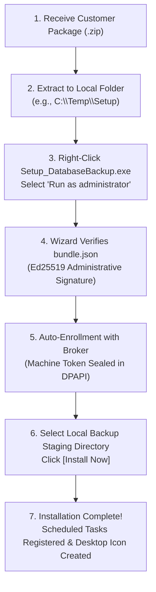

# 📦 User Installation & Deployment Guide
### Enterprise Database Cloud Backup Automation · v4.2.0

This guide is designed for **system administrators, IT support technicians, and end-users** installing the **Enterprise Database Cloud Backup Automation** system on a customer Windows server or PC.

---

## 🎯 Quick Installation Summary (Zero-Typing Experience)



---

## 📋 System Requirements & Prerequisites

| Requirement | Specification |
|---|---|
| **Operating System** | Windows 10, Windows 11, Windows Server 2016, 2019, 2022, 2025 (64-bit) |
| **Permissions** | Local Administrator rights (required for Windows Scheduled Task and DPAPI vault) |
| **Database Engines** | Microsoft SQL Server (2012–2022), MySQL (5.7, 8.0+), PostgreSQL (12+) |
| **Network Access** | Outbound HTTPS (Port 443) to `script.google.com` and `drive.google.com` |
| **Disk Space** | Minimum 500 MB free for application files; local staging folder requires 2.5× database size |

> [!IMPORTANT]
> **No Cloud Credentials Needed**: The client machine requires **no** Google account logins, OAuth tokens, or service account keys. All communications are mediated through the stateless Zero-Trust Upload Broker.

---

## 🚀 Step-by-Step Installation Walkthrough

### Step 1: Extract the Customer Deployment Package
You will receive a tailored customer deployment package (e.g., `acme_package.zip`).
1. Download or copy the `.zip` file to the target machine.
2. Extract the archive into a dedicated temporary folder (e.g., `C:\Temp\Installer` or Desktop).
3. Confirm that the extracted directory contains:
   * `Setup_DatabaseBackup.exe` — The graphical setup wizard.
   * `bundle.json` — The cryptographically signed configuration envelope.
   * `AppFiles/` — Contains application binaries (`DatabaseBackupApp.exe`), runtime libraries, and public keys (`backup_public.pem`, `escrow_public.pem`).

---

### Step 2: Run the Installer as Administrator
1. Locate **`Setup_DatabaseBackup.exe`**.
2. **Right-click** the executable and select **Run as administrator**.
3. When prompted by Windows User Account Control (UAC), click **Yes**.

---

### Step 3: Automated Bundle Verification & Enrollment
The installer wizard will open and automatically perform security checks:

1. **Digital Signature Verification**:
   The installer verifies `bundle.json` using the embedded administrative **Ed25519 public key**.
   * If verified, the configuration parameters (Broker URL, Customer Slug) are unlocked and pre-populated.
   * If modified or tampered with, installation is immediately blocked (`ERR_BUNDLE_TAMPERED`).

2. **Broker Connectivity & Health Ping**:
   The installer tests connection to the Google Apps Script Upload Broker.

3. **Machine Fingerprinting & Enrollment**:
   * The installer computes a unique hardware fingerprint (`SHA-256` of Motherboard UUID + CPU ID + MAC address).
   * It presents the single-use `ENROLL_CODE` from the bundle to the Broker.
   * The Broker authorizes the machine, registers the PC, and issues a dedicated machine token.

4. **Windows DPAPI Vault Sealing**:
   * The issued token is sealed into Windows DPAPI storage:  
     `C:\ProgramData\DatabaseBackupApp\token.dpapi`
   * The token is encrypted using the machine and service context (`CRYPTPROTECT_UI_FORBIDDEN`), ensuring it cannot be extracted or copied to another machine.

> [!NOTE]
> **Zero Typing Required**: You do not need to type or copy-paste any URLs, keys, or tokens. Everything is handled automatically.

---

### Step 4: Configure Local Backup Staging Directory
In the setup wizard:
1. Review the pre-populated configuration.
2. Choose a local folder for temporary staging during backups (e.g., `C:\SQLBackups` or `D:\DatabaseBackups`).
3. **Safety Protection**: The installer automatically blocks selection of cloud-synced folders (such as OneDrive, Dropbox, or Google Drive) to prevent file-locking conflicts.

---

### Step 5: Click `[Install Now]`
Click the **Install Now** button. The installer completes the following setup actions:
* Copies all binaries and runtime assets to `C:\Program Files\DatabaseBackupApp\`.
* Hardens NTFS folder permissions using Windows `icacls.exe`.
* Creates a desktop shortcut: **Database Backup Application**.
* Registers unattended background tasks in **Windows Task Scheduler**:
  * **Daily Automated Backup**: Configured to run every morning at 02:00 AM (+ staggered offset).
  * **Storage Health Monitor**: Configured to monitor free disk space and telemetry.

A success screen will confirm: **"Installation & Registration Complete!"**

---

## 🖥️ Verifying the Installation

### 1. Test from the Desktop GUI
1. Double-click the **Database Backup Application** shortcut on the Windows Desktop.
2. Confirm that the dashboard status shows **Ready**.
3. Select your database engine (e.g., **Microsoft SQL Server**).
4. Click **`[Run Backup Now]`** to perform a test backup cycle.
5. Switch to the **Live Execution Logs** tab to watch the real-time progress:
   * Pre-flight checks pass.
   * Database dump is created and compressed.
   * Dump is encrypted with AES-256-GCM + dual RSA-4096 into `.dbk2` format.
   * Plaintext dump is wiped.
   * Resumable upload session is established with Google Drive.
   * Encrypted file is streamed and verified.

### 2. Verify Windows Task Scheduler
1. Press `Win + R`, type `taskschd.msc`, and press **Enter**.
2. Click **Task Scheduler Library**.
3. Verify that the task **`DatabaseBackup_AutomatedTask`** is registered and set to **Ready**.

### 3. Check Persistent Log File
All application activities are recorded in:
```text
C:\ProgramData\DatabaseBackupApp\backup_log.txt
```

---

## 🛠️ Troubleshooting Common Installation Issues

| Issue / Error | Cause | Resolution |
|---|---|---|
| **`ERR_BUNDLE_TAMPERED`** | The `bundle.json` file was modified or corrupted during download. | Re-extract the original `.zip` package sent by the administrator. |
| **`ERR_NOT_APPS_SCRIPT`** | Broker URL does not match `https://script.google.com/macros/s/.../exec`. | Re-provision the package with the correct Web App URL. |
| **`ERR_HEALTH_EXCEPTION`** | Target machine cannot reach Google Apps Script on port 443. | Check corporate proxy, firewall, or DNS resolution. |
| **`ERR_CLOUD_SYNC_DETECTED`** | Selected backup staging folder is inside OneDrive or Dropbox. | Change backup folder to a dedicated local directory (e.g. `C:\SQLBackups`). |
| **`ERR_SQL_CONN_FAILED`** | Cannot reach the local SQL Server instance. | Verify SQL Server is running and credentials are valid in the GUI. |
| **Access Denied / UAC** | Installer was not launched with elevated privileges. | Right-click `Setup_DatabaseBackup.exe` and select **Run as administrator**. |

---

## 🔐 Security & Disaster Recovery Reference

* **Where are backups stored?** Encrypted `.dbk2` archives are uploaded to the organization's Google Drive.
* **Can Google read the backups?** No. Backups are encrypted with AES-256-GCM using client-side RSA-4096 envelope keys before uploading. Google sees only opaque ciphertext.
* **How are backups restored?** Restores are performed offline using the administrator's private key and `Tools/decrypt_backup.py`.
