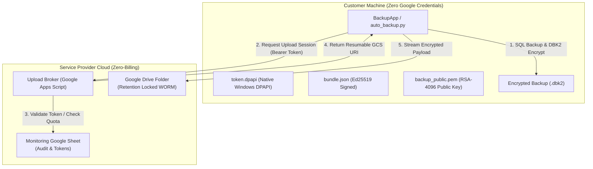

# 🛡️ Enterprise Database Cloud Backup Automation (Zero-Trust Security Architecture v4.2.0)

<div align="center">
  
  <br>
  <h3>Autonomous, Zero-Trust SQL Server Cloud Disaster Recovery & Telemetry System</h3>
  <p>
    
    
    
    
  </p>
</div>

---

## 📌 Executive Security Overview

The **Enterprise Database Cloud Backup Automation System (v4.2.0)** is an air-gapped, zero-trust cloud disaster recovery solution for Microsoft SQL Server deployments.

### Security Wall Architecture
- **Zero-Billing Google Infrastructure**: Transfers and audits use a completely free Google Apps Script Web App Broker. No Google Cloud Billing account required!
- **Zero Google Credentials on Client PCs**: Customer machines hold **no GCP service account keys, OAuth secrets, or credentials**. A compromised client machine cannot delete, read, list, or overwrite backups in the Cloud.
- **Client Authentication**: Authenticates strictly via native Windows DPAPI-protected per-PC Bearer token (`token.dpapi`) with zero external dependencies.
- **DBK2 Streaming Hybrid Encryption**: Backups are encrypted locally using authenticated AES-256-GCM. The AES key is wrapped for dual 4096-bit RSA keys (Primary + Escrow). Private keys remain **offline** on administrative recovery hardware.
- **One-Command Automated Customer Provisioning**: Admins generate dedicated, zero-friction installer packages for each customer in seconds using `Tools/setup_new_customer.py`. The customer clicks 'Install' with **Zero Typing**.

---

## 🏗 End-to-End Zero-Trust Architecture



---

## 📦 Directory Structure

```text
BackupAutomation/
├── apps_script_broker/
│   ├── Code.gs                      # 1-File Serverless Upload Broker (Google Apps Script)
│   └── pull_backup.py               # Air-gapped admin restore script
├── app_gui.py                       # Desktop interface v4.2.0
├── auto_backup.py                   # Command-line entrypoint & task router
├── backup_core.py                   # Backup orchestrator & DBK2 stream handler
├── broker_client.py                 # App-side HTTP client with native ctypes crypt32 DPAPI
├── crypto_stream.py                 # DBK2 AES-256-GCM + RSA-4096 hybrid stream encryption
├── installer_gui.py                 # Zero-Typing Setup Wizard (built via PyInstaller)
├── Tools/
│   ├── setup_new_customer.py        # 1-Command Automated Customer Installer & ZIP Generator
│   ├── decrypt_backup.py            # Air-gapped decryption utility
│   └── recover_package.py           # Disaster recovery package generator
├── README.md                        # Master repository guide
└── USER_GUIDE.md                    # Operational & disaster recovery runbook
```

---

## 🛠 Quick Start

### 1. Deploy Cloud Infrastructure
1. Create a Google Sheet with tabs: `Config`, `Tokens`, `Audit`, `Telemetry`.
2. Open **Extensions -> Apps Script** and paste `apps_script_broker/Code.gs`.
3. Deploy as a Web App (Execute as: You, Access: Anyone).

### 2. Generate Customer Installation Package
```bash
python Tools/setup_new_customer.py
```
* Generates secure 4096-bit RSA keys.
* Generates an Admin-signed `bundle.json`.
* Automatically copies the installer and application files into `customers/<slug>_package`.
* Outputs an `ENROLL_CODE` which you must paste into your Google Sheet's `Config` tab.

### 3. Customer Installation (Zero-Touch Client Experience)
1. Zip the `customers/<slug>_package` folder and send it to the customer.
2. The customer extracts the folder and runs **`Setup_DatabaseBackup.exe`** as Administrator.
3. The installer detects the `bundle.json` and automatically enrolls the PC. Zero typing required!
