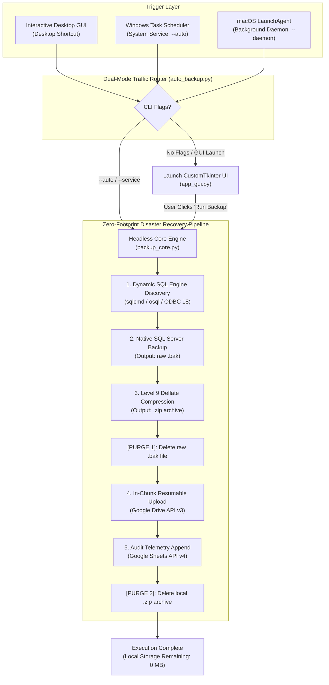

# 🛡️ Enterprise Database Cloud Backup Automation

<div align="center">
  
  <br>
  <h3>Autonomous, Zero-Touch SQL Server Cloud Disaster Recovery & Telemetry Pipeline</h3>
  <p>
    
    
    
    
    
    
  </p>
</div>

---

## 📌 Executive Overview

The **Enterprise Database Cloud Backup Automation System** is an industrial-grade, client-side disaster recovery and compliance solution engineered specifically for Microsoft SQL Server deployments across Windows Server, Remote Desktop Services (RDS/RDP), and standalone business workstations.

It replaces fragile third-party tools and expensive commercial software with a high-performance, autonomous native engine. Built on a clean **Model-View-Controller (MVC)** separation, the system pairs a headless, thread-safe core engine (`backup_core.py`) with a modern CustomTkinter desktop interface (`app_gui.py`), an autonomous deployment wizard (`installer_gui.py`), and a self-migrating clean uninstaller (`Uninstall.bat`).

<div align="center">
  
  <br>
  <em>Figure 1: Complete Operational Walkthrough — Installation Wizard, Executive Dashboard, Background Service Engine, and Real-Time Diagnostic Console</em>
</div>

---

## ✨ Key Enterprise Capabilities

- **🖥️ Unattended Windows System Service Mode:** Executes in isolated **Session 0** under `NT AUTHORITY\SYSTEM` with `/rl HIGHEST`. Runs at system startup before any user logs in, completely immune to RDP logoffs, locked user sessions, and automated weekend server reboots.
- **⚡ In-Chunk Resumable Cloud Transport:** Automatically uploads multi-gigabyte backup archives to Google Drive in 1MB chunks with 10 exponential backoff retries and 180s socket timeouts, effortlessly handling fluctuating or slow network connections without failing.
- **📊 Live Upload Speed & Progress Tracking:** Real-time visual progress bar showing exact transfer throughput (KB/s and MB/s), ETA timer, byte counters, and destination confirmation.
- **🛑 Thread-Safe Emergency Stop:** Provides an instantaneous `"🛑 STOP BACKUP"` control that terminates active `sqlcmd.exe` child processes, aborts Google Drive upload streams, and purges partial data from disk in under 500ms.
- **🛡️ Universal SQL Compatibility (SQL 2000–2022):** Dynamic detection from modern ODBC Driver 18 (with automatic TLS encryption bypass `-C`) down to legacy SQL Server 2000 via `osql.exe` and legacy system tables.
- **🛡️ SQL Server Error 5 & Msg 3201 Auto-Failover:** Autonomously traps and heals Windows NTFS permissions conflicts (`Operating system error 5: Access is denied`). If SQL Server's service account cannot write to a destination folder, it dynamically queries `SERVERPROPERTY('InstanceDefaultBackupPath')`, writes to the native engine folder, compresses to destination, and purges the temporary file.
- **🗜️ Maximum Deflation Compression:** Utilizes native Level 9 Deflate compression algorithms, reducing database dumps by **~80%** (e.g. 455 MB raw `.bak` compresses to ~80 MB `.zip`), minimizing upload payloads and bandwidth costs.
- **☁️ Zero-Footprint Two-Phase Purge:** Automatically deletes the raw `.bak` file upon compression, and purges the `.zip` archive upon cloud upload confirmation (`DELETE_LOCAL_AFTER_UPLOAD: true`). Maintains a permanent **0-byte persistent storage footprint** on the client machine.
- **📊 Real-time Compliance Telemetry:** Streams execution records (timestamp, database name, compressed size, and shareable Google Drive URL) directly into a centralized Google Sheet.
- **🗑️ Enterprise Clean Uninstallation (Zero-Leftovers Engine):** Features a detached background uninstaller that kills active processes, deletes scheduled tasks/services, cleans shortcuts, and purges the installation directory with zero leftovers.
- **📦 Zero-Dependency Standalone Executable:** Shipped as precompiled 64-bit Windows executables (`DatabaseBackupApp.exe` and `Setup_DatabaseBackup.exe`). Requires **zero Python installation or runtime setup** on client servers!

---

## 📸 Visual Tour & User Interface

### Executive Dashboard & Live Upload Progress

*Figure 2: Executive Dashboard featuring system status badge, server parameters, live upload progress bar with throughput & ETA, and one-click manual execution.*

### Unattended Scheduler & Service Configuration

*Figure 3: Unattended Background Engine configuration showing Session 0 System Service delegation, custom frequency modes, active day checkboxes, and 24-hour execution time selector.*

### Real-Time Execution Diagnostics & Logging

*Figure 4: Monospace dark console rendering auto-flushed operational events with direct log opening and clearing.*

---

## 🏗 End-to-End Architectural Decomposition



---

## 🚀 Quick Start & Deployment Guide

### Method A: Setup Wizard (Recommended for Administrators)
1. Launch `Setup_DatabaseBackup.exe`.
2. Choose installation folder and preferred options (Desktop Shortcut, Auto-Schedule).
3. Click **Install Now**. The setup deploys all files and configures background scheduling in seconds.

### Method B: Silent Scripted Install (For Customer Servers)
1. Open the deployment package folder.
2. Right-click [`1_Quick_Install.bat`](file:///c:/Users/dulla/OneDrive/Documents/Desktop/idea/Client_Installation_Package/1_Quick_Install.bat) and choose **Run as administrator**.
3. Installation completes automatically with zero user prompts.

---

## ⚙️ Configuration Reference (`config.json`)

```json
{
  "DB_SERVER": "localhost\\SQL25SARANGA",
  "DB_USER": "",
  "DB_PASSWORD": "",
  "TARGET_DATABASES": [
    "UserDB",
    "RGT"
  ],
  "LOCAL_BACKUP_DIR": "C:\\temp\\backups",
  "DRIVE_FOLDER_ID": "14X-x01-Zm4eU1h2qksm6eKhyvdY1-",
  "SHEET_ID": "1O7-sh1JTJas-JSmSkERepwfnrSm8kO-Tgwfld",
  "BACKUP_INTERVAL_HOURS": null,
  "SCHEDULE_DAYS": [
    "MON"
  ],
  "SCHEDULE_TIME": "02:00"
}
```

---

## 🔮 Next-Gen Module: Automated Database Performance Query System

Currently in active development:
- **Top Slow Query Interception:** Queries `sys.dm_exec_query_stats` to identify CPU-intensive queries and missing indexes.
- **Index Health & Fragmentation:** Analyzes `sys.dm_db_index_physical_stats` and flags tables requiring reindexing.
- **Memory & Buffer Pool Health:** Tracks Page Life Expectancy (PLE) and buffer cache hit ratios.
- **Pre-Backup Telemetry Hooks:** Runs non-intrusively prior to backup cycles and exports health scorecards directly to Google Sheets.

---
*Enterprise Database Cloud Backup Automation Suite — Production Release.*
