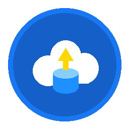
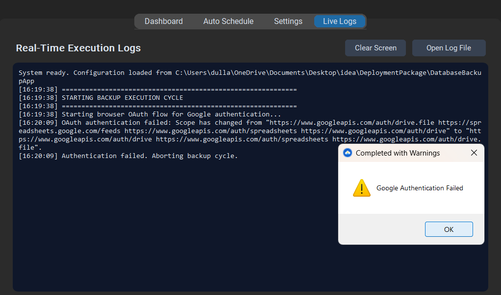
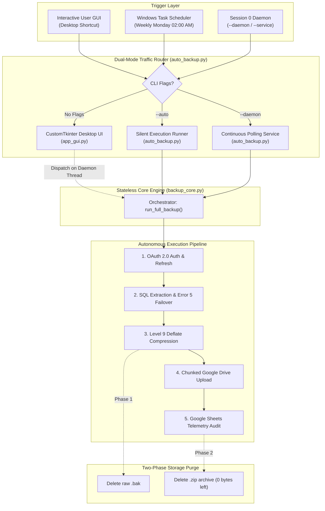
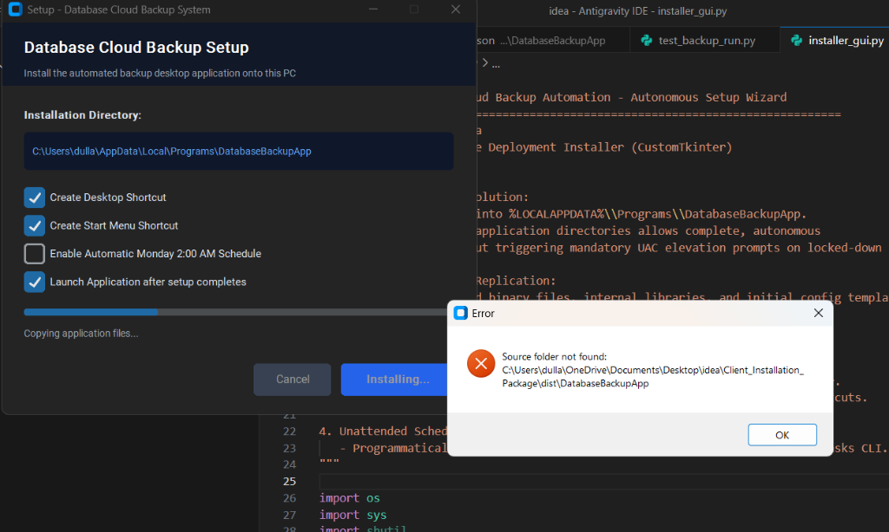

# 🛡️ Enterprise Database Cloud Backup Automation

<div align="center">
  
  <br>
  <h3>Autonomous, Zero-Touch SQL Server Cloud Disaster Recovery & Telemetry Pipeline</h3>
  <p>
    
    
    
    
    
    
  </p>
</div>

---

## 📌 Executive Overview

The **Enterprise Database Cloud Backup Automation System** is an industrial-grade, client-side disaster recovery and compliance solution engineered specifically for Microsoft SQL Server deployments across Windows Server, Remote Desktop Services (RDS/RDP), and standalone business workstations.

It replaces fragile third-party tools and expensive commercial software with a high-performance, autonomous native engine. Built on a clean **Model-View-Controller (MVC)** separation, the system pairs a headless, thread-safe core engine (`backup_core.py`) with a modern Windows 11 CustomTkinter desktop interface (`app_gui.py`), an autonomous deployment wizard (`installer_gui.py`), and a self-migrating clean uninstaller (`Uninstall.bat`).

<div align="center">
  
  <br>
  <em>Figure 1: Real-Time Execution Diagnostics, Emergency Stop Controls, and Dashboard Interface</em>
</div>

---

## ✨ Key Enterprise Capabilities

- **🖥️ Unattended Windows System Service Mode:** Executes in isolated **Session 0** under `NT AUTHORITY\SYSTEM` with `/rl HIGHEST`. Runs at system startup before any user logs in, completely immune to RDP logoffs, locked user sessions, and automated weekend server reboots.
- **🛑 Thread-Safe Emergency Stop:** Provides an instantaneous `"🛑 STOP BACKUP"` control that terminates active `sqlcmd.exe` child processes, aborts 2MB resumable Google Drive upload streams, and purges all partial data from disk in under 500ms.
- **🛡️ SQL Server Error 5 & Msg 3201 Auto-Failover:** Autonomously traps and heals Windows NTFS permissions conflicts (`Operating system error 5: Access is denied`). If SQL Server's service account cannot write to a destination folder, it dynamically queries `SERVERPROPERTY('InstanceDefaultBackupPath')`, writes to the native engine folder, compresses to destination, and purges the temporary file.
- **🗜️ Maximum Deflation Compression:** Utilizes native Level 9 Deflate compression algorithms, reducing database dumps by **~82%** (e.g. 455 MB raw `.bak` compresses to ~80 MB `.zip`), minimizing upload payloads and bandwidth costs.
- **☁️ Zero-Footprint Two-Phase Purge:** Automatically deletes the raw `.bak` file upon compression, and purges the `.zip` archive upon cloud upload confirmation (`DELETE_LOCAL_AFTER_UPLOAD: true`). Maintains a permanent **0-byte persistent storage footprint** on the client machine.
- **📊 Real-time Compliance Telemetry:** Streams execution records (timestamp, database name, compressed size, and shareable Google Drive URL) directly into a centralized Google Sheet.
- **🗑️ Enterprise Clean Uninstallation (Self-Migrating Pattern):** Features a self-migrating uninstaller that copies itself to `%TEMP%`, switches directory to release Windows file locks, kills active processes, deletes scheduled tasks/services, cleans shortcuts, and purges `%LOCALAPPDATA%\Programs\DatabaseBackupApp` with zero leftovers.
- **📦 Zero-Dependency Standalone Executable:** Shipped as precompiled 64-bit Windows executables (`DatabaseBackupApp.exe` and `Setup_DatabaseBackup.exe`). Requires **zero Python installation or runtime setup** on client servers!

---

## 🏗 End-to-End Architectural Decomposition



---

## 🚀 Autonomous Setup Wizard & Deployment

The deployment package features a standalone wizard (`Setup_DatabaseBackup.exe`) that automates client installations:

<div align="center">
  
  <br>
  <em>Figure 2: Autonomous Installation Wizard with Directory Customization & Service Registration</em>
</div>

### Quick Deployment (3 Simple Steps)
1. **Unpack Archive:** Extract `Client_Installation_Package.rar` onto the customer machine.
2. **Run Installer:** Launch `Setup_DatabaseBackup.exe` (or `1_Quick_Install.bat`).
3. **Authenticate Google Drive:**
   - Launch the application from the newly created Desktop shortcut.
   - Click `"🚀 Start Full Backup Now"` once.
   - A secure browser window opens. Authenticate with the authorized Google Account.
   - Credentials are permanently saved to `credentials.json` with an offline refresh token.
4. **Enable Unattended Automation:**
   - Go to the **⏰ Auto Schedule** tab.
   - Select **⚡ Unattended Windows System Service (Recommended for Servers / RDP)**.
   - Click **Save Schedule Settings**. The server is now 100% autonomously protected.

---

## ⚙️ Configuration Reference (`config.json`)

The application is 100% configuration-driven:

```json
{
    "SQL_SERVER_NAME": "localhost\\SQLEXPRESS",
    "SQL_USERNAME": "",
    "SQL_PASSWORD": "",
    "BACKUP_FOLDER": "C:\\temp\\backups",
    "BACKUP_EXTENSION": ".zip",
    "TARGET_DATABASES": [
        "ProductionDB",
        "CRM_Store"
    ],
    "GOOGLE_DRIVE_FOLDER_ID": "1LKuo7j4cHvvP0-p0C6PVo6gdkgoVBaQ4",
    "GOOGLE_SHEET_ID": "1FAnmfTAixeDgwA5f3TvJ9IEtFp1OuFTyw3UpDiOdvwg",
    "STRICTLY_MONDAYS_ONLY": true,
    "SCHEDULE_TIME": "02:00",
    "DELETE_LOCAL_AFTER_UPLOAD": true
}
```

---

## 🗑️ Clean Uninstallation

The application features a clean, uninstallation lifecycle:
1. **Inside Application GUI:** Go to **Settings** &rarr; click **🗑️ Uninstall Application**.
2. **From Application Folder:** Run `Uninstall.bat` in `%LOCALAPPDATA%\Programs\DatabaseBackupApp\`.
3. **Windows Installed Apps:** Go to **Settings &rarr; Apps &rarr; Installed Apps** &rarr; click **Uninstall** on *Database Cloud Backup*.

*The self-migrating batch engine migrates to `%TEMP%`, switches working directory to release Windows locks, terminates processes, purges Windows tasks and services, removes desktop and Start Menu shortcuts, and deletes the entire application directory with zero residue.*

---

## 🔒 Security & Compliance

- **Google OAuth 2.0 PKCE:** Connects via least-privilege scopes (`drive.file` and `spreadsheets`). The application **cannot** read, access, or delete any existing files outside its own folder.
- **Zero Secrets in Repository:** Real secrets, access tokens, and `.bak` files are strictly excluded via `.gitignore`.
- **Offline Token Rotation:** Automatically rotates hourly access tokens using persistent offline refresh tokens.

---

<div align="center">
  <p><strong>Database Cloud Backup Automation</strong> — Engineered for Enterprise Resilience.</p>
</div>
