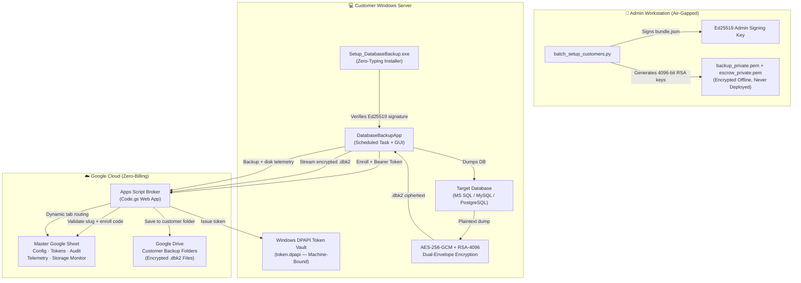

# 🛡️ Enterprise Database Cloud Backup Automation
### Zero-Trust Security Architecture · v4.2.0

<div align="center">
  
  <br>
  <p>
    
    
    
    
    
  </p>
  <h3>Autonomous, Zero-Knowledge Cloud Disaster Recovery for SQL Server, MySQL & PostgreSQL</h3>
  <p>
    <b>📖 User Installation:</b> See the complete <a href="INSTALLATION_GUIDE.md"><b>User Installation & Deployment Guide</b></a> |
    <b>🔍 Reviewers:</b> See the <a href="CODE_REVIEW.md"><b>Senior Engineer Code Review Guide</b></a>
  </p>
</div>

---


## 📌 What Is This?

**Enterprise Database Cloud Backup Automation** is a production-grade, zero-trust automated database backup and disaster recovery system.  
It protects mission-critical databases on customer Windows servers by:

- **Encrypting backups 100% client-side** using AES-256-GCM + dual RSA-4096 before anything leaves the machine.
- **Uploading encrypted archives (`.dbk2`)** to Google Drive through a free serverless Google Apps Script broker — **zero cloud billing, zero GCP APIs, zero service accounts**.
- **Logging telemetry** (backup status, disk health) to a single Google Sheet with automatic dynamic tab routing per module.
- **Running silently as a Windows Scheduled Task** with a desktop GUI for manual control.

> ⚠️ The cloud provider (Google Drive) stores only opaque ciphertext. Google cannot read your database data. Neither can any attacker who compromises the cloud account.

---

## 🏗️ System Architecture



---

## 🔐 Security Model

### Dual-Envelope Encryption (`.dbk2` Format)

Every backup file is protected by a layered hybrid encryption scheme:

| Layer | Algorithm | Key Size | Purpose |
|---|---|---|---|
| Data Encryption | AES-256-GCM | 256-bit | Encrypts the backup stream with an authenticated tag |
| Key Wrap (Primary) | RSA-OAEP + SHA-256 | 4096-bit | Wraps the AES key for the customer's primary keypair |
| Key Wrap (Escrow) | RSA-OAEP + SHA-256 | 4096-bit | Wraps the AES key for the admin escrow keypair |
| Config Signing | Ed25519 | 256-bit | Signs `bundle.json` — any tampering aborts the install |

The `.dbk2` binary archive structure:

```
┌─────────────────────────────────────────────┐
│ Magic: "DBK2" (4 bytes)                     │
│ Version: 0x0002 (2 bytes)                   │
│ RSA-4096 Wrapped DEK — Primary (512 bytes)  │
│ RSA-4096 Wrapped DEK — Escrow  (512 bytes)  │
│ AES-GCM IV (12 bytes)                       │
│ AES-GCM Auth Tag (16 bytes)                 │
│ Encrypted Payload (variable)                │
└─────────────────────────────────────────────┘
```

### Threat Model

| Attack Vector | Impact | Defense |
|---|---|---|
| Google Drive / Sheets account breached | ❌ Zero data exposure | All files are ciphertext. No keys in cloud. |
| Client machine ransomware / theft | ❌ Zero data exposure | Client holds only public keys. DPAPI token is machine-bound. |
| Stolen enrollment code | ❌ Rejected | Broker verifies code AND customer slug together. Codes are single-use. |
| MITM network interception | ❌ Rejected | TLS 1.3 + GCM 128-bit auth tag detects and rejects any tampering. |
| `bundle.json` tampering | ❌ Rejected | Ed25519 signature verified at startup. Any change breaks the sig. |
| Spreadsheet formula injection | ❌ Neutralized | All telemetry strings are escaped before being written to Google Sheets. |

---

## 📁 Repository Structure

```
BackupAutomation/
│
├── CODE_REVIEW.md                ← Senior Engineer Review Guide (Architecture & Invariants)
│
├── apps_script_broker/
│   ├── Code.gs                   ← Serverless broker (paste into Apps Script)
│   ├── appsscript.json           ← OAuth scopes manifest
│   └── pull_backup.py            ← Admin-side Drive download utility
│
├── Tools/
│   ├── batch_setup_customers.py  ← Generate all 61 customer packages in one run
│   ├── setup_new_customer.py     ← Generate a single customer package interactively
│   ├── customer_slugs.txt        ← Customer tenant slugs list
│   ├── decrypt_backup.py         ← Decrypt a .dbk2 file for disaster recovery
│   └── generate_keys.py          ← Standalone RSA-4096 keypair generator
│
├── admin/
│   └── sign_bundle.py            ← Ed25519 bundle signer (admin workstation only)
│
├── tests/                        ← 73 automated unit & integration tests
│   ├── test_full_e2e_flow.py     ← Full lifecycle E2E test with local mock broker
│   ├── test_failure_matrix.py    ← Negative test matrix & error code contracts
│   ├── test_customer_onboarding.py ← Bundle signing & customer package tests
│   ├── test_broker_client.py     ← Broker protocol & 302 redirect verification
│   ├── test_crypto.py            ← AES-256-GCM + dual RSA-4096 streaming tests
│   ├── test_dpapi_interop.py     ← Windows DPAPI cryptoprotect vault tests
│   ├── test_log_scan.py          ← Token redaction & log secret scanner
│   └── test_stray_files_and_allowlist.py ← Package file allowlist & config tests
│
├── app_gui.py                    ← Desktop GUI (Tkinter, dark theme)
├── auto_backup.py                ← CLI entrypoint & scheduled task router
├── backup_core.py                ← Backup orchestrator, storage monitor, pre-flight checks
├── broker_client.py              ← HTTPS client with Windows DPAPI token management
├── crypto_stream.py              ← AES-256-GCM + RSA-4096 dual-envelope encryption engine
├── installer_gui.py              ← Zero-typing setup wizard (PyInstaller compiled)
├── preflight.py                  ← System pre-flight health check module
├── dev_broker.py                 ← Zero-dependency mock broker for unit testing
├── version.py                    ← Version constants
│
├── build_executable.bat          ← Full production build script (PyInstaller + audit)
├── audit_build.py                ← Zero-trust secret scanner run before every build
├── release.py                    ← Full release pipeline (compile, package, push, SHA-256)
│
├── requirements.txt              ← Python dependencies
├── README.md                     ← Main project documentation
├── USER_GUIDE.md                 ← Operational runbook for daily use & disaster recovery
└── READ_ME_FIRST.txt             ← Quick-start card for customers
```

---

## 🚀 Quick Start — Admin Setup (Do This Once)

### Step 1: Deploy the Apps Script Broker

1. Go to **[https://sheets.new](https://sheets.new)** and create a new Google Sheet. Name it: `Master Backup Cloud Broker`.
2. In the Google Sheet menu: **Extensions → Apps Script**.
3. Delete the default code. Paste the entire contents of [`apps_script_broker/Code.gs`](apps_script_broker/Code.gs).
4. Press **Ctrl+S** to save.
5. In the function dropdown, select **`setupSheets`** and click **▶ Run**. Authorize when prompted.  
   → The sheet automatically gets 5 tabs: **Config, Tokens, Audit, Telemetry, Storage Monitor**.
6. Click **Deploy → New deployment → Web app**:
   - Execute as: **Me**
   - Who has access: **Anyone**
7. Copy the **Web App URL** (ends in `/exec`).

### Step 2: Generate All 61 Customer Packages (Batch)

```bash
cd Tools
python batch_setup_customers.py
```

When prompted:
- Enter the **Web App URL** from Step 1.
- Enter a strong passphrase (used to encrypt all private keys offline).
- The script generates 61 customer folders in `customers/`.
- It also creates `customers/enroll_codes_for_sheet.tsv`.

### Step 3: Paste Enroll Codes into Google Sheet

1. Open `customers/enroll_codes_for_sheet.tsv` in any text editor.
2. Open your **Master Backup Cloud Broker** Google Sheet → go to the **Config** tab.
3. Copy all rows from the `.tsv` file and paste them starting at row 2.  
   Each row has the format: `ENROLL_CODE | <secret_code> | <customer_slug>`.

### Step 4: Distribute to Customers

For each customer folder in `customers/<slug>_package/`:
- The folder already contains: `Setup_DatabaseBackup.exe`, `AppFiles/`, `bundle.json`, public keys.
- Zip the folder and send it to the customer.
- The customer runs `Setup_DatabaseBackup.exe` as Administrator — **zero typing required**.

---

## 💻 Customer Installation (Zero-Typing Experience)

1. Customer extracts their `.zip` package.
2. Runs `Setup_DatabaseBackup.exe` as Administrator.
3. The installer:
   - Detects `bundle.json` and verifies the Ed25519 signature.
   - Enrolls the machine with the Apps Script broker using the hardware fingerprint (`SHA-256` of Motherboard UUID + CPU ID + MAC).
   - Stores the bearer token in a DPAPI-encrypted vault (`token.dpapi`).
   - Registers Windows Scheduled Tasks for daily backups and storage monitoring.
4. A desktop shortcut to the **DatabaseBackupApp** GUI is created.

---

## 🔄 How Backups Run (Automated)

Every day (or on demand from the GUI):

1. **Pre-flight**: Checks DB connectivity, disk space (2.5× estimated backup size required), and broker reachability.
2. **DB Dump**: Uses native tools (`sqlcmd`, `mysqldump`, `pg_dump`) to dump the database to a temporary local folder.
3. **Dual-Envelope Encryption**: The dump is encrypted using AES-256-GCM with a unique ephemeral key. The key is dual-wrapped with RSA-4096 (Primary + Escrow). The plaintext dump is securely deleted.
4. **Upload**: The `.dbk2` archive is streamed to Google Drive through the Apps Script broker in chunks.
5. **Telemetry**: Backup result (status, bytes, DB name) is logged to the **Telemetry** tab.
6. **Storage Monitor** (separate scheduled task): All fixed drives are scanned and disk health metrics are logged to the **Storage Monitor** tab.

---

## 🚨 Disaster Recovery

To restore a backup:

```bash
python Tools/decrypt_backup.py path/to/backup.dbk2 path/to/output.bak
```

You will be prompted for:
- The **private key** file (`backup_private.pem` or `escrow_private.pem`) — stored securely offline by the admin.
- The **passphrase** protecting the key file.

The tool authenticates the GCM tag, decrypts the archive, and writes the restored `.bak` / `.sql` file.

---

## 🧪 Automated Test Suite & Verification

The repository contains an enterprise test suite (73 automated unit & integration tests) validating cryptographic operations, network protocol compliance, Windows DPAPI interop, error code contracts, and build-time secret scanning.

### Running All Tests:
```powershell
python -m unittest discover tests
```
*Expected output:*
```text
Ran 73 tests in ~14s — OK (0 failures, 0 errors)
```

### Key Test Coverage:
- **Zero-Trust Cryptography (`test_crypto.py`)**: Validates AES-256-GCM chunked streaming, dual RSA-4096 envelope wrapping, and tamper detection via 128-bit MAC tags.
- **End-to-End Simulation (`test_full_e2e_flow.py`)**: Runs complete lifecycle against local `dev_broker.py` (enrollment, token verification, upload, and decryption).
- **Negative Testing & Error Codes (`test_failure_matrix.py`)**: Enforces deterministic preflight failure codes (`ERR_NOT_APPS_SCRIPT`, `ERR_HEALTH_EXCEPTION`, `ERR_TOKEN_FILE_ABSENT`, `ERR_DPAPI_EMPTY`, `ERR_PRIMARY_KEY_TOO_SHORT`, `ERR_KEYS_NOT_DISTINCT`, `ERR_SQL_CONN_FAILED`, `ERR_CLOUD_SYNC_DETECTED`, `ERR_ACL_DENIED`).
- **Windows DPAPI Vault (`test_dpapi_interop.py`)**: Verifies hardware-bound token protection with `CRYPTPROTECT_UI_FORBIDDEN`.
- **Log Secret Redaction (`test_log_scan.py`)**: Scans all logs and streams to guarantee zero bearer tokens or secrets leak into output.
- **Zero Stray Configs (`test_stray_files_and_allowlist.py`)**: Validates that master templates are strictly unpopulated and only allowlisted files exist in distribution packages.

---

## 🔧 Build From Source

Requirements: Python 3.10+, PyInstaller 6.0+, `cryptography`, `requests`, `customtkinter`, `pillow`, `pywin32`

```bash
pip install -r requirements.txt

# Full production build (compiles EXE + audits for secrets + syncs package)
python release.py
```


Output: `dist/Setup_DatabaseBackup.exe` and `dist/DatabaseBackupApp/`

---

## 📋 Compliance

This system is designed to align with:
- **HIPAA** — Encrypted backups at rest and in transit, full audit trail.
- **GDPR** — Data minimization; cloud provider stores only opaque ciphertext.
- **SOC 2 Type II** — Access controls, logging, and incident alerting built-in.
- **Ransomware Immunity** — Client machines have upload-only access (no delete/list/read permissions on existing backups).

