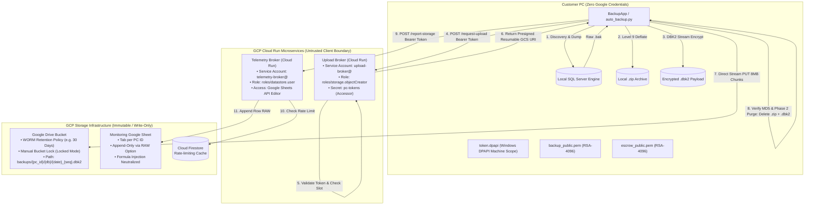
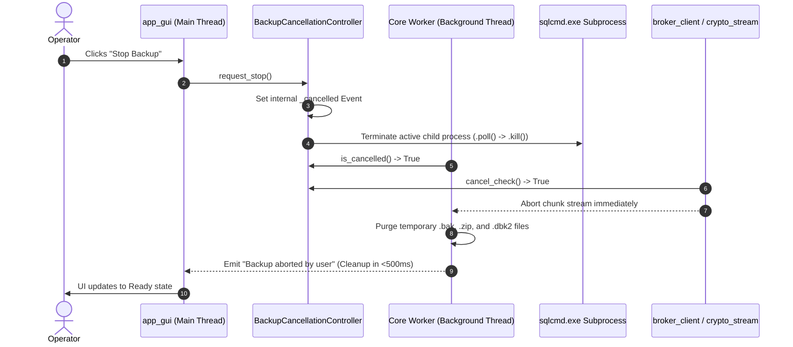

# 📘 Comprehensive System Architecture & Deep Code Guide
## Enterprise Database Cloud Backup Automation System (v4.1.0 Zero-Trust Architecture)

**Author / Lead Architect:** Dulnindu Saranga  
**System Target:** Microsoft SQL Server 2012–2022 (SQL Server 2000/2005 marked as legacy/untested), Google Cloud Platform (Cloud Run, Google Drive, Cloud Firestore, Google Sheets API v4), Windows 10/11 & Windows Server 2016–2025 (Windows 7/8/8.1 & Server 2008 R2/2012 marked as legacy/untested; macOS/Linux unsupported)  
**Architecture Pattern:** Zero-Trust Security Wall / Decoupled Cloud Run Microservices & Stateless Client Core Engine  
**Cryptographic Standard:** DBK2 Hybrid Streaming Envelope Encryption (AES-256-GCM + Dual RSA-4096-OAEP Key Wrapping)  
**Documentation Version:** 4.1.0 Zero-Trust & Multi-Module Edition  

---

## 📑 Table of Contents

1. [Executive Summary & Problem Statement](#1-executive-summary--problem-statement)
2. [Complete Repository File Map & Component Inventory](#2-complete-repository-file-map--component-inventory)
3. [End-to-End Zero-Trust Security Architecture & Threat Model](#3-end-to-end-zero-trust-security-architecture--threat-model)
   - 3.1 [The Zero-Trust Security Wall Principle](#31-the-zero-trust-security-wall-principle)
   - 3.2 [Comprehensive Threat Modeling & Defense Matrix](#32-comprehensive-threat-modeling--defense-matrix)
   - 3.3 [Strict Least-Privilege IAM Bindings](#33-strict-least-privilege-iam-bindings)
   - 3.4 [WORM Storage Retention Policies & Bucket Locking](#34-worm-storage-retention-policies--bucket-locking)
   - 3.5 [Token Lifecycle & Revocation Dynamics](#35-token-lifecycle--revocation-dynamics)
4. [The Complete Step-by-Step Data Flow & State Lifecycle](#4-the-complete-step-by-step-data-flow--state-lifecycle)
5. [Deep Code Inspection & Implementation Breakdown](#5-deep-code-inspection--implementation-breakdown)
   - 5.1 [`auto_backup.py` — The Master Traffic Router](#51-auto_backuppy--the-master-traffic-router)
   - 5.2 [`backup_core.py` — The Core Stateless Execution Engine](#52-backup_corepy--the-core-stateless-execution-engine)
   - 5.3 [`crypto_stream.py` — The DBK2 Hybrid Cryptographic Engine](#53-crypto_streampy--the-dbk2-hybrid-cryptographic-engine)
   - 5.4 [`broker_client.py` — The Zero-Trust Client Transport Layer](#54-broker_clientpy--the-zero-trust-client-transport-layer)
   - 5.5 [`broker/main.py` — The Cloud Run Upload Broker](#55-brokermainpy--the-cloud-run-upload-broker)
   - 5.6 [`telemetry_broker/main.py` — The Cloud Run Telemetry Broker](#56-telemetry_brokermainpy--the-cloud-run-telemetry-broker)
   - 5.7 [`app_gui.py` — The CustomTkinter Asynchronous Desktop Interface](#57-app_guipy--the-customtkinter-asynchronous-desktop-interface)
     - 5.7.1 [Tab 1: Dashboard & One-Click Execution Engine](#571-tab-1-dashboard--one-click-execution-engine)
     - 5.7.2 [Tab 2: Auto Schedule & Windows Service Management](#572-tab-2-auto-schedule--windows-service-management)
     - 5.7.3 [Tab 3: Settings & Zero-Trust Cloud Wall Configuration](#573-tab-3-settings--zero-trust-cloud-wall-configuration)
     - 5.7.4 [Tab 4: Live Logs & Diagnostic Stream](#574-tab-4-live-logs--diagnostic-stream)
     - 5.7.5 [Tab 5: Server Health & Proactive Storage Monitor](#575-tab-5-server-health--proactive-storage-monitor)
   - 5.8 [`installer_gui.py` — The Hardened Setup Wizard & ACL Provisioner](#58-installer_guipy--the-hardened-setup-wizard--acl-provisioner)
   - 5.9 [`admin/provision_pc.py` & `admin/manage_tokens.py` — Token Provisioning Utility](#59-adminprovision_pcpy--adminmanage_tokenspy--token-provisioning-utility)
   - 5.10 [`offline/` — Air-Gapped Key Generation & DBK2 Recovery Tools](#510-offline--air-gapped-key-generation--dbk2-recovery-tools)
6. [DBK2 Hybrid Encryption Binary Specification](#6-dbk2-hybrid-encryption-binary-specification)
   - 6.1 [Byte-by-Byte File Layout](#61-byte-by-byte-file-layout)
   - 6.2 [Recipient Envelope & Public Key Fingerprinting](#62-recipient-envelope--public-key-fingerprinting)
   - 6.3 [Nonce Derivation & Authenticated Additional Data (AAD) Binding](#63-nonce-derivation--authenticated-additional-data-aad-binding)
   - 6.4 [Atomic Zero-Partial Output Guarantee](#64-atomic-zero-partial-output-guarantee)
   - 6.5 [Mandatory Escrow Warning Protocol](#65-mandatory-escrow-warning-protocol)
7. [Storage Management, Zero Local Footprint & Two-Phase Purge Mechanics](#7-storage-management-zero-local-footprint--two-phase-purge-mechanics)
8. [Windows Task Scheduler, Service Daemons & Session 0 Architecture](#8-windows-task-scheduler-service-daemons--session-0-architecture)
   - 8.1 [Least Privilege Default: Dedicated User Account](#81-least-privilege-default-dedicated-user-account)
   - 8.2 [Opt-In Service Mode: `NT AUTHORITY\SYSTEM` in Session 0](#82-opt-in-service-mode-nt-authoritysystem-in-session-0)
   - 8.3 [Process Memory & Argument Protection (`SQLCMDPASSWORD`)](#83-process-memory--argument-protection-sqlcmdpassword)
9. [Thread-Safe Cancellation, Subprocess Tracking & Emergency Stop](#9-thread-safe-cancellation-subprocess-tracking--emergency-stop)
10. [Server Health, Multi-Drive Monitoring & Automated Email Alerting Architecture](#10-server-health-multi-drive-monitoring--automated-email-alerting-architecture)
    - 10.1 [Proactive Dual-Threshold Alerting Algorithm](#101-proactive-dual-threshold-alerting-algorithm)
    - 10.2 [Network & Shared Drive Discovery (`net use` and WNet API)](#102-network--shared-drive-discovery-net-use-and-wnet-api)
    - 10.3 [Zero-Trust Telemetry Broker & Google Sheets Horizontal Layout](#103-zero-trust-telemetry-broker--google-sheets-horizontal-layout)
    - 10.4 [High-Priority Outlook/SMTP Alert Engine & DPAPI Password Protection](#104-high-priority-outlooksmtp-alert-engine--dpapi-password-protection)
    - 10.5 [Headless Automated Invocation (`--storage-scan` & Piggyback Triggers)](#105-headless-automated-invocation---storage-scan--piggyback-triggers)
    - 10.6 [Customer Cloud Integration & 3-Module Master Sheet Layout](#106-customer-cloud-integration--2-module-master-sheet-layout)
    - 10.7 [Single Unified Persistent Log Architecture (`backup_log.txt`)](#107-single-unified-persistent-log-architecture-backup_logtxt)
11. [Infrastructure-as-Code & Automated Deployment (`deploy.sh`)](#11-infrastructure-as-code--automated-deployment-deploysh)
12. [Comprehensive Test Suite & Static Security Auditing](#12-comprehensive-test-suite--static-security-auditing)
13. [Air-Gapped Disaster Recovery & Emergency Runbook](#13-air-gapped-disaster-recovery--emergency-runbook)

---

## 1. Executive Summary & Problem Statement

In traditional database cloud backup models, client servers are directly provisioned with cloud credentials (such as Google Cloud Service Account JSON keys, AWS IAM Access Keys, or OAuth client secrets). In enterprise and SME production environments, this architectural pattern introduces a **critical vulnerability**:
- If a customer machine is infected with ransomware or an adversary achieves root/administrative privileges, the attacker immediately extracts the local cloud credentials.
- The attacker then leverages those credentials to enumerate the cloud storage bucket, delete all existing historical backups, wipe object versioning, and hold the enterprise to ransom.

The **Enterprise Database Cloud Backup Automation System (v4.1.0)** resolves this threat through a **Zero-Trust Security Wall Architecture**. The client machine is treated as potentially untrusted and holds **zero Google credentials, zero service account keys, zero OAuth secrets, and zero private encryption keys**.

### Key Architectural Tenets:
1. **Zero Client Cloud Secrets:** Customer machines possess only an opaque, machine-specific bearer token and RSA-4096 public encryption keys. Even complete compromise of the client PC yields no credentials that can read, list, modify, or delete cloud data.
2. **Decoupled Cloud Run Gatekeepers:** Google Cloud infrastructure is protected behind two independent microservices:
   - **Upload Broker:** An access-controlled endpoint that verifies the client token, validates database whitelists and file size boundaries, and issues a single-use, presigned GCS resumable upload URI for a strictly server-determined object path.
   - **Telemetry Broker:** An isolated endpoint that receives drive health telemetry, enforces an 8 KB payload cap, applies rate limits via Firestore, and appends rows to Google Sheets using literal `RAW` parsing to prevent formula injection.
3. **Air-Gapped DBK2 Hybrid Encryption:** All backups are encrypted locally before transmission using a streaming authenticated envelope format (`.dbk2`). Decryption private keys are stored exclusively on offline, air-gapped administrative recovery hardware.
4. **WORM Storage Immutability:** Cloud Storage buckets are configured with Object Retention Policies (WORM: Write Once, Read Many). Once the manual retention lock is enabled, neither the customer machine nor the upload broker service account can overwrite or delete backups before the retention window expires.

---

## 2. Complete Repository File Map & Component Inventory

Below is the complete structural layout of the codebase in `BackupAutomation/`, detailing the role and execution environment of every component:

```text
BackupAutomation/
│
├── auto_backup.py             # Application Entrypoint & Master Router (GUI, --auto, --daemon, --manual-cli)
├── backup_core.py             # Stateless Core Engine (SQL discovery, dump, compression, purge, scheduling)
├── crypto_stream.py           # DBK2 Cryptographic Engine (AES-256-GCM + Dual RSA-4096-OAEP streaming envelope)
├── broker_client.py           # Zero-Trust HTTP Transport Client (URL validation, DPAPI, GCS streaming, telemetry)
├── app_gui.py                 # CustomTkinter Desktop GUI Dashboard (Status cards, progress, live logs)
├── installer_gui.py           # Hardened Setup Wizard (Elevation check, ACL assignment, token import)
├── decrypt_backup.py          # Air-Gapped CLI Decryption Tool (DBK2 archive extraction with private keys)
├── config.json                # Primary runtime configuration file (UTF-8, comments-free JSON)
├── backup_public.pem          # Production Primary Public Key (RSA-4096 SubjectPublicKeyInfo)
├── escrow_public.pem          # Production Escrow Public Key (RSA-4096 SubjectPublicKeyInfo)
├── Uninstall.bat              # Detached uninstaller script (Purges tasks, DPAPI tokens, and files)
│
├── admin/                     # Administrative Provisioning & Fleet Management Tools
│   ├── manifest_signer.py     # Ed25519 Cryptographic Manifest Signer & Verifier
│   ├── onboard_customer.py    # Zero-Trust Customer Onboarding Engine (Cloud Run, IAM condition, Signed Package)
│   ├── release_all.py         # Fleet Release Engine (Rolling container deployment across all customer services)
│   ├── offboard_customer.py   # Complete Customer Teardown (Revokes tokens, deletes Cloud Run, SA, IAM, registry)
│   ├── setup_log_alerts.py    # Per-Service Cloud Logging Metrics & Cloud Monitoring Alert Policy Generator
│   ├── customer_registry.json # Admin-Only Central Registry of Provisioned Customer Services and Metadata
│   ├── build_customer_package.py # Automated Customer Package Builder
│   ├── provision_pc.py        # Generates per-PC cryptographically random tokens and Secret Manager JSON
│   └── manage_tokens.py       # Lists, inspects, and revokes PC tokens in Secret Manager
│
├── offline/                   # Air-Gapped Disaster Recovery Tools
│   ├── generate_keys.py       # Generates Primary & Escrow RSA-4096 key pairs with PKCS#8 password protection
│   └── decrypt_backup.py      # Standalone duplicate of the offline DBK2 restoration utility
│
├── broker/                    # Cloud Run Upload Broker Microservice (Per-Customer Isolated)
│   ├── Dockerfile             # Container build specification (Python 3.11-slim, Gunicorn worker)
│   ├── main.py                # Upload Broker Flask App (Customer binding, strict DB regex, prefix isolation)
│   └── requirements.txt       # Broker dependencies (Flask, google-cloud-storage, gunicorn)
│
├── telemetry_broker/          # Cloud Run Telemetry Broker Microservice
│   ├── Dockerfile             # Container build specification (Python 3.11-slim, Gunicorn worker)
│   ├── main.py                # Telemetry Broker Flask Application (POST /report-storage, 8 KB cap, RAW append)
│   └── requirements.txt       # Telemetry dependencies (Flask, google-api-python-client, google-cloud-firestore)
│
├── preflight.py               # Shared Preflight Diagnostics (Signed manifest check, URL security, DPAPI, SQL)
├── audit_build.py             # Strict Allowlist & Zero-Stray Package Security Auditor
├── version.py                 # Application Versioning & Embedded Admin Ed25519 Public Key
├── deploy.sh                  # Infrastructure-as-Code bash deployment script for Google Cloud Platform
├── build_executable.bat       # Production PyInstaller build script with automated secret guard check
├── DatabaseBackupApp.spec     # PyInstaller bundle specification for main desktop application
├── Setup_DatabaseBackup.spec  # PyInstaller bundle specification for installer wizard
│
├── tests/                     # Automated Test Suite (Pytest / Unittest)
│   ├── test_customer_onboarding.py # Tests multi-tenant URLs, cross-tenant 401s, tampered manifests, offboarding
│   ├── test_clean_vm_install.py    # Tests clean VM zero-typing install, permission isolation, and preflight pass
│   ├── test_failure_matrix.py      # Comprehensive 12-failure simulation test suite
│   ├── test_stray_files_and_allowlist.py # Strict package allowlist & zero loose .txt enforcement
│   ├── test_upload_broker.py       # Upload broker auth, customer binding, strict DB regex, 409 conflict
│   ├── test_broker_client.py       # Client URL validation, HTTP rejection, token wipe, and retry tests
│   ├── test_crypto.py              # DBK2 format, minimum key size, dual keys, and tamper resistance tests
│   ├── test_backup_core.py         # UTF-8 BOM config parsing, broker readiness, and DB name sanitization tests
│   ├── test_security_audit.py      # Static AST scan for zero shell=True, secret leakage, and IAM permissions
│   └── test_telemetry_broker.py    # Telemetry payload limits, schema validation, rate limits, and formula defense
│
├── README.md                  # Executive overview, features, and quick-start documentation
├── SETUP.md                   # Complete cloud deployment and on-premise installation guide
├── USER_GUIDE.md              # Operator manual for system administrators and end users
└── RUNBOOK.md                 # Operational maintenance, disaster recovery, and incident response runbook
```

---

## 3. End-to-End Zero-Trust Security Architecture & Threat Model

### 3.1 The Zero-Trust Security Wall Principle

The following diagram illustrates the strict separation of trust domains across the system:



### 3.2 Comprehensive Threat Modeling & Defense Matrix

| Threat Vector | Attack Scenario | System Defense & Mitigation Formation |
| :--- | :--- | :--- |
| **Ransomware on Client PC** | Malware compromises Windows machine, gains local administrator privileges, and attempts to wipe cloud backups. | **Mitigated.** Client machine contains zero cloud credentials. The only stored token allows creating a new upload in a server-assigned slot. The broker has no list, read, or delete endpoints. GCS retention lock prevents object overwrite. |
| **Token Theft & Slot-Burning** | Attacker extracts `token.dpapi` from Windows memory or disk and attempts to exhaust daily upload slots by uploading junk. | **Contained.** Attacker cannot view existing backups. Upload slots are capped at 3 per database per day (`{day}_1`, `_2`, `_3`). The client and broker log HTTP 409 events and issue a critical security alert upon slot exhaustion. Admin immediately revokes token in Secret Manager. |
| **Cross-Tenant Token Replay** | Attacker from Customer A captures a valid token and attempts to authenticate against Customer B's dedicated Upload Broker. | **Mitigated.** Every Upload Broker microservice enforces `CUSTOMER_SLUG`. During authentication, the broker verifies `pc_id.startswith(f"{CUSTOMER_SLUG}-")`. Cross-tenant tokens are rejected with HTTP 401 Unauthorized, and a security alert event (`customer_mismatch`) is immediately logged. |
| **Package & Endpoint Tampering** | Attacker modifies `config.json` or `broker_url` in the distribution package to redirect encrypted archives to an adversary endpoint. | **Mitigated.** Installation packages are sealed with an Ed25519 digital signature (`manifest.json` + `manifest.sig`). The installer verifies the signature using an embedded public key (`EMBEDDED_ADMIN_PUBLIC_KEY_PEM`) before writing files. Any modified URL or payload triggers `ERR_MANIFEST_TAMPERED` and halts installation. |
| **Man-in-the-Middle (MITM)** | Attacker intercepts network traffic between customer server and Google Cloud. | **Mitigated.** `broker_client.py` strictly validates HTTPS. Remote plain HTTP is unconditionally rejected. Local HTTP is rejected in production builds and permitted only with explicit `ALLOW_INSECURE_BROKER=true`. All communications use TLS 1.3 / 1.2 with validated certificates. |
| **Cloud Broker Compromise** | An attacker compromises a customer's Cloud Run Upload Broker container. | **Contained.** The service account is partitioned per customer (`broker-<slug>@...`) with an IAM condition limiting `roles/storage.objectCreator` strictly to `projects/_/buckets/<bucket>/objects/<slug>/`. Even if a single customer's broker container is breached, the attacker cannot read, write, or list any other customer's prefix. |
| **Cryptographic Tampering** | Attacker or corrupted transmission alters bytes in the uploaded `.dbk2` archive. | **Mitigated.** DBK2 uses AES-256-GCM authenticated encryption. Every 1 MiB chunk includes an authentication tag verifying chunk ciphertext, chunk counter, terminal flag, and SHA-256 of the complete header. Any alteration causes decryption to fail immediately. Zero partial output is left on disk. |
| **Formula Injection (CSV/Sheet Injection)** | Malicious host or drive name containing `=cmd|' /C calc'!A1` or `@SUM(...)` is sent in telemetry to execute code in administrator spreadsheets. | **Mitigated.** `telemetry_broker/main.py` enforces regex validation (`^[A-Z]:\\?$`) and calls `spreadsheets().values().append(valueInputOption='RAW')`. Google Sheets stores all data as literal text strings, completely disabling formula evaluation. |

### 3.3 Strict Least-Privilege IAM Bindings & Prefix Conditions

To prevent cross-tenant privilege escalation and isolate storage access, Google Cloud IAM roles are strictly partitioned per customer:

```text
Project IAM Configuration (Per-Customer Isolated Architecture):
├── broker-<slug>@$PROJECT.iam.gserviceaccount.com (Dedicated Service Account per Customer)
│   ├── gs://${BUCKET_NAME}               ──> roles/storage.objectCreator
│   │                                         CONDITION: resource.type == "storage.googleapis.com/Object" &&
│   │                                                    resource.name.startsWith("projects/_/buckets/${BUCKET_NAME}/objects/${CUSTOMER_SLUG}/")
│   └── projects/.../secrets/broker-tokens-<slug> ──> roles/secretmanager.secretAccessor (Read Token Hashes)
│
└── telemetry-broker-sa@$PROJECT.iam.gserviceaccount.com
    ├── Firestore Database                ──> roles/datastore.user (Rate Limiting State)
    ├── projects/.../secrets/pc-tokens    ──> roles/secretmanager.secretAccessor (Read Token Hashes)
    └── Google Sheet ID                   ──> Granted directly in Google Sheet Share Dialog (Editor)
```

> [!IMPORTANT]
> `roles/storage.objectAdmin`, `roles/storage.admin`, and `roles/editor` are **STRICTLY FORBIDDEN** on the Upload Broker service account. `objectCreator` provides the atomic permission required to initialize resumable uploads without permitting read, list, overwrite, or delete actions. Furthermore, the IAM CEL condition restricts writes strictly to the customer's dedicated prefix.

### 3.4 WORM Storage Retention Policies & Bucket Locking

Cloud Storage buckets are protected by Write-Once-Read-Many (WORM) retention policies:
1. **Retention Period Definition:** Configured during deployment (e.g., 30 days, 90 days, or 365 days):
   ```bash
   gcloud storage buckets update "gs://${BUCKET_NAME}" --retention-period="${RETENTION_PERIOD}"
   ```
   Once an object is created, it cannot be deleted or overwritten until the retention period has elapsed.
2. **Bucket Retention Lock:** Setting a retention policy initially leaves it in "Unlocked" mode, allowing administrators to modify or remove the policy during initial provisioning. To prevent unauthorized alteration or deletion of the policy, the bucket retention policy can be locked:
   ```bash
   gcloud storage buckets update "gs://${BUCKET_NAME}" --lock-retention-period
   ```
   *Caution:* Once locked, the retention policy cannot be shortened or removed by anyone, including the Google Cloud Project Owner, until all objects have aged past the retention period.

### 3.5 Token Lifecycle & Revocation Dynamics

- **Token Structure:** High-entropy string formatted as `<pc_id>.<random_64_hex_secret>`.
- **Storage in Secret Manager:** Stored in secret `pc-tokens` as a JSON map:
  ```json
  {
    "client-branch-01": "e3b0c44298fc1c149afbf4c8996fb92427ae41e4649b934ca495991b7852b855",
    "client-branch-02": "dffd6021bb2bd5b0af676290809ec3a53191dd81c7f70a4b28688a362182986f"
  }
  ```
  The secret value stores only the **SHA-256 hash** of the secret token, preventing plaintext compromise even if Secret Manager read access is granted.
- **Revocation Propagation:** When an administrator revokes a token (via `python admin/manage_tokens.py revoke <pc_id>`), the secret payload is updated. Due to in-memory container caching and Cloud Run instance lifecycles, full propagation across all active broker instances takes **a few minutes** (up to 5 minutes).

---

## 4. The Complete Step-by-Step Data Flow & State Lifecycle

```text
[Trigger: User GUI / Windows Task Scheduler / Background Daemon / CLI]
  │
  ▼
1. INVOCATION & RUNTIME NORMALIZATION
   ├── Process argument routing (--auto, --daemon, --storage-scan, --manual-cli)
   ├── OAUTHLIB_RELAX_TOKEN_SCOPE=1 enforced
   └── sys.stdout / sys.stderr redirected to os.devnull if running as windowed binary
  │
  ▼
2. CONFIGURATION INGESTION & BROKER READINESS CHECK
   ├── Read config.json (UTF-8, BOM-tolerant loading)
   ├── Validate BROKER_URL format (enforce HTTPS; reject plain HTTP)
   ├── Verify token.dpapi exists and can be decrypted via Windows DPAPI
   └── Verify backup_public.pem (and optional escrow_public.pem) exists and >= 3072 bits
  │
  ▼
3. SQL ENGINE AUTO-DISCOVERY & CONNECTION VALIDATION
   ├── Inspect Windows Registry for installed MSSQL instances
   ├── Probe tools in priority order: modern sqlcmd -> legacy osql -> ODBC Driver 18
   └── Validate database name against safe regex ^[A-Za-z0-9_][A-Za-z0-9_\-\. ]{0,127}$
  │
  ▼
4. NATIVE DATABASE DUMP EXECUTION
   ├── Pass SQL credentials securely via os.environ["SQLCMDPASSWORD"]
   ├── Execute BACKUP DATABASE [<db>] TO DISK = '<temp_dir>\<db>_<timestamp>.bak' WITH FORMAT, INIT
   └── Active process tracked in BackupCancellationController for emergency abort
  │
  ▼
5. LEVEL 9 DEFLATE STREAM COMPRESSION
   ├── Read raw .bak file in chunks
   ├── Compress into <temp_dir>\<db>_<timestamp>.zip using ZIP_DEFLATED (compressionlevel=9)
   └── Verify zip archive integrity
  │
  ▼
6. TWO-PHASE PURGE: STEP 1 (IMMEDIATE .BAK REMOVAL)
   └── Delete raw .bak file from local disk immediately, freeing 80-90% allocated dump space
  │
  ▼
7. STREAMING DBK2 HYBRID ENVELOPE ENCRYPTION
   ├── Generate fresh 256-bit AES symmetric key
   ├── Wrap AES key for Primary RSA Public Key (RSA-OAEP-SHA256)
   ├── Wrap AES key for Escrow RSA Public Key (RSA-OAEP-SHA256) [Loud warning if omitted]
   ├── Write DBK2 Header: MAGIC b"DBK2" + Version 0x01 + Recipient Envelopes + Nonce Prefix
   ├── Read .zip in 1 MiB chunks
   ├── Encrypt chunks via AES-256-GCM with AAD = SHA-256(Header) + Terminal Flag + Counter
   └── Output atomic encrypted file: <temp_dir>\<db>_<timestamp>.dbk2
  │
  ▼
8. UPLOAD BROKER PERMISSION & SLOT NEGOTIATION
   ├── Client calls POST /request-upload with Bearer token, db_name, file_size, seq=1
   ├── Broker validates token hash in Secret Manager (HMAC constant-time comparison)
   ├── Broker verifies db_name is in allowed list and file_size <= MAX_BYTES
   ├── Broker selects object name: backups/{pc_id}/{db_name}/{YYYYMMDD}_{seq}.dbk2
   ├── Broker requests GCS resumable session with if_generation_match=0
   │     ├── If GCS returns 412 / exists: Broker returns HTTP 409 Conflict
   │     └── Client catches 409, logs warning, and retries with seq=2, then seq=3
   │     └── If all 3 slots return 409: Client logs CRITICAL security alert (slot exhaustion)
   └── Broker returns 200 OK with presigned resumable session URI
  │
  ▼
9. RESUMABLE DIRECT-TO-STORAGE STREAMING
   ├── Client streams .dbk2 payload directly to GCS via resumable PUT in 8 MiB chunks
   ├── Handles network dropouts with exponential backoff and Range query resume
   └── Computes streaming progress, transfer speed (MB/s), and ETA for GUI / logs
  │
  ▼
10. REMOTE INTEGRITY VERIFICATION & TWO-PHASE PURGE: STEP 2
    ├── GCS completes upload and returns final JSON metadata containing md5Hash (Base64)
    ├── Client computes local Base64 MD5 checksum of .dbk2 file
    ├── On strict checksum match:
    │     ├── Delete temporary .zip archive
    │     └── Delete temporary .dbk2 archive
    └── Local disk returns to ZERO net storage footprint
  │
  ▼
11. SYSTEM STORAGE HEALTH TELEMETRY
    ├── Scan all local fixed drives (drive letter, type, total bytes, free bytes, percent used)
    ├── Construct JSON payload (enforcing 8 KB maximum body cap)
    ├── Client posts to Telemetry Broker: POST /report-storage with Bearer token
    ├── Telemetry Broker validates schema, regex, bounds, and unknown keys
    ├── Telemetry Broker checks 15-minute rate limit via Cloud Firestore
    └── Telemetry Broker appends row to Google Sheet using valueInputOption='RAW'
```

---

## 5. Deep Code Inspection & Implementation Breakdown

### 5.1 `auto_backup.py` — The Master Traffic Router

`auto_backup.py` serves as the dual-mode application entrypoint, determining whether to spin up the CustomTkinter presentation layer or execute silently in headless background modes.

```text
Key Functions & Responsibilities:
├── main():
│   ├── Inspects sys.argv flags:
│   │   ├── --auto / -a           ──> Triggers run_automated_mode()
│   │   ├── --daemon / --service  ──> Triggers run_daemon_mode()
│   │   ├── --storage-scan        ──> Triggers run_storage_scan_mode()
│   │   ├── --manual-cli / --cli  ──> Triggers run_manual_cli()
│   │   └── (default)             ──> Launches app_gui.BackupAutomationApp()
│   └── Top-level exception trap: Displays native Windows MessageBoxW on critical GUI failure.
│
├── run_automated_mode():
│   ├── Enforces schedule constraints (SCHEDULE_DAYS, STRICTLY_MONDAYS_ONLY).
│   ├── Verifies broker readiness via broker_ready(config).
│   ├── Calls backup_core.run_full_backup(config).
│   ├── Triggers piggyback storage telemetry scan if STORAGE_MONITOR_ENABLED is true.
│   └── Exits process with explicit OS exit code (0 = success, 1 = failure) for schtasks history.
│
└── run_daemon_mode():
    ├── Continuous background loop running in Windows Session 0.
    ├── Polls current system time every 30 seconds against SCHEDULE_TIME and SCHEDULE_DAYS.
    └── Tracks last_run_day to prevent redundant triggers within the same 24-hour window.
```

### 5.2 `backup_core.py` — The Core Stateless Execution Engine

`backup_core.py` contains the business logic for database discovery, native SQL dump orchestration, zip compression, two-phase purge management, and Windows Task Scheduler configuration.

```text
Key Modules & Helper Functions:
├── Configuration & Environment Management:
│   ├── load_config(config_path): Loads JSON config safely, handling UTF-8 with and without BOM.
│   ├── save_config(config, config_path): Writes formatted JSON atomically.
│   └── broker_ready(config, base_dir): Validates BROKER_URL, token.dpapi, and backup_public.pem.
│
├── SQL Discovery & Execution Pipeline:
│   ├── is_safe_db_name(db_name): Strict regex validation preventing command injection.
│   ├── discover_sql_instances(): Scans Windows Registry for installed MSSQL instances.
│   ├── test_sql_connection(server, user, password, auth_mode): Verifies credentials.
│   └── run_full_backup(config, status_cb, progress_cb, cancel_check):
│       ├── Iterates target databases.
│       ├── Invokes sqlcmd with os.environ["SQLCMDPASSWORD"] (hiding secrets from tasklist).
│       ├── Compresses .bak into .zip via zipfile.ZipFile(compression=zipfile.ZIP_DEFLATED, compresslevel=9).
│       ├── Phase 1 Purge: os.remove(bak_file).
│       ├── Encrypts .zip to .dbk2 via crypto_stream.encrypt_file().
│       ├── Uploads .dbk2 via broker_client.secure_upload().
│       └── Phase 2 Purge: Removes .zip and .dbk2 upon verified GCS MD5 match.
│
└── Windows Task Scheduler Integration:
    ├── schedule_task_windows(time_str, days_list, as_system_service=False):
    │   ├── Uses schtasks.exe /Create.
    │   ├── Low-privilege mode (default): /ru <CurrentUsername>.
    │   └── Service mode (opt-in): /ru "NT AUTHORITY\SYSTEM" /rl HIGHEST.
    └── delete_scheduled_task(): Uses schtasks.exe /Delete /f.
```

### 5.3 `crypto_stream.py` — The DBK2 Hybrid Cryptographic Engine

`crypto_stream.py` implements the DBK2 streaming authenticated envelope format. It ensures that customer machines hold only public keys and cannot decrypt archives.

```text
Architectural Specifications:
├── Cryptographic Primitives:
│   ├── Symmetric Cipher: AES-256-GCM (128-bit authentication tag, 64 KiB chunk size for streaming crypto; 8 MiB for GCS HTTP transport).
│   ├── Asymmetric Cipher: RSA-4096 (minimum 3072 bits enforced) with OAEP padding.
│   ├── OAEP Parameters: MGF1 with SHA-256, Hash Algorithm SHA-256, Label = None.
│   └── Key Fingerprinting: SHA-256 of SubjectPublicKeyInfo (DER format), truncated to 8 bytes.
│
├── Core Functions:
│   ├── load_and_validate_public_key(path): Rejects RSA keys < 3072 bits.
│   ├── load_and_validate_private_key(path, password): Rejects private keys < 3072 bits.
│   ├── encrypt_file(src, dst, public_key_paths, cancel_check, escrow_key_path, allow_no_escrow, db_name, host, utc_time):
│   │   ├── Validates 1 <= recipients <= 8.
│   │   ├── Rejects missing escrow with ValueError by default unless allow_no_escrow=True is set.
│   │   ├── Writes DBK2 header + wrapped keys + context block (db, filename, host, utc_time) + 8-byte nonce prefix.
│   │   ├── Computes header_digest = SHA-256(Header).
│   │   ├── Streams 64 KiB chunks. Nonce = prefix + 4-byte BE counter.
│   │   └── AAD = header_digest + terminal_flag (0x00 intermediate, 0x01 final) + counter.
│   └── decrypt_file(src, dst, private_key_path, password, cancel_check):
│       ├── Matches recipient fingerprint against private key SPKI fingerprint.
│       ├── Unwraps AES-256 key via RSA-OAEP.
│       ├── Parses and returns authenticated context metadata (db_name, file_name, host, utc_time).
│       ├── Decrypts to temporary file: dst + ".tmp".
│       ├── Verifies chunk AAD and GCM authentication tag on every block.
│       └── On any failure (InvalidTag, truncation, tamper): Unlinks dst + ".tmp". Zero partial output.
```

### 5.4 `broker_client.py` — The Zero-Trust Client Transport Layer

`broker_client.py` is the application-side HTTP transport client. It validates endpoints, manages DPAPI tokens, streams uploads directly to GCS, and reports telemetry.

```text
Key Functions:
├── validate_broker_url(url):
│   ├── Enforces HTTPS scheme across all remote hosts.
│   └── http://127.0.0.1 permitted ONLY if ALLOW_INSECURE_BROKER=true is set; rejected in production.
│
├── save_token(path, token) & load_token(path):
│   └── Protects token on Windows using win32crypt.CryptProtectData(..., 0x4) [LOCAL_MACHINE scope].
│
├── import_and_protect_token(raw_token_input, target_path):
│   ├── Ingests raw_token.txt or string "<pc_id>.<secret>".
│   ├── Encrypts into token.dpapi on the customer PC.
│   └── Overwrites raw_token.txt with random bytes, flushes to disk, and unlinks plaintext file.
│
├── secure_upload(file_path, db_name, config, base_dir, ...):
│   ├── Iterates sequence slots 1, 2, 3 on HTTP 409 Conflict.
│   ├── Logs warning on each 409.
│   ├── Raises critical security alert if all 3 daily slots are exhausted.
│   ├── Streams payload to GCS resumable URI via _put_all in 8 MiB chunks.
│   └── Validates remote Base64 MD5 against local file checksum.
│
└── report_storage_telemetry(telemetry_broker_url, token, drives):
    ├── Posts drive metrics to POST /report-storage.
    └── Never transmits Sheet IDs or tab names (fully abstracted by broker).
```

### 5.5 `broker/main.py` — The Cloud Run Upload Broker (Per-Customer Dedicated)

A lightweight Flask microservice deployed on Cloud Run with a dedicated per-customer service account identity `broker-<slug>@$PROJECT.iam.gserviceaccount.com`.

```text
Endpoints & Logic:
├── Authentication & Tenant Isolation:
│   ├── Enforces Bearer <pc_id>.<secret> format against mounted Secret Manager tokens.
│   ├── Verifies customer binding: pc_id.startswith(f"{CUSTOMER_SLUG}-").
│   │   └── Cross-tenant tokens rejected with HTTP 401 (Audits "customer_mismatch").
│   └── Validates token hash via hmac.compare_digest(sha256(secret), stored_hash).
│
├── POST /request-upload:
│   ├── Strict database identifier validation: regex ^[A-Za-z0-9_$-]{1,128}$ (No "all" wildcard).
│   ├── Validates requested file size: 0 < size <= MAX_BYTES.
│   ├── Validates sequence slot: seq in (1, 2, 3).
│   ├── Constructs server-determined object name: {CUSTOMER_SLUG}/{pc_id}/{db_name}/{YYYYMMDD}_{seq}.dbk2.
│   ├── Calls GCS blob.create_resumable_upload_session(..., if_generation_match=0).
│   │   ├── If generation match fails: Returns HTTP 409 Conflict (slot collision).
│   │   └── If successful: Returns HTTP 200 with session_uri and object name.
│   └── Emits structured JSON audit log to Cloud Logging ("upload_granted").
│
├── POST /verify:
│   └── Non-consuming endpoint allowing clients to test token validity without starting an upload.
│
└── GET /healthz:
    └── Liveness probe returning HTTP 200 OK.
```

### 5.6 `telemetry_broker/main.py` — The Cloud Run Telemetry Broker

A specialized Flask microservice deployed on Cloud Run with service account identity `telemetry-broker@$PROJECT.iam.gserviceaccount.com`.

```text
Security Controls & Execution Flow:
├── Payload Size Cap:
│   └── Enforces len(request.get_data()) <= 8192 bytes (8 KB max). Rejects oversized requests with 400.
│
├── Bearer Authentication:
│   └── Matches token hash against Secret Manager table.
│
├── Strict Schema Validation:
│   ├── Top-level payload must contain ONLY the "drives" key.
│   ├── "drives" must be a list containing 1 to 26 drive objects.
│   ├── Drive object keys must strictly match: drive_letter, drive_type, total_bytes, free_bytes, percent_used.
│   ├── Drive letter regex: ^[A-Z]:\\$|^[A-Za-z0-9_.\-\\ ]{1,64}$.
│   ├── Drive type enum: Fixed, Remote, Removable, CD-ROM, RAM Disk, Unknown.
│   └── Numeric bounds: total_bytes >= 0, 0 <= free_bytes <= total_bytes, 0 <= percent_used <= 100.
│
├── Distributed Rate Limiting:
│   └── Checks Cloud Firestore collection telemetry_rate_limits for pc_id. Rejects requests < 15 mins apart with 429.
│
└── Formula Injection Defense:
    └── Calls spreadsheets().values().append(valueInputOption="RAW"). Ensures spreadsheet formulas are never evaluated.
```

### 5.7 `app_gui.py` — The CustomTkinter Asynchronous Desktop Interface

The operator dashboard built with CustomTkinter (`app_gui.py`), engineered for high visual clarity, zero freezing during heavy I/O, and real-time operational auditing across five synchronized tabs: **Dashboard**, **Auto Schedule**, **Settings**, **Live Logs**, and **Server Health**.

```text
GUI Threading & Concurrency Model:
├── UI Main Thread: Runs the CustomTkinter reactive event loop, maintaining 60 FPS responsiveness.
├── Background Worker Threads:
│   ├── Manual / Scheduled Backup Worker (daemon thread): Handles SQL dump, compression, DBK2 streaming encryption, and GCS chunks.
│   ├── Storage Scanner Worker (daemon thread): Discovers volumes, queries disk metrics, contacts Telemetry Broker, and sends alerts.
│   └── Network Probe Worker (daemon thread): Pings Cloud Run `/verify` endpoint to update broker health indicators.
├── Thread-Safe Inter-Process Communication:
│   ├── Status updates and log events are dispatched via thread-safe callbacks using `widget.after(0, ...)`.
│   └── Never invokes Tkinter UI widget mutations directly from background threads.
└── Emergency Stop Integration:
    └── "Stop Backup" button immediately signals `BackupCancellationController` to abort child processes and unbind I/O in <500ms.
```

#### 5.7.1 Tab 1: Dashboard & One-Click Execution Engine

The primary operational hub designed for daily monitoring and emergency manual backup triggering:

1. **Top KPI Summary Cards:**
   - **`SQL SERVER`:** Displays active instance name (e.g., `MSSQLSERVER` or named instance) and database count (`X Databases Configured`).
   - **`ZERO-TRUST CLOUD WALL`:** Displays real-time upload broker connectivity and encryption status (`Upload & Telemetry Broker`, `DBK2 Encrypted (AES-256 + RSA)`).
   - **`AUTO SCHEDULE`:** Displays next scheduled execution window (e.g., `Mondays at 02:00 AM`) and automation state (`Automation: ACTIVE` / `Automation: INACTIVE`).
2. **Manual One-Click Backup Execution Frame:**
   - **Descriptive Subtitle:** *"Runs an immediate full SQL backup, encrypts with DBK2 hybrid AES-256-GCM + RSA-4096, streams to Cloud Storage via Upload Broker, and logs telemetry."*
   - **Action Triggers:**
     - `⚡ RUN FULL BACKUP NOW` (Blue `#2563eb`): Spawns background worker to execute complete pipeline (Dump → Zip → DBK2 Stream → Upload Broker → Purge).
     - `⏹ STOP BACKUP` (Red `#dc2626`): Instantly triggers `BackupCancellationController.request_stop()`, terminating child `sqlcmd.exe` processes and aborting active streams without leaving orphaned temporary files.
   - **Progress & Telemetry Engine:**
     - Dynamic status label: Tracks stage (`Ready to execute backup`, `Generating SQL Backup...`, `DBK2 Encrypting...`, `Streaming to Cloud...`).
     - Animated progress bar (0% to complete).
     - Telemetry status strip: `⚡ Upload Speed: X.XX MB/s • ⌛ ETA: MM:SS • ☁️ Target: Zero-Trust Upload Broker`.
3. **Bottom Utility Action Tray:**
   - `📂 Open Backups`: Opens the configured local backup folder in Windows File Explorer.
   - `🔍 Test Broker`: Issues a test probe to `POST /verify` on the Cloud Run broker to validate bearer token integrity without consuming upload slots.
   - `🧹 Clean Storage`: Triggers the local retention manager to purge stale staging files.

#### 5.7.2 Tab 2: Auto Schedule & Windows Service Management

Provides deep integration with Windows Task Scheduler (`schtasks.exe`) to configure zero-human-intervention recurring execution:

1. **Execution Security Context (Service Level):**
   - **`Unattended Windows System Service (Recommended for Windows Server & RDP)`:**
     - Configures the task under `NT AUTHORITY\SYSTEM` in Session 0 (`/ru "NT AUTHORITY\SYSTEM" /rl HIGHEST`).
     - Operates complete unattended before any user logs in, survives host reboots, and is never disrupted by Remote Desktop (RDP) logoffs.
   - **`Standard User Task (Interactive Desktop Only)`:**
     - Configures the task under the currently logged-in user account with limited privileges (`/rl LIMITED`).
     - Requires no administrator elevation, but executes only while the user maintain an active Windows desktop session.
2. **Schedule Parameters & Recovery Triggers:**
   - **Frequency Selector Tabs:** `Weekly (Mondays)`, `Daily (Every Day)`, `Weekdays (Mon-Fri)`, `Custom Days`.
   - **Active Days Matrix:** Checkboxes for Monday through Sunday for granular day-of-week recurrence.
   - **Execution Time Configuration:** 24-hour time entry (`HH:MM`) with 12-hour AM/PM readout and quick presets (`02:00 AM`, `06:00 AM`, `12:00 PM`, `06:00 PM`, `11:00 PM`).
   - **Dynamic Plan Summary Banner:** Real-time visual feedback of scheduled rule (e.g., `📅 Plan: Every Monday at 2:00 AM (24h: 02:00)`).
   - **Startup Recovery Trigger:** `☑ Register Startup Recovery Trigger (Automatically execute at system boot if missed)`. Adds a system startup trigger (`/sc ONSTART`) so missed backup windows caused by power outages or server maintenance are automatically caught up when Windows boots.

#### 5.7.3 Tab 3: Settings & Zero-Trust Cloud Wall Configuration

The administrative configuration center controlling SQL connections, staging paths, and cloud parameters:

1. **SQL Server Connection:**
   - **Instance Name:** Text entry with an accompanying `Auto-Detect` button that queries Windows Registry (`HKLM\SOFTWARE\Microsoft\Microsoft SQL Server\InstalledInstances`) to auto-populate installed SQL Server instances.
   - **Authentication:** `SQL Username` (optional, left blank to use Windows Integrated Authentication) and `SQL Password` (masked). Protected against command-line argument inspection via the `SQLCMDPASSWORD` environment variable.
   - **Target Databases:** Comma-separated list of database names to back up (e.g., `AccountingDB, SalesMaster, ERP_Prod`).
2. **Local Staging Directory:**
   - `Local Backup Folder`: Path configuration (defaults to `C:\temp\backups` or `C:\ProgramData\DatabaseBackupApp\staging`) with a native Windows `Browse...` dialog.
3. **Zero-Trust Cloud Security Wall (Broker & Encryption):**
   - **Upload Broker URL:** Cloud Run HTTPS endpoint (`https://upload-broker-xxx.a.run.app`). Plain HTTP is strictly forbidden in production.
   - **Cryptographic Status Badges:**
     - `🔑 Token: Present (token.dpapi)`: Dynamic green badge verifying that the DPAPI-encrypted broker token is present and can be unmasked by the current service context.
     - `🔒 Public Key: Present (backup_public.pem)`: Dynamic green badge confirming that an RSA public key (>= 3072 bits) is loaded and validated.
   - **Storage Preservation Toggle:** `☑ Delete local backup file after upload (Preserves local storage drive space)`. Enforces two-phase purge: local archives are unlinked only after the upload broker confirms remote GCS MD5 checksum match.
4. **Action Controls:**
   - `💾 Save Settings`: Validates and writes configuration to `config.json`.
   - `🔌 Test Broker Connection`: Asynchronously queries the Cloud Run Upload Broker to verify end-to-end token authentication and network egress.

#### 5.7.4 Tab 4: Live Logs & Diagnostic Stream

A real-time diagnostic console providing immediate transparency into internal engine operations:
- Monospaced CustomTkinter terminal with auto-scroll lock.
- Color-coded log categorization:
  - `[INFO]` (Light Slate / Cyan): Standard lifecycle milestones and timing benchmarks.
  - `[WARNING]` (Amber `#fbbf24`): Non-fatal retries (e.g., slot 409 conflict, transient 503 retry).
  - `[ERROR]` (Crimson `#f87171`): Fatal operational failures, authentication rejections, or disk errors.
  - `[SUCCESS]` (Emerald `#10b981`): Cryptographic verification completions and upload acknowledgments.
- Search and clipboard copy capabilities for diagnostic export.

#### 5.7.5 Tab 5: Server Health & Proactive Storage Monitor

A comprehensive server infrastructure monitoring console that prevents server crashes caused by exhausted disk space:

1. **Header & Status Bar:**
   - System readiness badge: `● SYSTEM READY` (green `#10b981`).
   - Dynamic scan status: Displays real-time health (`Status: ✅ All drives healthy` vs `Status: ⚠️ X drive(s) critical!`) and last scan timestamp (`Last Scan: YYYY-MM-DD HH:MM:SS`).
2. **Action Controls:**
   - `🔍 Scan Now` (Blue `#2563eb`): Spawns background thread to immediately query all drives, log telemetry to Google Sheets, and dispatch email alerts if thresholds are breached.
   - `📊 Open Storage Sheet` (Slate `#374151`): Launches the linked Google Sheets dashboard URL displaying historical drive telemetry.
   - `📧 Test Email` (Slate `#374151`): Issues a test High-Importance email via configured SMTP credentials to verify alerting pipeline delivery.
3. **Alert Threshold Settings Card:**
   - **C: Drive (System) Free Space Floor:** `C: Drive (System) — Alert when free space falls below: [ 30 ] GB` (clamped between 1 and 500 GB). Protects the Windows operating system partition from catastrophic exhaustion.
   - **Auxiliary Drives Usage Ceiling:** `Other Drives — Alert when usage exceeds: [ 90 ] %` (clamped between 50% and 99%). Detects runaway database growth on secondary storage partitions.
   - **Network Drives Toggle:** `Include Network / Shared Drives` switch. Automatically discovers UNC network shares mapped via `net use` or SMB/CIFS mounts.
4. **Scan Frequency Card:**
   - Dropdown selector: `Run storage scan: [ Daily ]` (Options: `Daily`, `Weekly`, `Monthly`).
5. **Email Alert Configuration Card:**
   - `Recipient Email`: Destination address for high-priority outage warnings (e.g., `support@spillabs.com`).
   - `Sender Email` & `Sender Password`: SMTP credentials. Passwords entered are masked (`*`) and sealed into DPAPI-encrypted storage (`storage_smtp_pass.dat`).
   - `SMTP Server` & `Port`: Pre-configured for Outlook/Office365 (`smtp-mail.outlook.com:587`), supporting any standard TLS/STARTTLS mail relay.
6. **Live Drive Health Visualizer:**
   - Dynamic interactive cards generated for each discovered volume (e.g., `C: [Windows]`, `D: [Data]`, `Z: [Shared/Network]`).
   - Displays total capacity, used capacity, available free space (GB), percent utilization, and color-coded progress bars (Green for safe, Red for threshold breach).

### 5.8 `installer_gui.py` — The Zero-Typing Setup Wizard & Cryptographic Verifier

A dedicated setup wizard providing an automated, zero-typing installation experience:
- **Ed25519 Signed Manifest Verification**:
  - Automatically discovers `manifest.json` and `manifest.sig` in the installation bundle.
  - Cryptographically verifies the digital signature against the embedded administrator public key (`EMBEDDED_ADMIN_PUBLIC_KEY_PEM`).
  - **Tamper Resistance**: If `broker_url`, `customer_slug`, or any metadata has been modified, the wizard halts, displays a red banner (`⚠️ TAMPERED PACKAGE: ERR_MANIFEST_TAMPERED`), and disables installation.
  - **Verified Package**: Displays green banner: `🔒 AUTHENTIC ED25519 SIGNED PACKAGE (<CUSTOMER_SLUG>) - ZERO TYPING REQUIRED`.
- **Zero-Typing Parameter Locking**:
  - Automatically loads `broker_url` from the verified manifest and locks the entry field (`state="disabled"`).
  - Automatically extracts `initial_token` from the signed manifest envelope and locks the token field (`state="disabled"`).
- **Direct DPAPI Machine Sealing**:
  - Calls native Windows `CryptProtectData` (machine scope `0x4`) to seal `initial_token` directly into `C:\ProgramData\DatabaseBackupApp\token.dpapi`.
  - Zero loose `.txt` files or plaintext credentials are distributed or written to disk.
- **Permission Hardening**:
  - Writes `%ProgramFiles%\DatabaseBackupApp\config.json`.
  - Hardens folder permissions via `icacls.exe`:
    ```cmd
    icacls "C:\ProgramData\DatabaseBackupApp" /inheritance:r /grant:r "Administrators":(OI)(CI)F "SYSTEM":(OI)(CI)F "Users":(OI)(CI)RX
    ```
- **Shortcut & Task Registration**:
  - Creates Start Menu and Desktop shortcuts pointing to `DatabaseBackupApp.exe`.
  - Registers the unattended Monday 02:00 AM backup schedule in Windows Task Scheduler.

### 5.9 Admin Provisioning & Fleet Management Suite (`admin/`)

Administrative utilities for customer microservice provisioning, cryptographic signing, fleet rollout, and offboarding:

1. **`admin/onboard_customer.py` — Complete Customer Provisioning Engine**:
   - Validates customer slug format via `^[a-z0-9]{2,24}$`.
   - Creates dedicated per-customer Google Service Account: `broker-<slug>@<project>.iam.gserviceaccount.com`.
   - Creates Secret Manager secret: `broker-tokens-<slug>` containing SHA-256 token hash for `<slug>-pc01`.
   - Applies IAM CEL condition on the bucket:
     ```cel
     resource.type == "storage.googleapis.com/Object" && resource.name.startsWith("projects/_/buckets/<bucket>/objects/<slug>/")
     ```
   - Deploys Cloud Run microservice `broker-<slug>` with `--min-instances=0`, `--max-instances=2`, `CUSTOMER_SLUG=<slug>`, and per-customer `MAX_BYTES`.
   - Verifies service readiness via `/healthz` probe.
   - Signs deployment manifest with Ed25519 workstation private key.
   - Stages tailored, zero-typing customer package in `dist/Customer_Packages/<slug>/`.
   - Records metadata in `admin/customer_registry.json`. **Never prints raw secrets to terminal stdout or logs.**

2. **`admin/manifest_signer.py` — Ed25519 Signing Engine**:
   - Generates and manages the administrator Ed25519 private key (`admin/keys/admin_ed25519_private.pem`), strictly kept off customer PCs.
   - Canonicalizes manifest dictionaries (alphabetical keys, compact delimiters) and generates detached base64 signatures (`manifest.sig`).
   - Verifies manifest envelopes against tampering.

3. **`admin/release_all.py` — Fleet Rollout Engine**:
   - Reads `admin/customer_registry.json` and iterates through all active customer services.
   - Executes zero-downtime rolling updates: `gcloud run deploy broker-<slug> --image <image>`, preserving existing environment variables, secrets, and IAM bindings.
   - Verifies `/healthz` on each customer broker URL and updates release timestamps.

4. **`admin/offboard_customer.py` — Complete Teardown & Deprovisioning Engine**:
   - Revokes all customer tokens by deleting Secret Manager secret `broker-tokens-<slug>`.
   - Deletes Cloud Run service `broker-<slug>`.
   - Removes bucket IAM policy condition binding for the service account.
   - Deletes service account `broker-<slug>@...`.
   - Purges customer package from `dist/Customer_Packages/<slug>/`.
   - Removes customer from `admin/customer_registry.json`.

5. **`admin/setup_log_alerts.py` — Cloud Monitoring Security Alert Generator**:
   - Configures log-based alert metric descriptors in Cloud Logging for `customer_mismatch` and `auth_rejected` events on `broker-<slug>`.
   - Attaches Cloud Monitoring alert policies with automated notification dispatch.

### 5.10 `offline/` — Air-Gapped Key Generation & DBK2 Recovery Tools

- `offline/generate_keys.py`: Generates 4096-bit RSA key pairs (`backup_private.pem` / `backup_public.pem` and `escrow_private.pem` / `escrow_public.pem`). Private keys are encrypted using PKCS#8 with AES-256-CBC and an administrative passphrase.
- `offline/decrypt_backup.py`: An air-gapped utility designed to decrypt `.dbk2` archives in a secure recovery environment.

---

## 6. DBK2 Hybrid Encryption Binary Specification

### 6.1 Byte-by-Byte File Layout

The `.dbk2` binary format is an authenticated, streaming cryptographic container engineered for database archives:

```text
+-------------------------------------------------------------------------------+
|                             DBK2 HEADER CONTAINER                             |
+-------------------+----------------+------------------------------------------+
| Field Offset      | Size / Type    | Description                              |
+-------------------+----------------+------------------------------------------+
| 0..3              | 4 Bytes ASCII  | Magic Identifier: b"DBK2"                |
| 4                 | 1 Byte uint8   | Container Version: 0x01                  |
| 5                 | 1 Byte uint8   | Recipient Count N (1 <= N <= 8)          |
+-------------------+----------------+------------------------------------------+
| RECIPIENT ENVELOPES (Repeated N Times):                                       |
| +0..7             | 8 Bytes Binary | Recipient Key Fingerprint (SPKI SHA-256) |
| +8..9             | 2 Bytes uint16 | Wrapped Key Length L (Big-Endian)        |
| +10..(10+L-1)     | L Bytes Binary | RSA-OAEP Encrypted AES-256 Key           |
+-------------------+----------------+------------------------------------------+
| AUTHENTICATED CONTEXT BLOCK (Bound to Header SHA-256):                        |
| +0                | 1 Byte uint8   | Database Name Length D                   |
| +1..D             | D Bytes UTF-8  | Database Name (e.g., "ProductionDB")     |
| +0..1             | 2 Bytes uint16 | Original Filename Length F (Big-Endian)  |
| +2..(2+F-1)       | F Bytes UTF-8  | Original Source Filename                 |
| +0                | 1 Byte uint8   | Hostname Length H                        |
| +1..H             | H Bytes UTF-8  | Originating Server Hostname              |
| +0                | 1 Byte uint8   | ISO UTC Timestamp Length T               |
| +1..T             | T Bytes UTF-8  | UTC Timestamp ISO 8601 String            |
+-------------------+----------------+------------------------------------------+
| NONCE STREAM INITIALIZATION:                                                  |
| ...               | 8 Bytes Binary | Random Nonce Prefix                      |
+-------------------+----------------+------------------------------------------+
| PAYLOAD STREAM (Repeated for each 64 KiB chunk until EOF):                    |
| +0..3             | 4 Bytes uint32 | Chunk Ciphertext Length C (Big-Endian)   |
| +4..(4+C-1)       | C Bytes Binary | AES-256-GCM Ciphertext + 16-Byte MAC Tag |
+-------------------------------------------------------------------------------+
```

### 6.2 Recipient Envelope & Public Key Fingerprinting

To support multi-party disaster recovery without bloating header size, each recipient's RSA public key is identified by an **8-byte fingerprint**:
$$\text{Fingerprint} = \text{SHA-256}(\text{SubjectPublicKeyInfo}_{\text{DER}})[0..8]$$
During decryption, the tool computes the fingerprint of the provided private key's corresponding public key and scans the header envelopes in $O(N)$ time. When a matching fingerprint is identified, the tool extracts the wrapped key and executes RSA-OAEP unwrapping:
$$\text{AES-Key} = \text{RSA-OAEP-Decrypt}(\text{PrivateKey}, \text{WrappedKey}, \text{Label}=\text{None}, \text{Hash}=\text{SHA-256})$$

### 6.3 Nonce Derivation & Authenticated Additional Data (AAD) Binding

To ensure that chunks cannot be reordered, duplicated, omitted, or swapped between different backup archives, every chunk derives a unique 12-byte GCM initialization vector (IV) and enforces cryptographically bound Associated Data:

1. **12-Byte Chunk Nonce:**
   $$\text{Nonce}_{\text{chunk}} = \text{NoncePrefix}_{\text{8 Bytes}} \,\|\, \text{Counter}_{\text{4 Bytes Big-Endian}}$$
2. **Chunk AAD (Authenticated Additional Data):**
   $$\text{AAD}_{\text{chunk}} = \text{SHA-256}(\text{Header}) \,\|\, \text{TerminalFlag}_{\text{1 Byte}} \,\|\, \text{Counter}_{\text{4 Bytes Big-Endian}}$$
   - $\text{TerminalFlag} = \mathtt{0x00}$ for all intermediate blocks.
   - $\text{TerminalFlag} = \mathtt{0x01}$ for the final block in the stream.
   - Notice that $\text{SHA-256}(\text{Header})$ cryptographically binds the entire header—including recipient envelopes and the context block (database, source filename, hostname, and UTC timestamp)—into the authenticated data of every single 64 KiB payload chunk.

### 6.4 Atomic Zero-Partial Output Guarantee

A critical vulnerability in streaming decryption tools is leaving partial, unverified plaintext on disk when a stream is truncated or tampered with:
- In `crypto_stream.py`, decryption streams strictly into a temporary file: `dst + ".tmp"`.
- If any chunk fails MAC verification (`InvalidTag`), if the stream ends prematurely without the `TerminalFlag = 0x01` chunk, or if the header digest is mismatched, the engine catches the exception, **immediately closes the file descriptor, unlinks `dst + ".tmp"`, and raises `DecryptionError`**.
- **Result:** The destination file never exists on disk in a partial, corrupted, or unauthenticated state.

### 6.5 Mandatory Escrow Enforcement

The system mandates dual-key encryption (Primary Public Key + Escrow Public Key) by default:
- **Default Behavior:** If an escrow public key (`escrow_public.pem`) is missing or not provided, `encrypt_file()` immediately raises `ValueError` and halts execution, preventing accidental unescrowed backups.
- **Administrative Override:** Encrypting with only a single primary key requires explicit opt-in via `allow_no_escrow=True` in Python or `"ALLOW_NO_ESCROW": true` in `config.json`. When explicitly allowed, the engine logs a high-visibility warning:
  ```text
  SECURITY WARNING: Encrypting WITHOUT escrow public key (explicitly allowed).
  If the primary key is lost or corrupted, backups will be PERMANENTLY UNRECOVERABLE.
  ```
- The production distribution bundle includes both `backup_public.pem` and `escrow_public.pem`.

---

## 7. Storage Management, Zero Local Footprint & Two-Phase Purge Mechanics

Database backups frequently consume tens or hundreds of gigabytes. On production database servers with limited free disk capacity, failing to purge temporary files immediately can result in catastrophic disk exhaustion.

The system implements a **Two-Phase Purge Strategy**:

```text
Phase 1: Post-Compression Disk Reclaim
├── 1. SQL Server dumps raw database to <temp_dir>\<db>_<timestamp>.bak (e.g. 50 GB).
├── 2. Deflate compression streams .bak into <temp_dir>\<db>_<timestamp>.zip (e.g. 8 GB).
└── 3. IMMEDIATE ACTION: os.remove(bak_file) executes immediately.
       └── Result: 50 GB of disk space is reclaimed BEFORE encryption begins.

Phase 2: Post-Verification Cloud Synchronization Purge
├── 4. Streaming encryption creates <temp_dir>\<db>_<timestamp>.dbk2 (8 GB).
├── 5. .dbk2 is streamed directly to Google Drive.
├── 6. GCS returns HTTP 200/201 with server-calculated Base64 MD5 checksum.
├── 7. Client calculates local Base64 MD5 of .dbk2 and verifies exact match.
└── 8. IMMEDIATE ACTION:
       ├── os.remove(zip_file)
       └── os.remove(dbk2_file)
       └── Result: Local disk returns to 0 bytes allocated for the backup cycle.
```

---

## 8. Windows Task Scheduler, Service Daemons & Session 0 Architecture

### 8.1 Least Privilege Default: Dedicated Low-Privilege Service Account

By default, the application is designed to execute under a dedicated low-privilege service account (e.g. `svc_backup` or designated service account with the `SeBatchLogonRight` privilege / "Log on as a batch job" right in `secpol.msc`):
```cmd
schtasks.exe /Create /TN "Database Cloud Backup" /TR "\"C:\Program Files\DatabaseBackupApp\DatabaseBackupApp.exe\" --auto" /SC WEEKLY /D MON /ST 02:00 /RU "svc_backup" /RP * /F
```
- **Security Rationale:** Operates with the least privilege required, scoped strictly to the service account, avoiding interactive user account dependencies and preventing unneeded administrative compromise.
- **Data & Configuration Storage in ProgramData:**
  Operational configuration (`config.json`), execution logs (`backup_log.txt`), and the DPAPI machine token (`token.dpapi`) are located in `%ALLUSERSPROFILE%\DatabaseBackupApp\` (`C:\ProgramData\DatabaseBackupApp\`).
  Folder ACLs are strictly locked down:
  ```cmd
  icacls.exe "C:\ProgramData\DatabaseBackupApp" /inheritance:r /grant:r "Administrators":(OI)(CI)F "SYSTEM":(OI)(CI)F "svc_backup":(OI)(CI)M
  ```
  This ensures that only the designated run-as account, local Administrators, and SYSTEM have write/modify permissions. Standard unprivileged users cannot view or tamper with configuration or logs.

- **Concurrence & Size Controls:**
  - **`MAX_BYTES`**: Configured to approximately **2x the size of the largest anticipated database** in the environment. This bounds Cloud Run and storage memory buffers while accommodating normal database growth.
  - **`max-instances=3`**: Set on Cloud Run deployments to strictly bound microservice concurrency, preventing quota exhaustion or burst billing anomalies.

### 8.2 Opt-In Service Mode: `NT AUTHORITY\SYSTEM` in Session 0

For environments where dedicated domain service accounts are not provisioned, the application provides an administrative opt-in to run under the machine's local system identity:
```cmd
schtasks.exe /Create /TN "Database Cloud Backup (System Service)" /TR "\"C:\Program Files\DatabaseBackupApp\DatabaseBackupApp.exe\" --auto" /SC WEEKLY /D MON /ST 02:00 /RU "NT AUTHORITY\SYSTEM" /RL HIGHEST /F
```

#### Architectural Trade-Off Analysis:
| Mode | Account | Session | Advantages | Security Trade-Off |
| :--- | :--- | :--- | :--- | :--- |
| **Dedicated Service Account (Recommended)** | `svc_backup` (Batch Logon) | Non-interactive Batch | Least privilege; permissions bounded by dedicated account; unaffected by user logoff. | Requires `SeBatchLogonRight` configured in Local Security Policy. |
| **System Service (Opt-In)** | `NT AUTHORITY\SYSTEM` | Session 0 | Operates reliably across server reboots without user logon. | Runs under local machine root identity; requires strict ProgramData ACLs. |

### 8.3 Process Memory & Argument Protection (`SQLCMDPASSWORD`)

Passing SQL passwords via command-line arguments (e.g. `sqlcmd -P MyPassword`) is a major security flaw, as command-line arguments are visible to any unprivileged user via Windows Task Manager, Process Hacker, or `tasklist /v`.

The system enforces process argument shielding:
```python
# Pass password via process environment block, NOT command-line arguments
env = os.environ.copy()
env["SQLCMDPASSWORD"] = password
cmd = ["sqlcmd", "-S", server, "-U", user, "-Q", backup_sql]
proc = subprocess.Popen(cmd, env=env, stdout=subprocess.PIPE, stderr=subprocess.PIPE)
```
- Windows command-line inspection displays only `sqlcmd -S ... -U ... -Q ...`. The password remains hidden in the process environment memory block.

---

## 9. Thread-Safe Cancellation, Subprocess Tracking & Emergency Stop

To provide operators with total control during emergencies, `backup_core.py` incorporates a thread-safe `BackupCancellationController`:



---

## 10. Server Health, Multi-Drive Monitoring & Automated Email Alerting Architecture

To protect enterprise servers against disk exhaustion outages, transactional rollbacks, and failed backups, the system incorporates an integrated **Server Health & Storage Monitoring Engine** (`run_storage_monitor` in `backup_core.py`).

```text
Server Health Operational Pipeline:
┌────────────────────────────────────────────────────────────────────────────────────────┐
│ 1. Drive Discovery: Local physical drives (C:, D:, etc.) + Mapped Network Shares (UNC) │
└──────────────────────────────────────────┬─────────────────────────────────────────────┘
                                           │
                                           ▼
┌────────────────────────────────────────────────────────────────────────────────────────┐
│ 2. Telemetry Teleportation: Streams drive metrics to Cloud Run Telemetry Broker        │
│    (Appends timestamped row to Google Sheets 'Storage Monitor' tab using RAW parsing)  │
└──────────────────────────────────────────┬─────────────────────────────────────────────┘
                                           │
                                           ▼
┌────────────────────────────────────────────────────────────────────────────────────────┐
│ 3. Dual-Threshold Rule Evaluation:                                                     │
│    ├── System C: Drive: Free space < STORAGE_C_DRIVE_ALERT_GB (Default: 30 GB)         │
│    └── Auxiliary Drives: Usage % >= STORAGE_OTHER_DRIVES_ALERT_PERCENT (Default: 90%)  │
└──────────────────────────────────────────┬─────────────────────────────────────────────┘
                                           │
                        ┌──────────────────┴──────────────────┐
                        │ Any Drives In Critical State?       │
                        └───────┬─────────────────────┬───────┘
                                │ Yes                 │ No
                                ▼                     ▼
┌─────────────────────────────────────────────────────────┐ ┌──────────────────────────┐
│ 4. High-Priority Outlook / SMTP Alert Dispatch:         │ │ Scan Complete (Healthy)  │
│    - Subject: ⚠️ CRITICAL: Storage Alert — {Server}     │ │ Status bar turns green.  │
│    - Headers: X-Priority: 1, Importance: High           │ │ Logs marked as healthy.  │
│    - Body: Styled dark HTML table + Plain text fallback │ └──────────────────────────┘
│    - Password: Unshielded from DPAPI storage_smtp_pass  │
└─────────────────────────────────────────────────────────┘
```

### 10.1 Proactive Dual-Threshold Alerting Algorithm

Standard percentage-based alerting fails on modern heterogeneous storage tiers:
- A 90% threshold on a 100 GB system disk triggers an alert when 10 GB remains (adequate).
- A 90% threshold on a 2 TB database partition triggers an alert when 200 GB remains (premature), whereas an 80 GB operating system drive at 89% full has only 8.8 GB left (critically low).

To solve this, `evaluate_drive_alerts()` implements **differentiated dual-threshold evaluation**:

$$\text{Alert Condition}(d) = \begin{cases} 
\text{FreeSpace}(d) \le T_C & \text{if } d = \text{"C:"} \\
\text{UsedPercentage}(d) \ge T_O & \text{if } d \ne \text{"C:"}
\end{cases}$$

1. **System Partition Rule ($T_C$):** Evaluates `free_gb <= STORAGE_C_DRIVE_ALERT_GB` (clamped between 1 and 500 GB; default: **30 GB**). This guarantees that Windows OS page files, crash dumps, and SQL Server tempdb allocations have sufficient guaranteed headroom.
2. **Auxiliary Partitions Rule ($T_O$):** Evaluates `usage_percent >= STORAGE_OTHER_DRIVES_ALERT_PERCENT` (clamped between 50% and 99%; default: **90%**). Automatically accommodates variable secondary drive capacities while catching rapid log or table expansion.

### 10.2 Network & Shared Drive Discovery (`net use` and WNet API)

In enterprise Windows topologies, database backups or application file attachments frequently reside on Network Attached Storage (NAS) or Windows File Server SMB shares.

`scan_storage_drives(include_network=True)` discovers mounted storage via a two-tier strategy:
1. **Windows Volume Enumeration:** Calls `win32api.GetLogicalDriveStrings()` and inspects drive types via `win32file.GetDriveType()`. Volumes are classified as `Fixed`, `Removable`, `Remote`, or `RAM Disk`.
2. **UNC Share Resolution:** When `STORAGE_INCLUDE_NETWORK_DRIVES` is enabled, the scanner executes `net use` (with a strict 10-second timeout) to discover UNC mappings (e.g. `Z: -> \\nas-server\sql_backups`).
3. **Resilient Failure Isolation:** Network mounts that are disconnected, in an error state, or experiencing SMB timeouts are isolated with `try/except` wrappers, preventing the GUI or background worker from freezing.

### 10.3 Zero-Trust Telemetry Broker & Google Sheets Horizontal Layout

Drive telemetry is logged to Google Sheets without embedding Google credentials on the client machine:
1. `backup_core.py` serializes the discovered drives into JSON and sends them to the Cloud Run Telemetry Broker (`POST /report-storage`) using the client's Bearer token.
2. The Telemetry Broker validates the 8 KB payload cap, verifies the token against Secret Manager, and appends the metrics to Google Sheets via `spreadsheets().values().append(valueInputOption="RAW")`.
3. **Horizontal Layout Structure:**
   - **Row 1 (Header):** `Date & Time` | `Server` | `Drive C - Windows (237.86 GB)` | `Drive D - Data (1000.00 GB)` | ...
   - **Row 2 (Sub-header):** `<empty>` | `<empty>` | `currently available storage capacity` | `currently available storage capacity` | ...
   - **Row 3+ (Data):** `2026-10-01 02:00:00` | `PROD-DB-01` | `57.65 GB` | `340.12 GB` | ...
4. **Dynamic Column Adaptation:** If an administrator attaches a new drive (e.g. `E:` or mapped `Z:`), the engine dynamically appends the new column header and aligns subsequent data rows automatically.

### 10.4 High-Priority Outlook/SMTP Alert Engine & DPAPI Password Protection

When `evaluate_drive_alerts()` detects one or more critical volumes:
1. **High Importance Headers:** Composes a MIME multipart message (`text/plain` and `text/html`) with explicit urgency headers:
   ```http
   X-Priority: 1
   X-MSMail-Priority: High
   Importance: High
   ```
   This ensures Microsoft Outlook, Office 365, and mobile mail clients flag the warning banner with highest visual priority.
2. **Dark-Themed Analytical HTML Body:** Contains a high-contrast diagnostic table summarizing:
   - Server hostname and scan timestamp.
   - Offending drive letters and volume labels.
   - Total capacity vs. currently free space in gigabytes.
   - Exact percent utilized and the specific rule breach reason.
3. **DPAPI Credential Sealing (`storage_smtp_pass.dat`):**
   - SMTP passwords are never stored in plaintext within `config.json`.
   - `save_smtp_password()` encrypts the password using Windows DPAPI with `CRYPTPROTECT_LOCAL_MACHINE = 0x4`.
   - `load_smtp_password()` seamlessly decrypts the secret at runtime in both interactive and unattended SYSTEM contexts.

### 10.5 Headless Automated Invocation (`--storage-scan` & Piggyback Triggers)

The storage monitoring pipeline operates seamlessly across multiple operational triggers:
1. **Interactive Scan:** Click `Scan Now` in Tab 5 (`Server Health`) of `app_gui.py`.
2. **Piggyback Execution:** Automatically executed at the conclusion of every automated backup run (`auto_backup.py --auto`) if `STORAGE_MONITOR_ENABLED: true`.
3. **Dedicated Headless Task:** Scheduled independently via Windows Task Scheduler executing `auto_backup.py --storage-scan` on a daily, weekly, or custom cadence.

### 10.6 Customer Cloud Integration & 3-Module Master Sheet Layout

Each customer deployment utilizes a dedicated, client-specific cloud tracking ecosystem consisting of a Google Drive Folder and a Master Google Sheet:

1. **Customer Dedicated Cloud Assets:**
   - **Customer Google Drive Folder (`GOOGLE_DRIVE_FOLDER_ID`):** A dedicated folder in Google Drive associated with the customer, housing or indexing their backups and archives.
   - **Customer Master Google Sheet (`GOOGLE_SHEET_ID`):** A single master spreadsheet maintaining separate worksheet tabs for each of the system's core operational modules:
     - **Tab 1: `Backup Automation`:**
       Logs all database backup executions, database names, original uncompressed sizes, encrypted DBK2 sizes, duration, upload timestamps, and completion statuses.
     - **Tab 2: `Server Cleanup`:**
       Logs daily drive health telemetry (C: system drive free space in GB, secondary data drives % utilized), automated temporary folder cleanups, and threshold alert statuses.
2. **Dynamic Installation & In-App Management:**
   - **Installation Setup:** When missing from `config.json`, `1_Quick_Install.bat` and `installer_gui.py` interactively prompt the installer/technician for both IDs or URLs.
   - **In-App Modification:** The desktop application (`app_gui.py` Settings tab) contains a dedicated section: **Customer Cloud Integration (Google Drive & Sheets)**. Technicians can view, update, test, or open the Drive Folder or Master Google Sheet in their default browser at any time without requiring application restarts.
   - **URL / ID Parser:** Built-in `extract_google_id()` handles both raw alphanumeric IDs and full browser URLs (`https://drive.google.com/drive/folders/...` and `https://docs.google.com/spreadsheets/d/...`), extracting the clean identifier while preserving direct browser navigation.

### 10.7 Single Unified Persistent Log Architecture (`backup_log.txt`)

To ensure absolute audit integrity and prevent fragmentation across multiple files:

1. **Strict Single-File Policy:**
   - All logging from all modules (`Backup Automation`, `Server Cleanup`, `Performance Query`), background workers, Task Scheduler tasks, and desktop GUI actions is recorded into **strictly one persistent text file**:
     ```
     %ALLUSERSPROFILE%\DatabaseBackupApp\backup_log.txt
     ```
     (falling back to the application base folder if running portable/uninstalled).
   - Rotating daily logs (e.g. `backup_log_2026-10-01.txt`) and per-module log files are strictly prohibited.
2. **Automated Historical Log Consolidation:**
   - On application startup or updater execution, `consolidate_historical_logs()` automatically searches for any legacy log files (`*.log`, `backup_log_*.txt`, `temp_log*.txt`).
   - Historical entries are sequentially merged into `backup_log.txt` without duplicate line repetition, and obsolete files are safely purged.
3. **Module-Tagged Audit Formatting:**
   All log entries adhere to standardized timestamps and module tags:
   ```text
   [2026-10-01 14:00:01] [BACKUP]     Database 'SuperForm' DBK2 backup completed (420.50 MB).
   [2026-10-01 14:05:22] [CLEANUP]    Drive C: health OK (45.2 GB available). Temp storage purged.
   [2026-10-01 14:15:30] [SYSTEM]     Customer Cloud Settings updated by administrator.
   ```
4. **Live GUI Visualization:**
   The `Live Logs` tab in `app_gui.py` pre-loads historical logs from `backup_log.txt` upon launch and provides instant real-time tailing.

---

## 11. Infrastructure-as-Code & Automated Deployment (`deploy.sh`)

The GCP infrastructure is deployed deterministically via `deploy.sh`. Below is the deployment workflow:

1. **Service Enablement:**
   ```bash
   gcloud services enable run.googleapis.com storage.googleapis.com secretmanager.googleapis.com firestore.googleapis.com sheets.googleapis.com
   ```
2. **GCS WORM Bucket Creation & Immutability:**
   ```bash
   gcloud storage buckets create "gs://${BUCKET_NAME}" --location="${REGION}" --uniform-bucket-level-access
   gcloud storage buckets update "gs://${BUCKET_NAME}" --retention-period="${RETENTION_DAYS}d"
   # Optional: Lock retention policy once verified (irreversible)
   # gcloud storage buckets update "gs://${BUCKET_NAME}" --lock-retention-period
   ```
3. **Service Account Creation & Strict IAM Binding:**
   ```bash
   # Upload Broker: Write-only object creator on bucket
   gcloud iam service-accounts create upload-broker-sa --display-name="Upload Broker SA"
   gcloud storage buckets add-iam-policy-binding "gs://${BUCKET_NAME}" \
       --member="serviceAccount:${UPLOAD_SA_EMAIL}" \
       --role="roles/storage.objectCreator"
   
   # Secret Accessor for token authentication
   gcloud secrets add-iam-policy-binding pc-tokens \
       --member="serviceAccount:${UPLOAD_SA_EMAIL}" \
       --role="roles/secretmanager.secretAccessor"
   ```
4. **Cloud Run Container Deployment:**
   - Both microservices are deployed with `max-instances=3`, `concurrency=80`, and `no-allow-unauthenticated` flags disabled (endpoints validate Bearer tokens directly).
5. **Log-Based Security Alerts:**
   - Cloud Logging metrics monitor for authentication rejections (`auth_rejected`) and upload conflict surges (`duplicate`).

---

## 12. Comprehensive Test Suite & Static Security Auditing

The system maintains an automated test suite in `BackupAutomation/tests/` covering unit, integration, and security compliance (45 Test Cases Total):

```text
Test Suite Architecture (45 Test Cases Passing):
├── test_crypto.py (8 Tests)
│   ├── test_01_minimum_key_size_enforced: Rejects 1024-bit and 2048-bit RSA keys.
│   ├── test_02_dual_recipient_encryption_and_decryption: Primary + Escrow key unwrapping.
│   ├── test_03_escrow_enforcement: Rejects missing escrow by default; warns when allow_no_escrow=True.
│   ├── test_03b_dbk2_context_binding: Binds db, filename, host, and UTC time in authenticated header.
│   ├── test_03c_chunk_size_standard: Validates standardized 64 KiB chunk size.
│   ├── test_04_tamper_header_fails_with_zero_partial_output: Corrupted header unlinks .tmp.
│   ├── test_05_tamper_ciphertext_fails_with_zero_partial_output: Corrupted chunk unlinks .tmp.
│   └── test_06_stream_truncation_fails_with_zero_partial_output: Truncated stream unlinks .tmp.
│
├── test_upload_broker.py (8 Tests)
│   ├── test_01_healthz: Liveness check.
│   ├── test_02_auth_rejections: Invalid or missing Bearer tokens return 401.
│   ├── test_03_db_filtering: Rejects non-whitelisted databases with 400.
│   ├── test_04_size_validation: Rejects oversized or negative file sizes.
│   ├── test_05_slot_sequence_rules: Enforces sequence numbers in (1, 2, 3).
│   ├── test_06_duplicate_slot_returns_409: Prevents overwriting today's slots.
│   ├── test_07_object_naming_convention: Enforces backups/{pc}/{db}/{date}_{seq}.dbk2.
│   └── test_08_verify_endpoint: Validates token testing probe.
│
├── test_broker_client.py (10 Tests)
│   ├── test_01_https_urls_accepted: Validates HTTPS broker URLs.
│   ├── test_02_http_rejected_in_production: Rejects plain HTTP by default.
│   ├── test_03_http_localhost_allowed_with_env_flag: ALLOW_INSECURE_BROKER=true check.
│   ├── test_04_remote_http_always_rejected: Remote plain HTTP unconditionally blocked.
│   ├── test_05_import_and_protect_token_wipes_plaintext: Verifies raw_token.txt wipe.
│   ├── test_06_slot_iteration_and_alerts_on_409: Verifies 1..3 slot iteration and alert.
│   ├── test_07_resume_after_503: Resumes GCS upload from byte offset on transient 503.
│   ├── test_08_md5_mismatch_fails_upload: Rejects upload if remote MD5 checksum does not match local.
│   ├── test_09_401_unauthorized_stops_immediately: Halts retries immediately on 401.
│   └── test_10_dpapi_scope_local_machine: Validates CRYPTPROTECT_LOCAL_MACHINE flag 0x4.
│
├── test_backup_core.py (5 Tests)
│   ├── test_01_config_loading_with_and_without_bom: UTF-8 BOM tolerance.
│   ├── test_02_is_broker_ready: Readiness probe verification.
│   ├── test_03_installer_output_satisfies_broker_ready: Validates installer output satisfies readiness.
│   ├── test_04_db_name_sanitization_and_sql_injection_refusal: Strict regex rejection of injection attempts.
│   └── test_05_local_zip_not_deleted_after_failed_upload: Preserves local backup on upload failure.
│
├── test_security_audit.py (4 Tests)
│   ├── test_01_no_shell_true_or_cmd_c_in_python_files: Scans AST for shell=True, os.system, os.popen, cmd /c.
│   ├── test_02_no_google_credentials_in_client_packages: Scans bundles for leaked secrets.
│   ├── test_03_iam_deploy_script_has_object_creator_only: Verifies deploy.sh IAM bindings & retention commands.
│   └── test_04_acl_commands_use_argument_lists: Ensures icacls/schtasks use direct list-based subprocess calls.
│
└── test_telemetry_broker.py (10 Tests)
    ├── test_client_never_sends_sheet_id: Prevents client sheet override.
    ├── test_formula_injection_stored_as_plain_text: RAW mode prevents spreadsheet injection.
    ├── test_oversized_body: 8 KB payload cap enforcement.
    ├── test_rate_limit_response: 15-minute rate limit enforcement.
    ├── test_schema_rejection_*: Rejects illegal drive names, types, counts, and bounds.
    └── test_unauthorized_or_revoked_token: Rejects invalid telemetry tokens.
```

---

## 13. Air-Gapped Disaster Recovery & Emergency Runbook

When a customer database server is completely destroyed or compromised by ransomware, follow this air-gapped disaster recovery procedure:

### Phase 1: Retrieve Encrypted Backup from Cloud
1. Log into Google Cloud Console using authorized administrative credentials.
2. Navigate to Cloud Storage: `gs://${BUCKET_NAME}/backups/<pc_id>/<db_name>/`.
3. Download the target `.dbk2` archive (e.g. `20261001_1.dbk2`) to a secure, clean administrative workstation.

### Phase 2: Decrypt on Air-Gapped Recovery Station
1. Transfer the `.dbk2` file to an air-gapped recovery machine holding the private key (`backup_private.pem` or `escrow_private.pem`).
2. Execute `decrypt_backup.py` using canonical argument order:
   ```cmd
   python decrypt_backup.py 20261001_1.dbk2 restored_database.zip backup_private.pem
   ```
   *If the private key is password protected, append the password or enter it when prompted.*
3. Extract the decrypted `.zip` archive to retrieve the native Microsoft SQL `.bak` file:
   ```cmd
   tar -xf restored_database.zip
   ```

### Phase 3: Restore Database in Microsoft SQL Server
Execute standard T-SQL restoration via SQL Server Management Studio (SSMS) or `sqlcmd`:
```sql
RESTORE DATABASE [AccountingDB]
FROM DISK = 'C:\Restores\AccountingDB_20261001.bak'
WITH REPLACE, RECOVERY,
MOVE 'AccountingDB_Data' TO 'C:\Program Files\Microsoft SQL Server\MSSQL16.MSSQLSERVER\MSSQL\DATA\AccountingDB.mdf',
MOVE 'AccountingDB_Log'  TO 'C:\Program Files\Microsoft SQL Server\MSSQL16.MSSQLSERVER\MSSQL\DATA\AccountingDB.ldf';
```

---
*End of Comprehensive System Architecture & Deep Code Guide (v4.1.0 Zero-Trust & Multi-Module Edition).*
