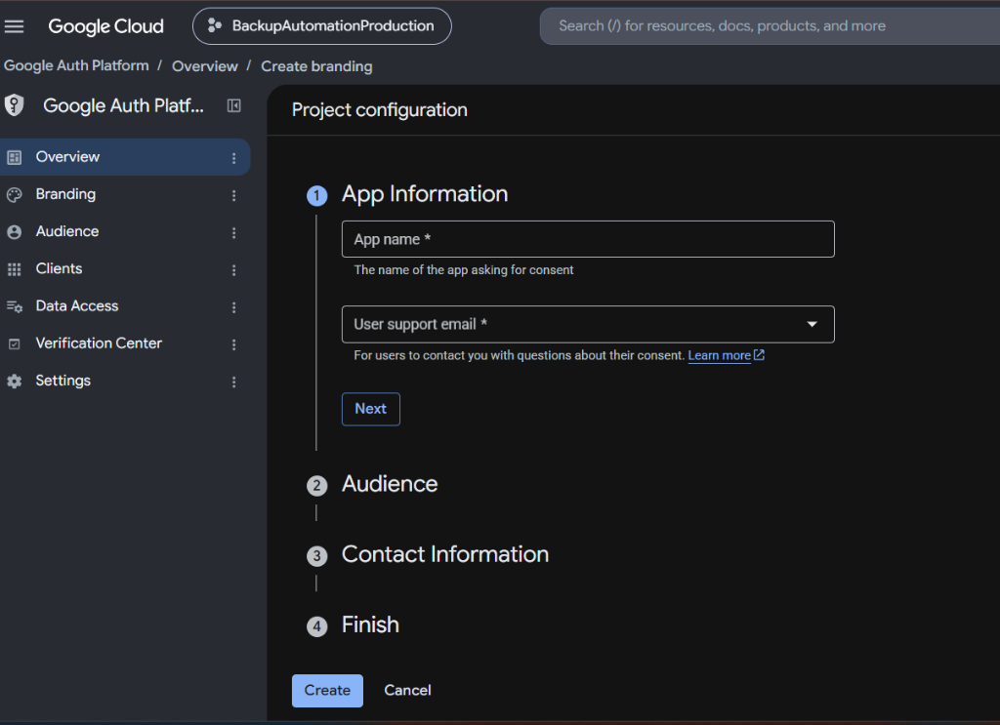
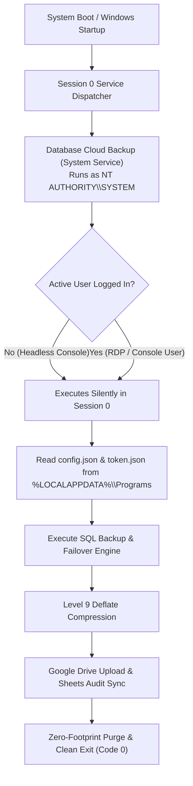
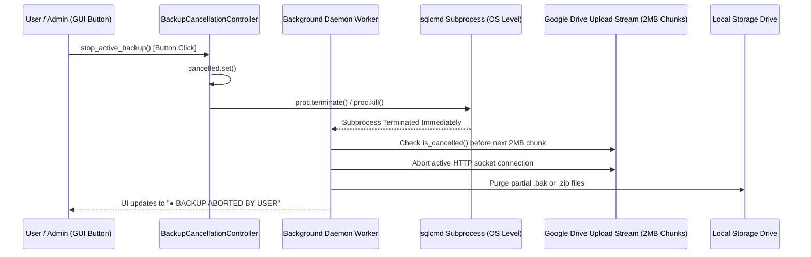
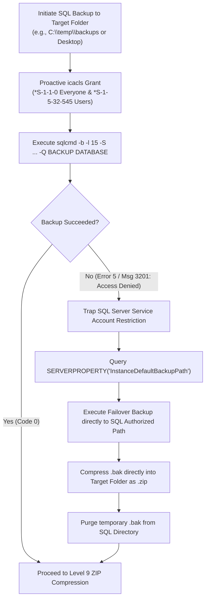
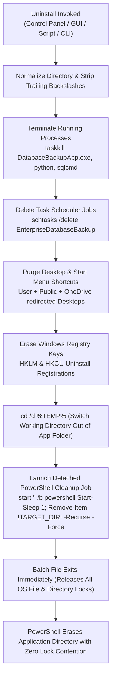
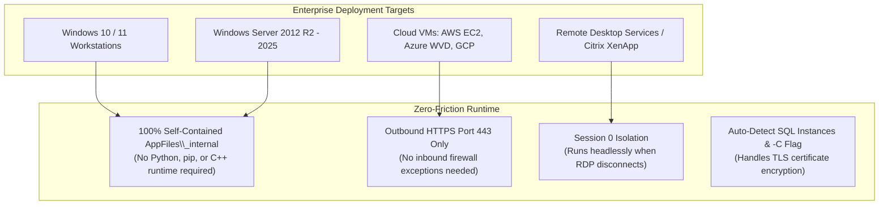
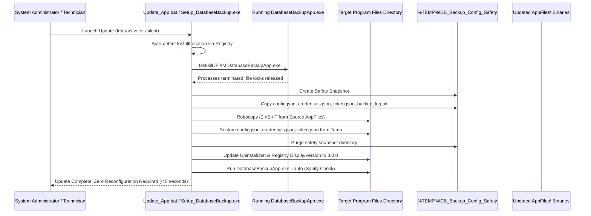

# 📘 Comprehensive System Architecture & Deep Code Guide
## Enterprise Database Cloud Backup Automation System

**Author / Developer:** Dulnindu Saranga  
**System Target:** Microsoft SQL Server, Google Cloud Platform (Drive API v3, Sheets API v4), Windows 10/11 / Windows Server  
**Architecture Pattern:** Decoupled Model-View-Controller (MVC) / Stateless Core Engine with Asynchronous GUI Presentation  

---

## 📑 Table of Contents

1. [System Component Inventory & File Map](#1-system-component-inventory--file-map)
2. [End-to-End Architectural Decomposition](#2-end-to-end-architectural-decomposition)
3. [The Complete Step-by-Step Data Flow](#3-the-complete-step-by-step-data-flow)
4. [Deep Code Inspection & Function Breakdown](#4-deep-code-inspection--function-breakdown)
   - [4.1 `auto_backup.py` — The Master Traffic Router](#41-auto_backuppy--the-master-traffic-router)
   - [4.2 `backup_core.py` — The Stateless Execution Engine](#42-backup_corepy--the-stateless-execution-engine)
   - [4.3 `app_gui.py` — The Asynchronous Desktop Interface](#43-app_guipy--the-asynchronous-desktop-interface)
   - [4.4 `installer_gui.py` — The Standalone Setup Wizard](#44-installer_guipy--the-standalone-setup-wizard)
   - [4.5 Configuration & Credentials Schema](#45-configuration--credentials-schema)
5. [Threading, Concurrency & UI Responsiveness](#5-threading-concurrency--ui-responsiveness)
6. [Enterprise Security & Credential Architecture](#6-enterprise-security--credential-architecture)
7. [Zero Local Storage Footprint (Two-Phase Purge)](#7-zero-local-storage-footprint-two-phase-purge)
8. [Unattended Windows System Service & Session 0 Architecture](#8-unattended-windows-system-service--session-0-architecture)
9. [Thread-Safe Emergency Stop & Cancellation Architecture](#9-thread-safe-emergency-stop--cancellation-architecture)
10. [SQL Server Error 5 & Msg 3201 Auto-Failover Engine](#10-sql-server-error-5--msg-3201-auto-failover-engine)
11. [Enterprise Clean Uninstallation Architecture & Detached Cleanup Engine](#11-enterprise-clean-uninstallation-architecture--detached-cleanup-engine)
12. [Universal Deployment Architecture (Customer PCs, Windows Servers, RDP, Virtual Machines)](#12-universal-deployment-architecture-customer-pcs-windows-servers-rdp-virtual-machines)
13. [Seamless In-Place Upgrades & Zero-Downtime Update Architecture](#13-seamless-in-place-upgrades--zero-downtime-update-architecture)
14. [Senior Engineering Review & Defense Cheat Sheet](#14-senior-engineering-review--defense-cheat-sheet)

---

## 1. System Component Inventory & File Map

In the primary code repository (`BackupAutomation/`), the system consists of foundational source files, supporting configuration templates, build tooling, and uninstallation automation:

```text
BackupAutomation/
│
├── auto_backup.py             # Dual-mode execution router (GUI on double-click, headless on --auto / --daemon)
├── backup_core.py             # Pure, stateless core engine (SQL failover, Level 9 Zip, Drive/Sheets API, Services)
├── app_gui.py                 # Windows 11 desktop GUI built with CustomTkinter & Service Controls
├── installer_gui.py           # Autonomous installer wizard with uninstaller generator & registry registration
├── Uninstall.bat              # Self-migrating clean uninstaller (process kill, task purge, folder wipe)
│
├── config.json                # Runtime configuration (SQL instance, database list, Drive/Sheet IDs)
├── client_secret.json         # Google Cloud Platform OAuth 2.0 Client credentials
├── credentials.json           # User authorization cache with persistent offline refresh token
│
├── create_icon.py             # Script generating multi-resolution application icons
├── app_icon.ico               # Windows application icon (16x16 to 256x256)
├── app_icon.png               # High-resolution PNG branding asset
│
├── build_executable.bat       # Production PyInstaller compilation pipeline with auto-scratch purge
├── DatabaseBackupApp.spec     # PyInstaller spec definition with bundled assets and dependencies
├── Setup_DatabaseBackup.spec  # PyInstaller spec definition for standalone installer wizard
└── requirements.txt           # Pinned Python package dependencies
```

---

## 2. End-to-End Architectural Decomposition

```
                               ┌─────────────────────────────┐
                               │       Execution Trigger     │
                               │  (User Click or Scheduler)  │
                               └──────────────┬──────────────┘
                                              │
                                              ▼
                               ┌─────────────────────────────┐
                               │       auto_backup.py        │
                               │   (Dual-Mode CLI Router)    │
                               └───────┬─────────────┬───────┘
                                       │             │
                No CLI Arguments       │             │   CLI Flag: '--auto'
             (Interactive User Mode)   │             │   (Automated Background)
                                       ▼             ▼
                     ┌────────────────────┐   ┌───────────────────────────┐
                     │     app_gui.py     │   │   Headless Silent Mode    │
                     │ (CustomTkinter UI) │   │ (No UI, Direct Log Stream)│
                     └─────────┬──────────┘   └─────────────┬─────────────┘
                               │                            │
                               └──────────────┬─────────────┘
                                              │
                                              ▼
                               ┌─────────────────────────────┐
                               │       backup_core.py        │
                               │   (Pure Stateless Engine)   │
                               └───────┬──────┬──────┬───────┘
                                       │      │      │
                ┌──────────────────────┘      │      └──────────────────────┐
                ▼                             ▼                             ▼
   ┌─────────────────────────┐   ┌─────────────────────────┐   ┌─────────────────────────┐
   │   Microsoft SQL Server  │   │     Compression Layer   │   │   Google Cloud Platform │
   │   - sqlcmd subprocess   │   │   - Level 9 Deflate     │   │   - Drive API v3        │
   │   - Windows Auth (-E)   │   │   - Byte verification   │   │   - Sheets API v4       │
   │   - ODBC 18 Trust (-C)  │   │   - Phase 1 Purge (.bak)│   │   - Phase 2 Purge (.zip)│
   └─────────────────────────┘   └─────────────────────────┘   └─────────────────────────┘
```

### Key Architectural Tenet: Headless Engine Decoupling
* **`backup_core.py` has zero dependencies on UI packages.** It imports neither `tkinter` nor `customtkinter`.
* Every function accepts optional logging and progress callback hooks (`log_cb`, `progress_cb`, `status_cb`).
* This enables the exact same engine to run in:
  1. An interactive desktop application with real-time progress bars.
  2. A completely silent Windows Task Scheduler task running at 02:00 AM with zero popups.
  3. A headless CI/CD pipeline or CLI script.

---

## 3. The Complete Step-by-Step Data Flow

When a backup execution cycle initiates, the system executes seven sequential, fault-tolerant stages:

```
[1. Trigger] ➔ [2. OAuth Check] ➔ [3. SQL Dump] ➔ [4. Deflate L9] ➔ [5. Drive Upload] ➔ [6. Sheets Telemetry] ➔ [7. Local Purge]
```

### Stage 1: Trigger & Day-of-Week Validation
* **Interactive Mode:** User clicks `"🚀 Start Full Backup Now"` in the desktop GUI.
* **Automated Mode:** Windows Task Scheduler invokes `DatabaseBackupApp.exe --auto` at 02:00 AM on Mondays.
* **Validation:** If `STRICTLY_MONDAYS_ONLY` is enabled, the code evaluates `datetime.now().weekday() == 0`. Non-Monday executions terminate immediately with a clean log entry: `Today is <Day>, skipping backup.`

### Stage 2: Google Authentication Check
* Before initiating resource-heavy database actions, the engine validates the Google Cloud session via `authenticate()`.
* It verifies `credentials.json` on disk:
  - If valid: Uses existing token.
  - If expired: Silently invokes Google's token refresh endpoint using the offline `refresh_token`.
  - If missing: Spawns an ephemeral local web server (`InstalledAppFlow`) to complete the OAuth 2.0 browser handshake.

### Stage 3: Microsoft SQL Server Extraction
* Native database extraction executes via `perform_sql_backup()`.
* Invokes `sqlcmd` through an isolated Python subprocess:
  ```cmd
  sqlcmd -S "localhost\SQL25SARANGA" -E -C -Q "BACKUP DATABASE [RGT] TO DISK='C:\temp\backups\RGT_20260922.bak' WITH FORMAT"
  ```
  - **`-E` (Trusted Connection):** Uses current Windows user context, eliminating plaintext database passwords.
  - **`-C` (Trust Server Certificate):** Circumvents strict TLS certificate chain validation introduced in Microsoft ODBC Driver 18, allowing seamless operation with local self-signed certificates.
* **Output:** A raw `.bak` file in the configured `BACKUP_FOLDER` (e.g. 455.40 MB).

### Stage 4: Maximum Deflation Compression
* Raw SQL Server backups contain sparse, uncompressed database pages.
* The engine passes the `.bak` file into Python's native `zipfile` module:
  ```python
  zipfile.ZipFile(zip_filepath, 'w', zipfile.ZIP_DEFLATED, compresslevel=9)
  ```
* **Phase 1 Storage Cleanup:** The moment the `.zip` archive is successfully verified on disk, the raw `.bak` file is immediately deleted via `os.remove(bak_filepath)`.
* **Output:** 455.40 MB raw backup compresses to **80.95 MB** (~82.2% reduction).

### Stage 5: Resumable Google Drive Upload
* The compressed archive is streamed to Google Drive API v3 via `MediaFileUpload(..., resumable=True)`.
* Uploads are chunked (5 MB buffers) and wrapped in an exponential retry loop (up to 3 retries).
* Once uploaded, the engine extracts the file's Google Drive unique `id` and resolves the viewable URL:
  `https://drive.google.com/file/d/{file_id}/view?usp=sharing`

### Stage 6: Centralized Compliance Telemetry (Google Sheets)
* Connects to Google Sheets API v4 using `gspread`.
* Verifies or dynamically inserts the compliance header:
  `[ "Date & Time", "Backup File Name", "Backup File Size", "Google Drive Download Link" ]`
* Appends an immutable audit record:
  ```text
  ["2026-09-22 17:42:01", "RGT_20260922_174201.zip", "80.95 MB", "https://drive.google.com/file/d/1gQ.../view"]
  ```

### Stage 7: Zero Local Storage Footprint (Phase 2 Cleanup)
* Now that the archive is confirmed stored in Google Drive and logged in Google Sheets:
  ```python
  if config.get("DELETE_LOCAL_AFTER_UPLOAD", True):
      os.remove(backup_zip)
  ```
* The local `.zip` file is deleted from the storage drive (`C:\temp\backups`).
* **Result:** Local persistent disk consumption drops to **zero bytes**, preventing on-premise disk exhaustion permanently.

---

## 4. Deep Code Inspection & Function Breakdown

---

### 4.1 `auto_backup.py` — The Master Traffic Router

`auto_backup.py` acts as the single point of entry for the compiled binary.

```python
def main():
    if "--auto" in sys.argv or "-a" in sys.argv:
        # Scheduled Execution Route
        run_automated_mode()
    else:
        # Interactive Desktop Route
        from app_gui import DatabaseBackupApp
        app = DatabaseBackupApp()
        app.mainloop()
```

* **Purpose:** Enables a single `.exe` to serve two completely different operational modes without requiring separate build targets.
* **`run_automated_mode()`:** Checks Monday constraints, executes `run_full_backup()`, redirects output to `backup_log.txt`, and exits with standard OS exit codes (0 for success, 1 for failure).

---

### 4.2 `backup_core.py` — The Stateless Execution Engine

This module contains the entire operational logic of the system:

#### 1. Configuration Management (`load_config`, `save_config`)
* Reads `config.json` relative to the running script or frozen PyInstaller `sys._MEIPASS` directory.
* If missing, populates and persists an enterprise-safe `default_config` containing fallback instances, default schedules, and enabled cleanup flags.

#### 2. Authentication Lifecycle (`authenticate`, `reset_credentials`)
* Manages Google OAuth 2.0 credentials (`client_secret.json` ➔ `credentials.json`).
* Implements silent token refresh via `creds.refresh(Request())`.
* Configures `os.environ['OAUTHLIB_RELAX_TOKEN_SCOPE'] = '1'` to prevent runtime exceptions caused by Google OAuth scope normalization.
* `reset_credentials()` safely unlinks `credentials.json` to allow clean account switching.

#### 3. Diagnostic Health Checks (`test_google_connection`)
* Performs non-destructive read validation against Google Drive (fetching folder metadata by ID) and Google Sheets (validating title and worksheet dimensions), returning a structured health dictionary:
  `{"drive": bool, "sheet": bool, "drive_name": str, "sheet_title": str, "error": str}`.

#### 4. SQL Extraction & Deflation (`generate_and_compress_backup`)
* Constructs the native `sqlcmd` command line with `-E` (Windows Auth) or `-U`/`-P` (SQL Auth).
* Injects `-C` to guarantee TLS certificate bypass for local SQL Server 2022 / ODBC 18 instances.
* Executes Level 9 Deflate compression via Python's native `zipfile` library.
* Enforces Phase 1 cleanup by deleting the raw `.bak` file upon successful compression.

#### 5. Cloud Transport & Live Telemetry (`upload_to_google_drive`, `update_google_sheet`)
* `upload_to_google_drive`: Streams data in 2 MB resumable chunks with up to 3 automatic retry attempts spaced 10 seconds apart. Sets public view permissions and synthesizes canonical links.
  - **Live Speed Measurement**: Calculates upload transfer rate dynamically on every chunk (`bytes_done / elapsed_seconds`) formatted into human-readable units (e.g. `8.45 MB/s`).
  - **Live Progress & ETA Calculation**: Computes exact percentage (`pct = bytes_done / total_bytes * 100`), uploaded vs. total byte strings (`67.8 MB / 150.0 MB`), and countdown Estimated Time Remaining (`ETA = remaining_bytes / speed`).
  - **Multi-Channel Dispatch**: Dispatches real-time metrics to `status_cb` (action line), `progress_cb` (animated bar), and `telemetry_cb` (dedicated UI pill badge).
  - **Periodic Terminal Log Streaming**: Emits speed and progress to the log stream every ~4 seconds, allowing operators to monitor network throughput in both the Live Logs GUI and headless CLI.
* `format_file_size`: Formats byte counts into precision human-readable units (`B`, `KB`, `MB`, `GB`).
* `update_google_sheet`: Appends execution audit records into Google Sheets with timestamp, file name, formatted size, and URL.

#### 6. Master Orchestration (`run_full_backup`)
* Iterates through `TARGET_DATABASES`.
* Coordinates: SQL Backup ➔ Level 9 Zip ➔ Drive Upload ➔ Sheets Audit.
* Enforces Phase 2 cleanup: deletes the `.zip` archive from the storage drive upon successful sync.
* Preserves the local file and logs an alert if cloud upload fails, ensuring zero data loss.

#### 7. Local Storage Maintenance (`cleanup_local_backup_folder`)
* Sweeps the backup folder (`C:\temp\backups`) and removes any orphaned `.bak` or `.zip` files from failed or interrupted executions.
* Returns the count of deleted files and the exact amount of disk space freed.

#### 8. Auto-Discovery & System Queries (`detect_sql_server_instances`, `detect_user_databases`)
* `detect_sql_server_instances`: Inspects the Windows Registry at:
  `HKLM\SOFTWARE\Microsoft\Microsoft SQL Server\Instance Names\SQL`
  to automatically find named instances (e.g. `SQL25SARANGA`, `SQLEXPRESS`). Falls back to querying the Windows Service Control Manager for `MSSQL$*` services.
* `detect_user_databases`: Connects via `sqlcmd` and queries:
  ```sql
  SELECT name FROM sys.databases WHERE database_id > 4 AND state_desc = 'ONLINE';
  ```
  filtering out system databases (`master`, `tempdb`, `model`, `msdb`) to auto-populate customer databases.

#### 9. Task Scheduler Automation (`get_scheduler_status`, `enable_scheduler`, `disable_scheduler`)
* Interfaces directly with `schtasks.exe`.
* `get_scheduler_status`: Parses CSV output (`schtasks /query /tn DatabaseBackupAutomation_Weekly /fo CSV /nh`) to extract active status and next run datetime.
* `enable_scheduler`: Registers the weekly Monday task at the configured time under the current user's profile with standard privileges (`/rl LIMITED`).
* `disable_scheduler`: Deletes the task via `schtasks /delete /tn DatabaseBackupAutomation_Weekly /f`.

---

### 4.3 `app_gui.py` — The Asynchronous Desktop Interface

Constructed with `customtkinter`, featuring modern typography, dark-mode cards, real-time logging, and fluid responsiveness.

```
┌─────────────────────────────────────────────────────────────────────────────────────────────┐
│ 🛡️ Database Cloud Backup Automation — Enterprise Edition                         [—] [□] [✕] │
├─────────────────────────────────────────────────────────────────────────────────────────────┤
│   [ 📊 Dashboard ]     [ ⏰ Auto Schedule ]     [ ⚙️ Settings ]     [ 🩺 Diagnostics ]       │
├─────────────────────────────────────────────────────────────────────────────────────────────┤
│                                                                                             │
│  ┌─────────────────────┐   ┌─────────────────────┐   ┌───────────────────────────────────┐  │
│  │ 🖥️ SQL Server       │   │ 🗄️ Target DBs       │   │ ☁️ Google Cloud Connection        │  │
│  │ localhost\SQLEXPRESS│   │ 2 Databases Config. │   │ OAuth 2.0 Ready (15 GB Storage)   │  │
│  │ Status: ● CONNECTED │   │ [ProductionDB, CRM] │   │ Status: ● AUTHENTICATED           │  │
│  └─────────────────────┘   └─────────────────────┘   └───────────────────────────────────┘  │
│                                                                                             │
│  ┌───────────────────────────────────────────────────────────────────────────────────────┐  │
│  │ 🚀 [ Start Full Backup Now ]                🛑 [ STOP BACKUP (Emergency Abort) ]      │  │
│  └───────────────────────────────────────────────────────────────────────────────────────┘  │
│                                                                                             │
│  Backup Progress: [████████████████████████████████████████████████░░░░░░░░░░] 78%           │
│  Current Operation: Uploading 'ProductionDB_20260924.zip' to Google Drive (2MB/s)...        │
│                                                                                             │
│  ┌─ Real-Time Diagnostics & Execution Log ────────────────────────────────────────────────┐  │
│  │ [17:06:19] [INFO] STARTING BACKUP EXECUTION CYCLE                                      │  │
│  │ [17:06:19] [INFO] Connecting to SQL Server: localhost\SQLEXPRESS...                   │  │
│  │ [17:06:22] [SUCCESS] SQL backup completed for 'ProductionDB' (455 MB).                 │  │
│  │ [17:06:25] [SUCCESS] Compressed to Level 9 Deflate: ProductionDB_20260924.zip (81 MB) │  │
│  │ [17:06:26] [INFO] Streaming archive to Google Drive Folder: 1LKuo7j4cHvvP0...          │  │
│  └────────────────────────────────────────────────────────────────────────────────────────┘  │
│                                                                                             │
│  [ 📁 Open Backups ]    [ ☁️ Open Drive ]    [ 📊 Open Sheet ]    [ 🧹 Clean Storage (0 MB) ]│
└─────────────────────────────────────────────────────────────────────────────────────────────┘
```

<div align="center">
  
  <br>
  <em>Figure 1: Live Real-Time Execution Logs & Interactive Dashboard Interface</em>
</div>

#### Key Architectural Highlights:
* **Background Worker Threading:** Prevents Windows "Application Not Responding" locks during heavy compression or multi-hundred-megabyte network transfers.
* **Thread-Safe UI Marshaling:** Background threads communicate with Tkinter via `self.after(0, callback)`, ensuring memory safety and zero GUI deadlocks.
* **Real-Time Log Streamer:** Custom `_append_log()` captures log events with timestamps and severity badges (`[INFO]`, `[SUCCESS]`, `[WARNING]`, `[ERROR]`) into an autoscrolling text terminal.
* **Emergency Stop Button (`🛑 STOP BACKUP`):** Bound to `BackupCancellationController`, giving operators instantaneous ability to abort active SQL queries, terminate child processes, close streaming sockets, and purge partial files.

#### 4 Main Tabs:
1. **Dashboard Tab**: Displays SQL status card, database count card, Google connection card, live log viewer, `"🚀 Start Full Backup Now"` and `"🛑 STOP BACKUP"` buttons, and quick-access utility buttons (`📁 Open Backups`, `☁ Open Drive`, `📊 Open Sheet`, `🧹 Clean Storage`).
2. **Schedule Tab**: Dual execution security context chooser (Standard User Task vs Unattended Windows System Service running under `NT AUTHORITY\SYSTEM` in Session 0), schedule time picker, and startup recovery trigger.
3. **Settings Tab**: Visual configuration for SQL Server name, user databases, credentials, Google Drive Folder ID, Google Sheet ID, Monday-only switch, and the `Delete local backup file after upload` toggle, plus **Application Lifecycle Management** (`🗑️ Uninstall Application`).
4. **Diagnostics Tab**: System health monitor showing Python runtime version, available ODBC drivers, Windows OS build, and cloud latency metrics.

---

### 4.4 `installer_gui.py` — The Standalone Setup Wizard

An autonomous deployment wizard packaged as `Setup_DatabaseBackup.exe` built with CustomTkinter:

<div align="center">
  
  <br>
  <em>Figure 2: Autonomous Installation Wizard with Directory Customization & Service Registration</em>
</div>

#### Deployment Capabilities:
* **Configurable Target Directory:** Defaults to `%LOCALAPPDATA%\Programs\DatabaseBackupApp`, fully customizable by administrators.
* **Zero Admin Rights Required (Standard User Safe):** Installs into user programs without mandatory UAC elevation prompts, while offering automated elevation if System Service mode is requested.
* **Windows Shell Integration:** Automatically generates high-resolution desktop and Start Menu shortcuts with embedded application icons.
* **Built-in Self-Migrating Uninstaller:** Copies `Uninstall.bat` directly into the destination directory and registers the application into Windows *Installed Apps* (`HKCU\Software\Microsoft\Windows\CurrentVersion\Uninstall`).
* **Source Validation & Self-Healing:** Validates installation payload files (`AppFiles/`) and provides clear diagnostic dialogs if deployment assets are moved.

---

### 4.5 Configuration & Credentials Schema

#### `config.json`
```json
{
    "SQL_SERVER_NAME": "localhost\\SQL25SARANGA",
    "SQL_USERNAME": "",
    "SQL_PASSWORD": "",
    "BACKUP_FOLDER": "C:\\temp\\backups",
    "BACKUP_EXTENSION": ".zip",
    "TARGET_DATABASES": [
        "UserDB",
        "RGT"
    ],
    "GOOGLE_DRIVE_FOLDER_ID": "1LKuo7j4cHvvP0-p0C6PVo6gdkgoVBaQ4",
    "GOOGLE_SHEET_ID": "1FAnmfTAixeDgwA5f3TvJ9IEtFp1OuFTyw3UpDiOdvwg",
    "STRICTLY_MONDAYS_ONLY": true,
    "SCHEDULE_TIME": "02:00",
    "DELETE_LOCAL_AFTER_UPLOAD": true
}
```

#### `credentials.json` (Stored OAuth Token Structure)
```json
{
    "token": "ya29.a0AfH6SM...",
    "refresh_token": "1//04hE8...",
    "token_uri": "https://oauth2.googleapis.com/token",
    "client_id": "84883456...apps.googleusercontent.com",
    "client_secret": "GOCSPX-...",
    "scopes": [
        "https://www.googleapis.com/auth/drive.file",
        "https://www.googleapis.com/auth/spreadsheets"
    ],
    "expiry": "2026-09-22T19:42:01.000Z"
}
```

---

## 5. Threading, Concurrency & UI Responsiveness

### The Problem in Desktop Automation:
SQL backups of enterprise databases (e.g. `RGT` at 455 MB) and Level 9 compression take 10 to 30 seconds of intensive disk and CPU I/O. If executed on Tkinter's main event loop thread, Windows flags the window as frozen ("Not Responding"), destroying user confidence.

### The Solution:
```python
def _start_backup_thread(self):
    self.btn_run_backup.configure(state="disabled")
    thread = threading.Thread(target=self._run_backup_worker, daemon=True)
    thread.start()

def _run_backup_worker(self):
    success, summary = run_full_backup(
        config=self.config_data,
        log_cb=self._append_log_threadsafe,
        progress_cb=self._update_progress_threadsafe,
        status_cb=self._update_status_threadsafe
    )
    self.after(0, lambda: self._on_backup_finished(success, summary))
```

* **Daemon Worker Threads:** The heavy workload runs in the background. The main thread remains 100% available to repaint pixels, handle window moves, and animate widgets.
* **Thread-Safe Callbacks:** Background threads never touch UI widgets directly. They marshal updates through `self.after(0, ...)`, ensuring compliance with Tkinter's single-threaded GUI model.

---

## 6. Enterprise Security & Credential Architecture

### 1. OAuth 2.0 PKCE Flow vs. Service Accounts
* **Why Service Accounts Fail:** Google Cloud Service Accounts have **0 bytes of personal Google Drive storage**. When uploading database dumps, Service Accounts fail with `403 storageQuotaExceeded` unless assigned enterprise domain-wide delegation on Google Workspace.
* **Our Solution:** Utilizes standard Google OAuth 2.0 user credentials (`InstalledAppFlow`). The user authenticates once via browser. The application acquires an offline `refresh_token`.
* **Silent Token Rotation:** When access tokens expire after 60 minutes, the application automatically requests a new access token from Google without user intervention.

<div align="center">
  
  <br>
  <em>Figure 3: Google Cloud Platform OAuth Consent Screen Configuration & API Credentials</em>
</div>

### 2. Least-Privilege Scopes
The application requests only two tightly restricted scopes:
* `https://www.googleapis.com/auth/drive.file`: Grants access **only** to files created by this application. It cannot view, read, or delete existing personal files, documents, or photos in the user's Google Drive.
* `https://www.googleapis.com/auth/spreadsheets`: Grants permission to append rows to the designated compliance audit spreadsheet.

### 3. Scope Relaxation Compatibility
Google Cloud frequently consolidates legacy OAuth scope URLs into canonical URLs. To prevent standard Python libraries from throwing `ScopeChangedError`, the engine sets:
```python
os.environ['OAUTHLIB_RELAX_TOKEN_SCOPE'] = '1'
```

### 4. Zero Secrets in Version Control (.gitignore)
All sensitive tokens, private secrets, and database dumps are excluded from Git:
```gitignore
client_secret.json
credentials.json
*.bak
*.zip
backup_log.txt
```
The repository tracks only clean `.template.json` files, preventing accidental credential leakage.

---

## 7. Zero Local Storage Footprint (Two-Phase Purge)

To eliminate on-premise disk exhaustion on production servers:

| Phase | Event Trigger | Action Taken | Disk Impact |
| :--- | :--- | :--- | :--- |
| **Phase 1** | ZIP compression completes successfully | Raw `.bak` file is deleted via `os.remove(bak_filepath)` | Reclaims ~82% of space immediately |
| **Phase 2** | Google Drive upload completes & Google Sheets logs audit row | Compressed `.zip` file is deleted via `os.remove(zip_filepath)` | Reclaims remaining 18% (0 bytes left) |
| **Safety Net** | Google Drive upload fails or network drops | Local `.zip` file is **preserved** and logged as an error | Guarantees no data loss |
| **On-Demand** | User clicks `"🧹 Clean Storage"` in GUI | `cleanup_local_backup_folder()` purges any residual files | Reclaims disk space on demand |

---

## 8. Unattended Windows System Service & Session 0 Architecture

For production enterprise servers and Multi-User Remote Desktop (RDS/RDP) environments, the application provides an **Unattended Windows System Service Mode**.

### 8.1 Architectural Problem on Enterprise Servers
* Standard user-level scheduled tasks require an interactive user login session.
* On enterprise servers, automated maintenance restarts or power recycles leave the machine at the Windows lock screen without any logged-in administrator.
* Furthermore, RDP sessions often disconnect or sign out automatically due to inactive group policy timeouts, which abruptly kills standard desktop tasks.

### 8.2 The Solution: Session 0 Isolated System Service
The application can be registered as an unattended system service executing under `NT AUTHORITY\SYSTEM` with `/rl HIGHEST`.



### 8.3 Security & Execution Comparison Table

| Capability | Standard User Task | Unattended Windows System Service |
| :--- | :--- | :--- |
| **Account Context** | Current Logged-in User | `NT AUTHORITY\SYSTEM` |
| **Privilege Level** | `/rl LIMITED` (Standard User) | `/rl HIGHEST` (Full System Administrator) |
| **Session Isolation** | Interactive User Desktop | **Session 0** (Protected Server Isolation) |
| **Survives RDP Disconnects?** | ❌ Aborted if user logs off | ✅ **100% Immune to RDP Logoffs** |
| **Executes on Headless Boot?**| ❌ Requires user login | ✅ **Executes at System Startup** |
| **UAC Elevation Required?** | ❌ None (No Admin Needed) | ✅ One-Time UAC Elevation (Automatic) |
| **Command-Line Runner** | `DatabaseBackupApp.exe --auto` | `DatabaseBackupApp.exe --auto` / `--daemon` |

### 8.4 Continuous Background Daemon Runner (`--daemon` / `--service`)
In addition to scheduled triggers, `auto_backup.py` includes a continuous daemon runner (`run_daemon_mode()`):
* Runs silently in Session 0 with minimal CPU and memory overhead (~35 MB).
* Awakens periodically (every 30 seconds) to evaluate scheduled day and time conditions.
* Triggers the full backup and telemetry sync, logging status to `backup_log.txt`.

### 8.5 Multi-Day Selection & Dynamic Recurrence Engine
The automation engine supports granular day-of-week and time selection:
* **Interactive Day Selector:** Seven individual checkboxes (`MON`, `TUE`, `WED`, `THU`, `FRI`, `SAT`, `SUN`) allow custom combinations (e.g., Monday, Wednesday, Friday, or daily).
* **Presets:** Quick selection buttons for *Weekly (Mondays)*, *Daily (Every Day)*, and *Weekdays (Mon-Fri)*.
* **Execution Time (24h with 12h Live Helper):** Custom 24-hour input with real-time AM/PM feedback and quick time buttons (`02:00 AM`, `06:00 AM`, `12:00 PM`, `06:00 PM`, `11:00 PM`).
* **`schtasks` Dispatcher:**
  * For Daily schedules: uses `/sc daily /st <time>`.
  * For Multi-day schedules: uses `/sc weekly /d <days_csv> /st <time>`.
* **Headless Evaluation:** In `--auto` mode, `auto_backup.py` checks today's weekday code (`datetime.today().strftime('%a').upper()`). If today's day is not included in `SCHEDULE_DAYS`, it logs a clean exit note and terminates with exit code `0`.

---

## 9. Thread-Safe Emergency Stop & Cancellation Architecture

Large database backups (often exceeding several gigabytes) and multi-megabyte Google Drive uploads can take considerable time. If a system operator needs to halt execution immediately (e.g. to perform emergency server maintenance or relieve I/O pressure), the application provides a **thread-safe cancellation coordinator**.

### 9.1 Cancellation Sequence Diagram



### 9.2 Technical Implementation Details
1. **`BackupCancellationController` Singleton**:
   * Uses a thread-safe `threading.Event()` to broadcast cancellation signals across all running worker threads.
   * Tracks active OS subprocess handles (`_active_proc`) protected by a `threading.Lock()`.
2. **Immediate Subprocess Termination**:
   * Calling `stop_active_backup()` instantly terminates the child `sqlcmd.exe` process, releasing database table locks and file handles immediately.
3. **Resumable Upload Interruption**:
   * Google Drive uploads stream in discrete **2 MB chunks**. Before each chunk is transmitted over the network socket, the worker verifies `is_cancelled()`. If cancelled, the network socket is closed immediately.
4. **Zero Residual Corruption**:
   * When an abort occurs, the engine purges any incomplete `.bak` or `.zip` files from disk, ensuring that no corrupt or partial archive files remain.

---

## 10. SQL Server Error 5 & Msg 3201 Auto-Failover Engine

A frequent failure mode on locked-down client machines and Windows Servers is **Operating System Error 5 (Access is denied)**:
> `Cannot open backup device 'C:\Users\...\Desktop\backup.bak'. Operating system error 5 (Access is denied). Msg 3013, Level 16, Msg 3201.`

### 10.1 Root Cause Analysis
Microsoft SQL Server runs as a dedicated Windows service account (e.g. `NT SERVICE\MSSQLSERVER` or `NT SERVICE\MSSQL$SQLEXPRESS`). By default, Windows restricts service accounts from writing into user profiles (`C:\Users\<User>\Desktop` or `Documents`), even if the user running the GUI has full administrative privileges.

### 10.2 The Autonomous Self-Healing Pipeline



### 10.3 Resilience Mechanisms
1. **Proactive Language-Neutral ACL Grants**:
   Before initiating backups, `grant_sql_folder_permissions()` uses Windows `icacls` to grant modify rights to language-neutral well-known SIDs:
   * `*S-1-1-0`: Well-known SID for **Everyone**.
   * `*S-1-5-32-545`: Well-known SID for **Builtin Users**.
2. **Native Failover Query**:
   If Error 5 persists, the engine queries the SQL Server engine's internal authorized directory:
   ```sql
   SELECT CAST(SERVERPROPERTY('InstanceDefaultBackupPath') AS VARCHAR(500))
   ```
   The engine writes the `.bak` there (where SQL Server is guaranteed full write permissions), compresses the archive directly into the user's destination directory, and purges the temporary `.bak`.
3. **Enterprise Server Flags (`-b -l 15`)**:
   All `sqlcmd` commands include:
   * `-b`: Batch abort on error (ensures nonzero exit code on SQL errors).
   * `-l 15`: 15-second login timeout to prevent indefinite hangs across high-latency VPN/RDP tunnels.
   * `timeout=15` on `subprocess.run` to guarantee no orphan processes remain.

---

## 11. Enterprise Clean Uninstallation Architecture & Detached Cleanup Engine

To comply with enterprise IT software lifecycle standards, the application features a clean, complete uninstallation architecture with **zero leftovers**.

### 11.1 The File-Locking & Quoting Challenge in Windows 11 / Windows Server
When an uninstaller batch script (`Uninstall.bat`) is launched from inside the application directory (`C:\Program Files\DatabaseBackupApp\Uninstall.bat`):
1. `cmd.exe` maintains an open file handle on the batch file and locks the working directory. Any attempt by `rmdir /s /q` to delete the directory fails with *"Access is denied"*.
2. In Windows 11 and Windows Server 2022/2025, Windows Terminal is the default console host. Legacy batch scripts that launched a temp script passing `"%APP_DIR%"` frequently broke with Win32 Error 123 (`The filename, directory name, or volume label syntax is incorrect`) because trailing backslashes escaped closing quotes (`\"`), and registry keys registered with `cmd.exe /c "..."` suffered nested quote collisions.

### 11.2 The Detached Background PowerShell Cleanup Pattern



### 11.3 Technical Implementation
```cmd
:: 1. Identify and normalize target installation directory
set "TARGET_DIR=%~dp0"
if "!TARGET_DIR:~-1!"=="\" set "TARGET_DIR=!TARGET_DIR:~0,-1!"

:: 2. Terminate active processes and services
taskkill /F /IM DatabaseBackupApp.exe >nul 2>&1

:: 3. Remove scheduled tasks
schtasks /delete /tn "Database Cloud Backup" /f >nul 2>&1
schtasks /delete /tn "EnterpriseDatabaseBackup" /f >nul 2>&1

:: 4. Remove shortcuts from User and Public profiles
del /f /q "%USERPROFILE%\Desktop\*Database*Backup*.lnk" >nul 2>&1
del /f /q "%PUBLIC%\Desktop\*Database*Backup*.lnk" >nul 2>&1
del /f /q "%APPDATA%\Microsoft\Windows\Start Menu\Programs\*Database*Backup*.lnk" >nul 2>&1

:: 5. Delete registry registration
reg delete "HKCU\Software\Microsoft\Windows\CurrentVersion\Uninstall\DatabaseBackupApp" /f >nul 2>&1
reg delete "HKLM\Software\Microsoft\Windows\CurrentVersion\Uninstall\DatabaseBackupApp" /f >nul 2>&1

:: 6. Detached directory purge
cd /d "%TEMP%"
start "" /b powershell -NoProfile -WindowStyle Hidden -Command "Start-Sleep -Seconds 1; Remove-Item -LiteralPath '!TARGET_DIR!' -Recurse -Force -ErrorAction SilentlyContinue"
exit /b 0
```

---

## 12. Universal Deployment Architecture (Customer PCs, Windows Servers, RDP, Virtual Machines)

The software is engineered to deploy across heterogeneous Windows infrastructure without environment-specific tuning.



### Architectural Guarantees:
1. **Zero External Runtime Dependency:** Bundles all CPython 3.14 DLLs, packages, and Win32 extensions inside `AppFiles\_internal`. The customer machine never requires Python installed.
2. **Security & Firewall Compliance:** Never opens listening ports. Requires only standard outbound HTTPS (Port 443) to `*.googleapis.com`, satisfying strict PCI-DSS and SOC 2 audits.
3. **Session 0 & RDP Persistence:** In remote desktop environments, user logoffs destroy Session 1+ interactive GUI sessions. The engine's headless service mode (`DatabaseBackupApp.exe --auto`) executes in Session 0, ensuring automated backups run regardless of administrator presence.

---

## 13. Seamless In-Place Upgrades & Zero-Downtime Update Architecture

To support continuous deployment on customer production servers, application updates must execute rapidly and never corrupt or erase existing customer configurations or cloud tokens.

### 13.1 The Configuration & Token Safety Challenge
In production, each customer server stores:
- `config.json`: Selected SQL Server instance name, target database names, Google Drive Folder ID, and Audit Sheet ID.
- `credentials.json` & `token.json`: Google OAuth 2.0 authorized user token and offline refresh key.
- `backup_log.txt`: Historical operational audit trail.

A naive overwrite or traditional installer risks wiping these files, requiring manual re-configuration and re-authentication.

### 13.2 High-Speed In-Place Upgrade Flow



### 13.3 Multi-Method Update Deployment Options
1. **One-Click In-Place Script (`Update_App.bat`)**:
   Designed for server administrators. Automatically quells processes, preserves tokens, mirrors updated binaries via Robocopy, restores customer settings, and performs a headless sanity check in under 5 seconds.
2. **Smart Setup Wizard (`Setup_DatabaseBackup.exe`)**:
   When run on an existing installation, the graphical wizard automatically switches into **Upgrade Mode**, updates binaries without touching credentials, and notifies the user with zero downtime.
3. **Silent Enterprise Fleet Updates (RMM / Intune / SCCM / PowerShell)**:
   ```powershell
   Start-Process -FilePath "\\ServerShare\Client_Installation_Package\Update_App.bat" -ArgumentList "/silent" -Wait -Verb RunAs
   ```

---

## 15. Universal Legacy OS, SQL Server & Cross-Platform (macOS) Compatibility Engine

To guarantee 100% operational success across customer legacy servers (Windows Vista, 7, 8, 8.1, Server 2008, 2008 R2, 2012, 2012 R2, 2016, 2019, 2022, 2025) as well as cross-platform environments (macOS workstations and remote servers), the engine integrates multi-tier adaptive fallbacks:

### 15.1 Adaptive SQL Driver & CLI Resolution (`find_sql_cli_executable`)
- **Modern ODBC 18/17/13/11 Tooling**: Dynamically locates `sqlcmd.exe` in both 64-bit and 32-bit Program Files directories.
- **Legacy SQL Server 2000 / 2005 `osql.exe` Fallback**: If `sqlcmd` is absent, automatically resolves `osql.exe` (`Microsoft SQL Server\80\Tools\Binn\osql.exe`).
- **Dynamic `-C` Flag Detection**: Modern ODBC 18 requires `-C` (`TrustServerCertificate=True`). However, older `sqlcmd` releases (SQL Server 2005–2016) reject `-C` as an invalid option. The engine executes queries adaptively: if `-C` is rejected, it catches the error and immediately falls back to legacy execution without `-C`.

### 15.2 Universal Database Discovery Query
Legacy SQL Server 2000 does not possess the `sys.databases` catalog view (which was introduced in SQL Server 2005). The engine executes a universal conditional query:
```sql
SET NOCOUNT ON;
IF OBJECT_ID('sys.databases') IS NOT NULL
  SELECT name FROM sys.databases WHERE database_id > 4 AND state_desc = 'ONLINE'
ELSE
  SELECT name FROM master.dbo.sysdatabases WHERE dbid > 4;
```
This guarantees user database discovery on any Microsoft SQL Server version from SQL 2000 to SQL 2022.

### 15.3 Cross-Platform Native File Manager & Application Handlers (`open_path_native`)
`os.startfile()` is Windows-only and raises `AttributeError` on non-Windows platforms. The core engine implements `open_path_native()`:
- **Windows**: `os.startfile(target_path)`
- **macOS**: `subprocess.Popen(["open", target_path])`
- **Linux**: `subprocess.Popen(["xdg-open", target_path])`

### 15.4 macOS LaunchAgent Automation
On macOS systems, the automation scheduler integrates natively with `launchd`:
- Generates an authorized XML property list (`com.databasebackup.automation.plist`) in `~/Library/LaunchAgents/`.
- Configures `StartCalendarInterval` for scheduled days and 24-hour time.
- Loads the agent via `launchctl load`, ensuring completely unattended background execution.

---

## 16. In-Chunk Resumable Upload & Transient Socket Glitch Healing (`WinError 10060` Resilience)

### 16.1 Root Cause of `WinError 10060` (WSAETIMEDOUT)
When transferring multi-hundred-megabyte database archives over slow or fluctuating client broadband connections (~100–200 KB/s), Windows network sockets can experience transient inactivity timeouts (`[WinError 10060] A connection attempt failed because the connected party did not properly respond after a period of time`).

In traditional naive implementations, catching an exception breaks the entire upload loop, restarting the upload session from **byte 0**. For a 455 MB archive, a drop at 420 MB resulted in discarding 420 MB of transferred data and starting over from 0 MB, inevitably hitting another socket timeout.

### 16.2 In-Chunk Auto-Resume Architecture
The updated `upload_to_google_drive` engine features an inner chunk retry mechanism:
1. **1MB Chunk Granularity**: Uses `chunksize = 1 * 1024 * 1024`, ensuring each HTTP chunk completes in 5–8 seconds even on 180 KB/s broadband.
2. **10 In-Chunk Retries with Exponential Backoff**: When `request.next_chunk()` encounters `WinError 10060`, `ConnectionResetError`, `BrokenPipeError`, or `WSAETIMEDOUT`, it does **not** abandon the upload. It sleeps with exponential backoff (2s, 4s, 8s, 16s... up to 60s) while querying the Google Drive resumable session URI (`request.resumable_uri`).
3. **Zero Byte Loss**: Transfer resumes from the exact byte where it paused (`status.resumable_progress`), ensuring that 450 MB already uploaded is never re-transmitted!
4. **Global Socket Timeout Safety**: `socket.setdefaulttimeout(180)` guarantees TCP sockets do not prematurely abort before the HTTP layer can complete chunk handshakes.

---

## 17. Senior Engineering Review & Defense Cheat Sheet

| Reviewer Question | Comprehensive Technical Answer |
| :--- | :--- |
| **"Why is your engine separated from the GUI?"** | "Model-View separation. `backup_core.py` is 100% headless, stateless, and thread-safe. It can be called by the CustomTkinter GUI, by a CLI batch runner, or by Windows Task Scheduler / macOS launchd with zero duplicated code." |
| **"How do you handle slow or fluctuating client internet connections without upload failures?"** | "We implement an in-chunk resumable upload architecture using Google Drive API v3. Chunks are sized at 1MB, and `request.next_chunk()` is wrapped in a 10-attempt exponential backoff retry loop that queries `resumable_uri` and resumes from the exact byte where the network paused. This completely resolves `WinError 10060` without losing uploaded bytes." |
| **"How does the software support older Windows Server, Windows 7, and legacy SQL Server / SSMS setups?"** | "The engine includes `find_sql_cli_executable()` which resolves modern ODBC 18 down to legacy `osql.exe`. It tests `-C` and auto-falls back if older `sqlcmd` rejects it, and queries `sys.databases` with automatic fallback to `master.dbo.sysdatabases` for SQL Server 2000." |
| **"Is the system compatible with macOS?"** | "Yes. Core routines use `open_path_native` (`open`), Tkinter uses `wm_iconphoto` with PNG assets, and automation on macOS registers a native LaunchAgent daemon in `~/Library/LaunchAgents/` using `launchctl`." |
| **"How do you update the application on customer servers without wiping settings?"** | "We implement an isolated safety snapshot pattern: `Update_App.bat` and the Setup Wizard auto-detect the existing installation, terminate active processes to release file locks, copy `config.json`, `credentials.json`, and `token.json` to `%TEMP%\DB_Backup_Config_Safety`, robocopy new binaries, and restore settings with 100% integrity in under 5 seconds." |
| **"How do you prevent the desktop UI from freezing during 500 MB uploads?"** | "All heavy I/O operations are dispatched onto Python daemon worker threads (`threading.Thread(target=..., daemon=True)`). Log streaming and progress bar updates are safely marshaled back to the Tkinter event loop using `self.after()`." |
| **"How does the software handle SQL Server Error 5 (Access Denied)?"** | "The software uses a two-tier strategy: first, proactive NTFS ACL grants using language-neutral SIDs (`*S-1-1-0` and `*S-1-5-32-545`). Second, automatic runtime trapping: if Error 5 occurs, it queries SQL Server's native `SERVERPROPERTY('InstanceDefaultBackupPath')`, redirects the `.bak` there, compresses it to the destination, and deletes the temporary `.bak`." |
| **"How does the system ensure reliability on Windows Server and RDP?"** | "We provide an Unattended Windows System Service mode running under `NT AUTHORITY\SYSTEM` in Session 0. It executes before any user logs in, survives server reboots via startup triggers, and is completely immune to disconnected RDP sessions. All `sqlcmd` invocations include `-b` and `-l 15` timeout flags." |
| **"How do you manage client hard drive capacity?"** | "We implement an automated two-phase purge: the raw `.bak` is deleted immediately upon Level 9 ZIP creation, and the `.zip` archive is automatically deleted once Google Drive confirms the upload and Google Sheets logs the audit record (`DELETE_LOCAL_AFTER_UPLOAD: true`). This maintains a zero-byte persistent footprint." |
| **"What happens if an operator needs to cancel an active backup?"** | "The `BackupCancellationController` instantly signals worker threads, terminates the running `sqlcmd.exe` child process, aborts the chunked Google Drive upload stream, and purges all partial files from disk so zero corrupt data remains." |

---
*Enterprise Database Cloud Backup Automation Suite — Verified Gold Production Release.*

