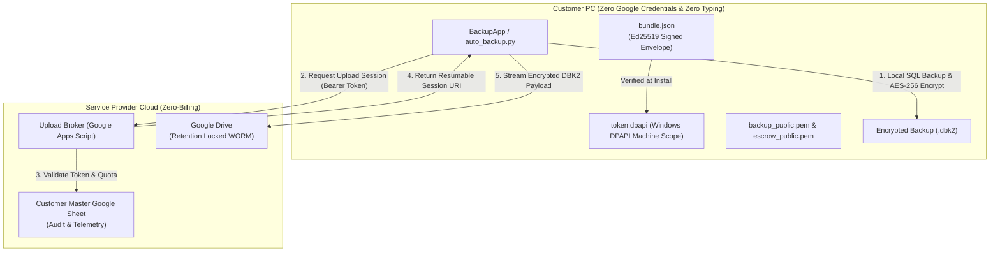

# 🛡️ Enterprise Database Cloud Backup Automation System
# Technical Architecture, Engineering Documentation & Operational Runbook

**Document Version:** 4.2.0 (Zero-Trust Security Wall, Apps Script Broker & Zero-Typing Edition)  
**Classification:** Confidential & Proprietary — Engineering, DevOps & Client Deployment Runbook  
**Target Operating Systems:** Windows 10, 11 | Windows Server 2016, 2019, 2022, 2025  
**Supported Database Engines:** Microsoft SQL Server 2012, 2014, 2016, 2017, 2019, 2022  
**Author / Chief Architect:** Dulnindu Saranga  
**Last Revised & Verified:** October 2026  

---

## 📌 1. Executive Summary & Zero-Trust Security Wall

The **Enterprise Database Cloud Backup Automation System (v4.2.0)** enforces a strict **Zero-Trust Security Wall** between customer PCs and Google Cloud Infrastructure.

### Security Wall Principles
1. **Zero Client Secrets**: Customer PCs hold **no Google service account keys, cloud credentials, or OAuth secrets**. A compromised client machine cannot read, list, overwrite, or delete backups in Google Drive.
2. **Zero-Billing Google Apps Script Broker**: The upload and telemetry endpoints are hosted entirely on a free Google Apps Script Web App. No Google Cloud Billing account is required!
3. **Ed25519 Signed Bundle & Zero-Typing Installation**: Customer packages are cryptographically signed with an administrative Ed25519 key in `bundle.json`. The installer verifies the signature, and if verified, automatically registers the PC and seals the initial token into Windows DPAPI machine storage (`token.dpapi`) with **zero typing required from the customer**.
4. **Tamper Resistance**: If any file, endpoint URL, or manifest field in `bundle.json` is altered, the installer detects the mismatch (`ERR_BUNDLE_TAMPERED`), alerts the operator, and aborts installation.
5. **DBK2 Hybrid Envelope Encryption**: SQL Server database dumps are compressed into `.zip` and encrypted into streaming `.dbk2` format using authenticated AES-256-GCM. The ephemeral 256-bit AES symmetric key is wrapped using dual 4096-bit RSA keys (Primary `backup_public.pem` + Escrow `escrow_public.pem`). All RSA private decryption keys remain strictly **offline** on administrative hardware.

---

## 🏗️ 2. Architectural Data Flow & Component Topology



---

## 🚀 3. Installation & Setup Workflows (Zero Typing Required)

### Graphical Setup Wizard (`Setup_DatabaseBackup.exe`)
1. Run `Setup_DatabaseBackup.exe` as Administrator.
2. **Automatic Bundle Verification**:
   - The installer verifies `bundle.json` against the embedded Ed25519 administrator public key.
   - When verified, it automatically connects to the Broker using the pre-configured `ENROLL_CODE`.
   - The Broker verifies the PC name and issues a secure bearer token.
3. **Pre-Configured & Locked Parameters**:
   - **Upload Broker URL**: Extracted securely from `bundle.json`.
   - **Machine Authentication Token**: Automatically sealed into Windows DPAPI machine-scope storage (`C:\ProgramData\DatabaseCloudBackup\token.dpapi`).
   - The customer types **nothing** into these fields.
4. Click `[Install Now]`. The installer:
   - Copies all binaries, dependencies, and public encryption keys (`backup_public.pem`, `escrow_public.pem`).
   - Hardens folder permissions via `icacls.exe`.
   - Registers Windows Desktop and Start Menu shortcuts.
   - Registers the unattended Monday 02:00 AM backup schedule in Windows Task Scheduler.

---

## 📋 4. Administration & Operational Runbook

### 4.1 Automated Customer Onboarding (1 Single Command)
On your administrator machine, run:
```bash
python Tools/setup_new_customer.py
```
#### Automated Pipeline:
1. Prompts for customer slug and your Apps Script Web App URL.
2. Generates distinct Primary and Escrow 4096-bit RSA keys.
3. Generates a secure, signed `bundle.json` using your Admin Ed25519 Private Key.
4. Outputs an `ENROLL_CODE` for you to paste into your Google Sheet.
5. Automatically grabs `Setup_DatabaseBackup.exe` and `AppFiles` and places them into `customers/<slug>_package`.
6. You simply ZIP this folder and send it to the customer.

### 4.2 Restoring & Decrypting a Backup Offline
On an air-gapped recovery machine containing the private decryption key:
```bash
python Tools/decrypt_backup.py backup_20261001_1.dbk2 restored_backup.zip backup_private.pem [password]
```
If the primary private key is unavailable, use `escrow_private.pem` with the exact same syntax.

### 4.3 Single Unified Persistent Audit Log
- All operations are appended to:
  `C:\ProgramData\DatabaseCloudBackup\backup_log.txt`
- Log format:
  `YYYY-MM-DD HH:MM:SS [MODULE] [LEVEL] Message text`
- Module tags: `[BACKUP]`, `[CLEANUP]`, `[PERF_QUERY]`, `[SYSTEM]`
- View logs live in the **Live Logs** tab inside the application.
