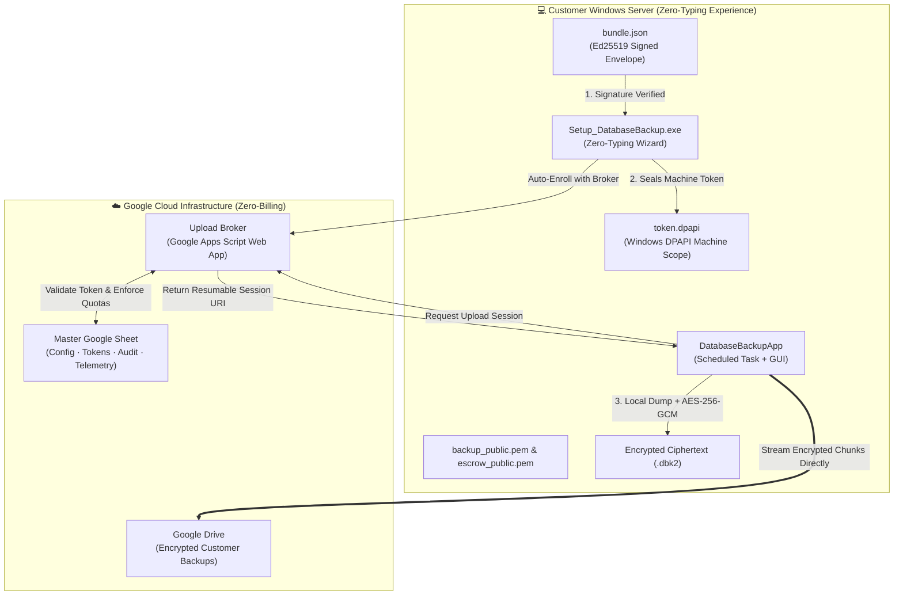

# 🛡️ Enterprise Database Cloud Backup Automation System
# Operational Runbook & User Installation Guide

**Document Version:** 4.2.0 (Zero-Trust Security Wall, Apps Script Broker & Zero-Typing Edition)  
**Classification:** Engineering, DevOps & Client Deployment Runbook  
**Target Operating Systems:** Windows 10, 11 | Windows Server 2016, 2019, 2022, 2025  
**Supported Database Engines:** Microsoft SQL Server (2012–2022), MySQL (5.7, 8.0+), PostgreSQL (12+)  
**Author / Chief Architect:** Dulnindu Saranga  
**Last Revised & Verified:** October 2026  

---

## 📌 1. Executive Summary & Zero-Trust Security Wall

The **Enterprise Database Cloud Backup Automation System (v4.2.0)** enforces a strict **Zero-Trust Security Wall** between customer on-premise Windows servers and Google Cloud Storage infrastructure.

### Security Wall Principles
1. **Zero Client Secrets**: Customer PCs hold **no Google service account keys, cloud credentials, or OAuth secrets**. A compromised client machine cannot read, list, overwrite, or delete backups in Google Drive.
2. **Zero-Billing Google Apps Script Broker**: The upload and telemetry endpoints are hosted on a serverless Google Apps Script Web App. No Google Cloud Billing account is required!
3. **Ed25519 Signed Bundle & Zero-Typing Installation**: Customer packages are cryptographically signed with an administrative Ed25519 key in `bundle.json`. The installer verifies the signature, automatically registers the PC, and seals the issued machine token into Windows DPAPI storage (`token.dpapi`) with **zero typing required from the customer**.
4. **Tamper Resistance**: If any file, endpoint URL, or manifest field in `bundle.json` is altered, the installer detects the mismatch (`ERR_BUNDLE_TAMPERED`), alerts the operator, and aborts installation.
5. **DBK2 Hybrid Envelope Encryption**: Database dumps are compressed into `.zip` and encrypted into streaming `.dbk2` format using authenticated **AES-256-GCM**. The ephemeral 256-bit AES symmetric key is wrapped using dual 4096-bit RSA keys (Primary `backup_public.pem` + Escrow `escrow_public.pem`). All RSA private decryption keys remain strictly **offline** on air-gapped administrative hardware.

---

## 🏗️ 2. Architectural Data Flow & Component Topology



---

## 💻 3. Customer Installation Guide (Zero-Typing Experience)

Installing the software on a client machine requires **no technical knowledge** and zero manual credential entry.

### Prerequisites:
* **Operating System**: Windows 10, Windows 11, or Windows Server 2016/2019/2022/2025.
* **Privileges**: Administrator rights (required for Windows Task Scheduler and DPAPI machine-scope protection).
* **Python Dependency**: **NONE** (Pre-compiled standalone `.exe` with embedded runtime in `_internal`; Python is NOT required on client PCs).
* **Network**: Outbound HTTPS access (Port 443) to `script.google.com` and `drive.google.com`.

### Installation Steps:
1. **Extract Package**:
   Extract the customer `.zip` file (e.g., `acme_package.zip`) into a local folder (such as `C:\Temp\Setup` or Desktop).
   
   The folder must contain:
   * `Setup_DatabaseBackup.exe` (Installation Wizard)
   * `bundle.json` (Cryptographically signed deployment manifest)
   * `AppFiles/` (Application binaries, runtime libraries, and public keys)

2. **Launch Installer as Administrator**:
   Right-click **`Setup_DatabaseBackup.exe`** and select **Run as administrator**.

3. **Automatic Verification & Zero-Typing Enrollment**:
   * The installer automatically loads `bundle.json` and verifies the administrative **Ed25519 digital signature**.
   * It connects to the Google Apps Script broker, validates the hardware fingerprint, and receives an authorized machine token.
   * The token is immediately sealed into Windows DPAPI machine-scope storage (`C:\ProgramData\DatabaseBackupApp\token.dpapi`).
   * The Broker URL, Customer Slug, and Token are locked — **the user types nothing**.

4. **Select Local Backup Staging Directory**:
   * Choose a dedicated local directory for staging temporary dumps (e.g., `C:\SQLBackups` or `D:\Backups`).
   * *Note*: Cloud-synced folders (OneDrive, Dropbox, Google Drive) are automatically detected and blocked to prevent sync race conditions.

5. **Click `[Install Now]`**:
   The installer:
   * Copies application files to `C:\Program Files\DatabaseBackupApp\`.
   * Restricts NTFS folder ACL permissions via `icacls.exe`.
   * Creates a desktop shortcut: **Database Backup Application**.
   * Registers unattended automated Windows Scheduled Tasks:
     * **Daily Database Backup**: Runs daily at 02:00 AM + staggered offset minutes.
     * **Storage Health Monitor**: Runs hourly to assess disk health and log telemetry.

---

## 🖥️ 4. Daily Operations & Manual Backup Guide

Once installed, backups run completely unattended. Users can also manage backups via the desktop application.

### Opening the Application
Launch **Database Backup Application** from the Windows Desktop or Start Menu.

### Dashboard Overview
* **Status Card**: Shows the last backup execution time, duration, and status (SUCCESS / FAILED).
* **Engine Selector**: Choose between **Microsoft SQL Server**, **MySQL**, or **PostgreSQL**.
* **Database Target**: Select target database names or specify individual databases.
* **Storage Overview**: Visual indicator of free disk space and estimated backup requirements.

### Running an On-Demand Backup:
1. Click **`[Run Backup Now]`**.
2. The application executes the automated cycle:
   * **Pre-flight Checks**: Tests database access, free disk space (≥ 2.5× database size), and broker availability.
   * **Compression**: Dumps and zips database contents.
   * **Streaming Encryption**: Compresses and encrypts the dump with AES-256-GCM + dual RSA-4096 envelope keys into a `.dbk2` archive. Plaintext dumps are wiped.
   * **Resumable Upload**: Requests a session URI from the broker and streams 8MB chunks to Google Drive.
   * **Telemetry**: Appends results to the local log and uploads metrics to the Google Sheet.
3. Observe live output in the **Live Execution Logs** tab.

---

## 🛠️ 5. Administrator Setup & Customer Provisioning Guide

Administrators manage multiple customers using a single Master Google Sheet and central Google Drive.

### Step 1: Deploy Apps Script Broker
1. Open your [Master Google Sheet](https://docs.google.com/spreadsheets/d/12xEfxLTOw8D4K8Qi_kj0RWPl12hID6x5HZpvU_AsTLE/edit).
2. Go to **Extensions → Apps Script**.
3. Paste the contents of [`apps_script_broker/Code.gs`](apps_script_broker/Code.gs).
4. Run the function **`setupSheets`** once to initialize all 5 tabs:
   * `Config`
   * `Tokens`
   * `Audit`
   * `Telemetry`
   * `Storage Monitor`
5. Click **Deploy → Manage deployments / New deployment**:
   * Type: **Web app**
   * Execute as: **Me**
   * Who has access: **Anyone**
6. Copy the Web App URL (ends in `/exec`).

### Step 2: Provision a New Customer Package
On your administrator machine:
```powershell
python Tools\setup_new_customer.py
```
1. Enter customer slug (e.g. `acme`).
2. Enter your Apps Script Web App URL.
3. Enter a secure passphrase for the customer's offline private keys.
4. The wizard generates:
   * Customer folder: `customers/<slug>_package/`
   * Private key: `offline/<slug>_backup_private.pem` (KEEP SECURELY OFFLINE)
   * Console output: Row for Google Sheet `Config` tab.

### Step 3: Authorize Customer in Google Sheet
Copy the output row and paste it into the **`Config`** tab of your Google Sheet:
```text
ENROLL_CODE | <generated_secret_code> | <customer_slug>
```

### Step 4: Dispatch Package
Zip `customers/<slug>_package/` and deliver it to the client.

---

## 🚨 6. Disaster Recovery & Decryption Guide

When disaster strikes, backups can be restored on any machine using the air-gapped private decryption key.

### Restoring from a `.dbk2` Backup:
1. Retrieve the encrypted backup file (`.dbk2`) from Google Drive (or local staging).
2. On an administrative machine with access to the offline private key:
   ```powershell
   python Tools\decrypt_backup.py path\to\backup_20261001_1.dbk2 restored_backup.zip offline\backup_private.pem [passphrase]
   ```
3. If the primary customer key is inaccessible, use the escrow key:
   ```powershell
   python Tools\decrypt_backup.py path\to\backup_20261001_1.dbk2 restored_backup.zip offline\escrow_private.pem [passphrase]
   ```
4. Extract `restored_backup.zip` to recover your `.bak` / `.sql` database dump.
5. Restore into SQL Server Management Studio (SSMS), `mysql`, or `pg_restore`.

---

## 🔍 7. Troubleshooting & Error Codes

| Error Code | Meaning | Remediation |
|---|---|---|
| `ERR_BUNDLE_TAMPERED` | The `bundle.json` signature does not match. | Re-extract original untampered `.zip` package from admin. |
| `ERR_NOT_APPS_SCRIPT` | The configured URL is not an official Google Apps Script endpoint. | Verify Web App URL starts with `https://script.google.com/`. |
| `ERR_HEALTH_EXCEPTION` | Cannot reach the broker endpoint. | Check network connectivity, proxy settings, or firewall port 443. |
| `ERR_CLOUD_SYNC_DETECTED` | Backup folder is inside OneDrive/Dropbox. | Select a dedicated local path (e.g. `C:\SQLBackups`). |
| `ERR_PRIMARY_KEY_TOO_SHORT` | RSA key is smaller than 3072 bits. | Generate 4096-bit keys using `Tools/setup_new_customer.py`. |
| `ERR_KEYS_NOT_DISTINCT` | Primary and Escrow keys are identical. | Ensure two independent keypairs are generated. |
| `ERR_TOKEN_FILE_ABSENT` | `token.dpapi` is missing. | Re-run `Setup_DatabaseBackup.exe` to re-enroll. |
| `ERR_DPAPI_EMPTY` | Token cannot be decrypted in current context. | Ensure service runs under LocalSystem or matching user account. |
| `ERR_SQL_CONN_FAILED` | Database instance not reachable. | Check database service status and credentials. |

---

## 📁 8. File & Path Reference

* **Application Directory**: `C:\Program Files\DatabaseBackupApp\`
* **Data & DPAPI Vault**: `C:\ProgramData\DatabaseBackupApp\`
* **Persistent Log**: `C:\ProgramData\DatabaseBackupApp\backup_log.txt`
* **Scheduled Task Names**:
  * `DatabaseBackup_AutomatedTask`
  * `DatabaseBackup_StorageMonitor`
